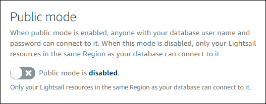

# Configure public access for your Lightsail database

Your managed database in Amazon Lightsail is accessible only by your Lightsail resources
(instances, load balancers, etc.) that are in the same Lightsail account. One common scenario
is to create both a Lightsail instance with a public-facing web application and a Lightsail
database that is not publicly accessible, and then connect the two.

Enable the public mode feature to make your database publicly accessible. This way, anyone
with the database endpoint, port, user name, and password can connect to your database. For more
information, see [Connect
to your MySQL database](amazon-lightsail-connecting-to-your-mysql-database.md "amazon-lightsail-connecting-to-your-mysql-database.md") or [Connect to your PostgreSQL
database](amazon-lightsail-connecting-to-your-postgres-database.md "amazon-lightsail-connecting-to-your-postgres-database.md").

###### To configure the public mode for your database

1. Sign in to the [Lightsail console](https://lightsail.aws.amazon.com/ "https://lightsail.aws.amazon.com/").
2. In the left navigation pane, choose **Databases**.
3. Choose the name of the database for which you want to configure public mode.
4. Choose the **Networking** tab.
5. Under the **Public mode** section, use the toggle to turn it on.
   Likewise, use the toggle to turn it off.

The public accessibility setting begins applying immediately but may require a few
minutes to complete. During this time, the status of your database changes to
**Modifying**. The status of your database changes to
**Available** after the public accessibility setting is applied.

## Next steps

Here are a few guides to help you manage your database:

- [Configure the
  data import mode for your database](amazon-lightsail-configuring-database-data-import-mode.md "amazon-lightsail-configuring-database-data-import-mode.md")
- [Manage your database
  password](amazon-lightsail-managing-database-password.md "amazon-lightsail-managing-database-password.md")
- [Connect to your
  MySQL database](amazon-lightsail-connecting-to-your-mysql-database.md "amazon-lightsail-connecting-to-your-mysql-database.md")
- [Connect to
  your PostgreSQL database](amazon-lightsail-connecting-to-your-postgres-database.md "amazon-lightsail-connecting-to-your-postgres-database.md")
- [Import
  data into your MySQL database](amazon-lightsail-importing-data-into-your-mysql-database.md "amazon-lightsail-importing-data-into-your-mysql-database.md")
- [Import
  data into your PostgreSQL database](amazon-lightsail-importing-data-into-your-postgres-database.md "amazon-lightsail-importing-data-into-your-postgres-database.md")
- [Create a snapshot of
  your database](amazon-lightsail-creating-a-database-snapshot.md "amazon-lightsail-creating-a-database-snapshot.md")
