# Connect a WordPress instance

to a Lightsail bucket for static content

This tutorial describes the steps required to connect your WordPress website running on an
Amazon Lightsail instance to a Lightsail bucket. You can use the bucket to host static content
such as images and attachments. To do this, you must install the WP Offload Media Lite plugin on
your WordPress website and configure it to connect to your Lightsail bucket. After the plugin
is configured, all media that you upload to your WordPress website is automatically added to
your bucket instead of the instance’s disk.

**Contents**

- [Step 1:
  Complete the prerequisites](#connecting-buckets-to-wordpress-prerequisites "#connecting-buckets-to-wordpress-prerequisites")
- [Step 2: Modify your bucket permissions](#connecting-buckets-to-wordpress-modify-bucket-permissions "#connecting-buckets-to-wordpress-modify-bucket-permissions")
- [Step 3: Install the WP Offload Media Lite plugin on your WordPress
  website](#connecting-buckets-to-wordpress-install-wp-offload-media-lite "#connecting-buckets-to-wordpress-install-wp-offload-media-lite")
- [Step 4:
  Test the connection between your WordPress website and your Lightsail
  bucket](#connecting-buckets-to-wordpress-test-connection "#connecting-buckets-to-wordpress-test-connection")

## Step 1: Complete the

prerequisites

Complete the following prerequisites if you haven't already:

- Create a WordPress instance in Lightsail. For more information, see [Tutorial: Launch
  and configure a WordPress instance in Amazon Lightsail](amazon-lightsail-tutorial-launching-and-configuring-wordpress.md "amazon-lightsail-tutorial-launching-and-configuring-wordpress.md").
- Create a bucket in the Lightsail object storage service. For more information, see
  [Create a bucket](amazon-lightsail-creating-buckets.md "amazon-lightsail-creating-buckets.md").

## Step 2: Modify

your bucket permissions

Complete the following procedure to change the permissions of your bucket to give access
to your WordPress instance and the Offload Media Lite plugin. The access permissions of your
bucket must be set to **Individual objects can be made public (read-only)**.
You must also attach the WordPress instance to the access role of your bucket. For more
information about bucket permissions, see [Bucket
permissions](amazon-lightsail-understanding-bucket-permissions.md "amazon-lightsail-understanding-bucket-permissions.md").

1. Sign in to the [Lightsail console](https://lightsail.aws.amazon.com/ "https://lightsail.aws.amazon.com/").
2. In the left navigation pane, choose **Storage**.
3. Choose the name of the bucket that you want to use with your WordPress website.

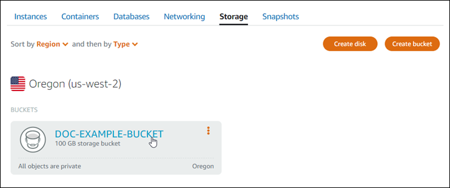 4. Choose the **Permissions** tab on the **Bucket
management** page. 5. Choose **Change permissions** under the **Bucket access
permissions** section of the page.

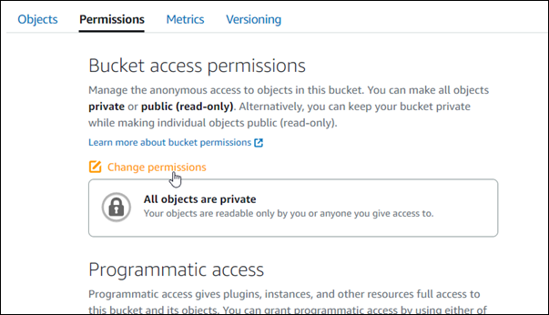 6. Choose **Individual objects can be made public and read
only**.

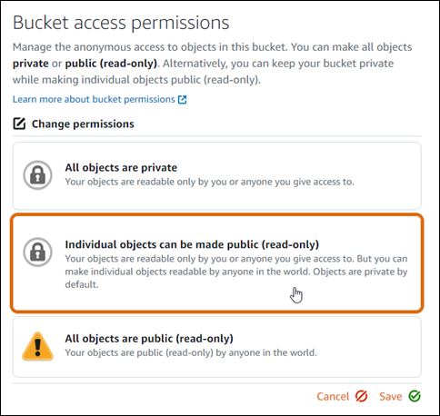 7. Choose **Save**. 8. Choose **Yes, save** in the confirmation prompt that appears.

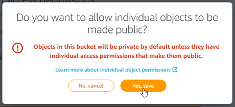

After a few moments, your bucket is configured to allow for individual object access.
This ensures that objects uploaded to your bucket from your WordPress website using the
Offload Media Lite plugin are readable to your customers. 9. Scroll to the **Resource access** section of the page, and choose
**Attach instance**.

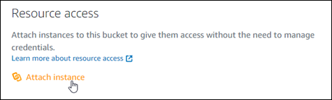 10. Choose the name of your WordPress instance in the drop-down list that appears, and
then choose **Attach**.

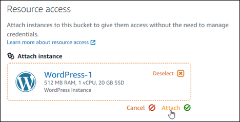

After a few moments, your WordPress instance is attached to your bucket. This gives
your WordPress instance access to manage your bucket and its objects.

## Step 3:

Install the WP Offload Media Lite plugin on your WordPress website

Complete the following procedure to install the WP Offload Media Lite plugin on your
WordPress website. This plugin automatically copies images, videos, documents, and any other
media added through the WordPress media uploader to your Lightsail bucket. For more
information, see [WP
Offload Media Lite](https://wordpress.org/plugins/amazon-s3-and-cloudfront/ "https://wordpress.org/plugins/amazon-s3-and-cloudfront/") in the _WordPress website_.

1. Sign in to the dashboard of your WordPress website as an administrator.

For more information, see [Getting the
application user name and password for your Bitnami instance in
Amazon Lightsail](log-in-to-your-bitnami-application-running-on-amazon-lightsail.md "log-in-to-your-bitnami-application-running-on-amazon-lightsail.md"). 2. Pause on **Plugins** in the left navigation menu, and choose
**Add New**.

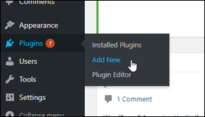 3. Search for **WP Offload Media Lite**. 4. In the search results, choose **Install Now** next to the
**WP Offload Media** plugin.

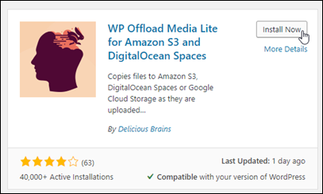 5. Choose **Activate** after the plugin is done installing.

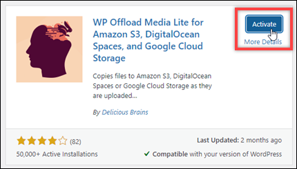 6. In the left navigation menu, choose **Settings**, and then choose
**Offload Media**.

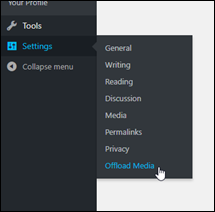 7. In the **Offload Media** page, choose **Amazon S3**
as the storage provider.

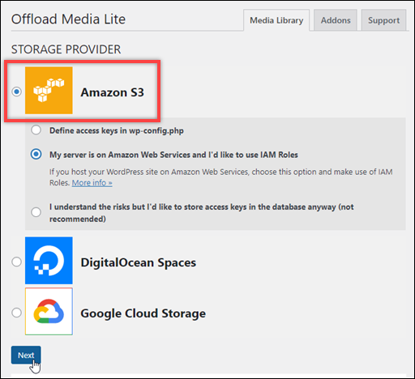 8. Choose **My server is on Amazon Web Services and I'd like to use IAM
Roles**.

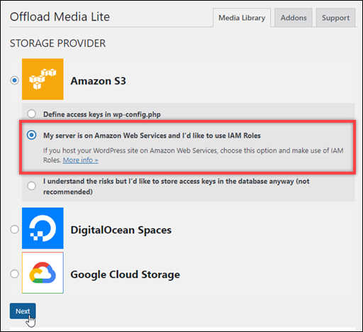 9. Choose **Next**.

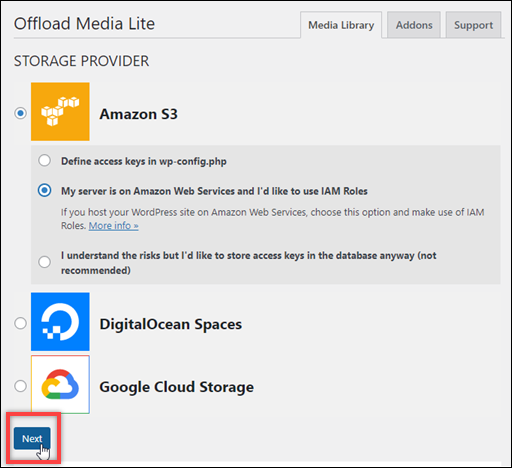 10. Choose **Browse existing buckets** in the **What bucket would
you like to use?** page that appears.

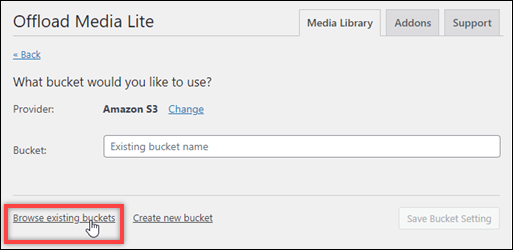 11. Choose the name of the bucket that you want to use with your WordPress
instance.

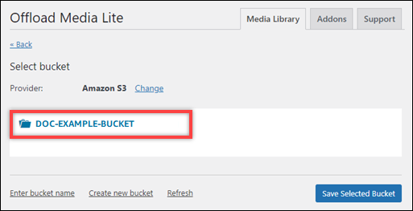 12. In the **Offload Media Lite Settings** page that appears, make sure
to turn on **Force HTTPS** and **Remove Files From
Server**.

    * The **Force HTTPS** setting must be turned on because Lightsail
     buckets use HTTPS by default to serve media files. If you don't turn this feature on,
     media files that are uploaded to your Lightsail bucket from your WordPress website
     won't be served correctly to your website visitors.
    * The **Remove Files From Server** setting ensures that media that
     is uploaded to your Lightsail bucket isn't also stored on your instance's disk. If
     you don't turn this feature on, media files that are uploaded to your Lightsail
     bucket are also stored on the local storage of your WordPress instance.

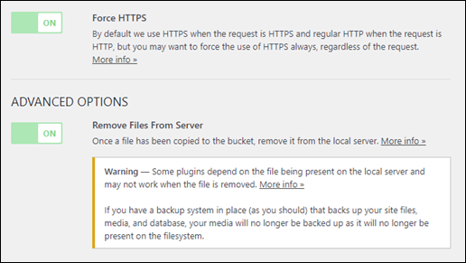 13. Choose **Save Changes**.

###### Note

To return to the **Offload Media Lite Settings** page later, pause
on **Settings** in the left navigation menu, and choose
**Offload Media Lite**.

Your WordPress website is now configured to use the Media Lite Plugin. The next time
you upload a media file through WordPress, that file is automatically uploaded to your
Lightsail bucket, and is served by the bucket. To test the configuration, continue to
the next section of this tutorial.

## Step 4: Test the connection

between your WordPress website and your Lightsail bucket

Complete the following procedure to upload a media file to your WordPress instance and
confirm that it is uploaded to, and is served from your Lightsail bucket.

1. Pause on **Media** in the left navigation menu of the WordPress
   dashboard, and choose **Add New**.

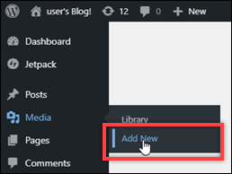 2. Choose **Select Files** on the Upload New Media page that
appears.

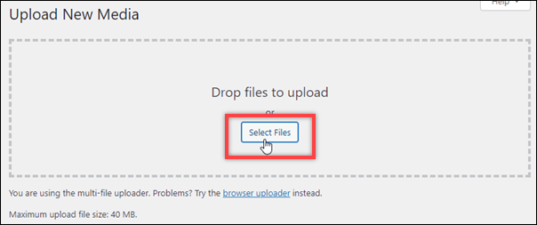 3. Choose a media file to upload from your local computer, and choose
**Open**.

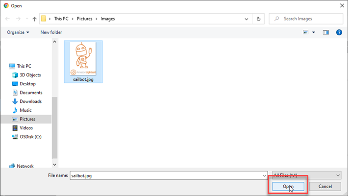 4. When the file is done uploading, choose **Library** under
**Media** in the left navigation menu.

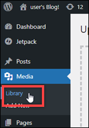 5. Choose the file that you recently uploaded.

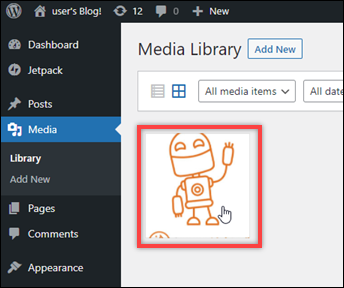 6. In the details panel of the file, you should see the name of your bucket in the
**Bucket** and **File URL** fields.

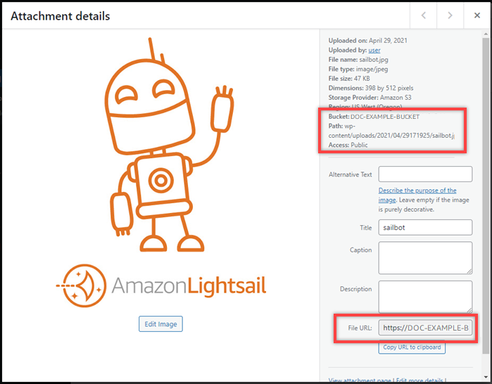 7. When you go to the **Objects** tab of the Lightsail bucket
management page, you should see a **wp-content** folder. This folder is
created by the Offload Media Lite plugin and is used to store your uploaded media
files.

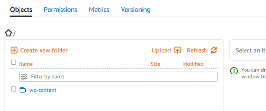

## Manage buckets and

objects

These are the general steps to manage your Lightsail object storage bucket:

1. Learn about objects and buckets in the Amazon Lightsail object storage service. For more
   information, see [Object storage in
   Amazon Lightsail](buckets-in-amazon-lightsail.md "buckets-in-amazon-lightsail.md").
2. Learn about the names that you can give your buckets in Amazon Lightsail. For more
   information, see [Bucket naming rules
   in Amazon Lightsail](bucket-naming-rules-in-amazon-lightsail.md "bucket-naming-rules-in-amazon-lightsail.md").
3. Get started with the Lightsail object storage service by creating a bucket. For more
   information, see [Creating buckets in
   Amazon Lightsail](amazon-lightsail-creating-buckets.md "amazon-lightsail-creating-buckets.md").
4. Learn about security best practices for buckets and the access permissions that you can
   configure for your bucket. You can make all objects in your bucket public or private, or you
   can choose to make individual objects public. You can also grant access to your bucket by
   creating access keys, attaching instances to your bucket, and granting access to other AWS
   accounts. For more information, see [Security Best Practices for
   Amazon Lightsail object storage](amazon-lightsail-bucket-security-best-practices.md "amazon-lightsail-bucket-security-best-practices.md") and [Understanding bucket
   permissions in Amazon Lightsail](amazon-lightsail-understanding-bucket-permissions.md "amazon-lightsail-understanding-bucket-permissions.md").

After learning about bucket access permissions, see the following guides to grant access
to your bucket:

    * [Block public access
     for buckets in Amazon Lightsail](amazon-lightsail-block-public-access-for-buckets.md "amazon-lightsail-block-public-access-for-buckets.md")
    * [Configuring bucket
     access permissions in Amazon Lightsail](amazon-lightsail-configuring-bucket-permissions.md "amazon-lightsail-configuring-bucket-permissions.md")
    * [Configuring
     access permissions for individual objects in a bucket in Amazon Lightsail](amazon-lightsail-configuring-individual-object-access.md "amazon-lightsail-configuring-individual-object-access.md")
    * [Creating access keys
     for a bucket in Amazon Lightsail](amazon-lightsail-creating-bucket-access-keys.md "amazon-lightsail-creating-bucket-access-keys.md")
    * [Configuring
     resource access for a bucket in Amazon Lightsail](amazon-lightsail-configuring-bucket-resource-access.md "amazon-lightsail-configuring-bucket-resource-access.md")
    * [Configuring
     cross-account access for a bucket in Amazon Lightsail](amazon-lightsail-configuring-bucket-cross-account-access.md "amazon-lightsail-configuring-bucket-cross-account-access.md")

5. Learn how to enable access logging for your bucket, and how to use access logs to audit
   the security of your bucket. For more information, see the following guides.
   - [Access logging for buckets in the
     Amazon Lightsail object storage service](amazon-lightsail-bucket-access-logs.md "amazon-lightsail-bucket-access-logs.md")
   - [Access log format for a bucket in
     the Amazon Lightsail object storage service](amazon-lightsail-bucket-access-log-format.md "amazon-lightsail-bucket-access-log-format.md")
   - [Enabling access logging for a
     bucket in the Amazon Lightsail object storage service](amazon-lightsail-enabling-bucket-access-logs.md "amazon-lightsail-enabling-bucket-access-logs.md")
   - [Using access logs for a bucket in
     Amazon Lightsail to identify requests](amazon-lightsail-using-bucket-access-logs.md "amazon-lightsail-using-bucket-access-logs.md")

6. Create an IAM policy that grants a user the ability to manage a bucket in Lightsail.
   For more information, see [IAM
   policy to manage buckets in Amazon Lightsail](amazon-lightsail-bucket-management-policies.md "amazon-lightsail-bucket-management-policies.md").
7. Learn about the way that objects in your bucket are labeled and identified. For more
   information, see [Understanding object key names in Amazon Lightsail](understanding-bucket-object-key-names-in-amazon-lightsail.md "understanding-bucket-object-key-names-in-amazon-lightsail.md").
8. Learn how to upload files and manage objects in your buckets. For more information, see
   the following guides.
   - [Uploading files to a
     bucket in Amazon Lightsail](amazon-lightsail-uploading-files-to-a-bucket.md "amazon-lightsail-uploading-files-to-a-bucket.md")
   - [Uploading files to a bucket in Amazon Lightsail using multipart upload](amazon-lightsail-uploading-files-to-a-bucket-using-multipart-upload.md "amazon-lightsail-uploading-files-to-a-bucket-using-multipart-upload.md")
   - [Viewing objects in a
     bucket in Amazon Lightsail](amazon-lightsail-viewing-objects-in-a-bucket.md "amazon-lightsail-viewing-objects-in-a-bucket.md")
   - [Copying or moving
     objects in a bucket in Amazon Lightsail](amazon-lightsail-copying-moving-bucket-objects.md "amazon-lightsail-copying-moving-bucket-objects.md")
   - [Downloading objects from
     a bucket in Amazon Lightsail](amazon-lightsail-downloading-bucket-objects.md "amazon-lightsail-downloading-bucket-objects.md")
   - [Filtering objects in a
     bucket in Amazon Lightsail](amazon-lightsail-filtering-bucket-objects.md "amazon-lightsail-filtering-bucket-objects.md")
   - [Tagging objects in a bucket
     in Amazon Lightsail](amazon-lightsail-tagging-bucket-objects.md "amazon-lightsail-tagging-bucket-objects.md")
   - [Deleting objects in a
     bucket in Amazon Lightsail](amazon-lightsail-deleting-bucket-objects.md "amazon-lightsail-deleting-bucket-objects.md")

9. Enable object versioning to preserve, retrieve, and restore every version of every
   object stored in your bucket. For more information, see [Enabling and suspending
   object versioning in a bucket in Amazon Lightsail](amazon-lightsail-managing-bucket-object-versioning.md "amazon-lightsail-managing-bucket-object-versioning.md").
10. After enabling object versioning, you can restore previous versions of objects in your
    bucket. For more information, see [Restoring previous versions of
    objects in a bucket in Amazon Lightsail](amazon-lightsail-restoring-bucket-object-versions.md "amazon-lightsail-restoring-bucket-object-versions.md").
11. Monitor the utilization of your bucket. For more information, see [Viewing metrics for your bucket in
    Amazon Lightsail](amazon-lightsail-viewing-bucket-metrics.md "amazon-lightsail-viewing-bucket-metrics.md").
12. Configure an alarm for bucket metrics to be notified when the utilization of your bucket
    crosses a threshold. For more information, see [Creating bucket metric alarms in
    Amazon Lightsail](amazon-lightsail-adding-bucket-metric-alarms.md "amazon-lightsail-adding-bucket-metric-alarms.md").
13. Change the storage plan of your bucket if it's running low on storage and network
    transfer. For more information, see [Changing the plan of your bucket in Amazon Lightsail](amazon-lightsail-changing-bucket-plans.md "amazon-lightsail-changing-bucket-plans.md").
14. Learn how to connect your bucket to other resources. For more information, see the
    following tutorials.
    - [Tutorial:
      Connecting a WordPress instance to an Amazon Lightsail bucket](amazon-lightsail-connecting-buckets-to-wordpress.md "amazon-lightsail-connecting-buckets-to-wordpress.md")
    - [Tutorial: Using an
      Amazon Lightsail bucket with a Lightsail content delivery network
      distribution](amazon-lightsail-using-distributions-with-buckets.md "amazon-lightsail-using-distributions-with-buckets.md")

15. Delete your bucket if you're no longer using it. For more information, see [Deleting buckets in
    Amazon Lightsail](amazon-lightsail-deleting-buckets.md "amazon-lightsail-deleting-buckets.md").
