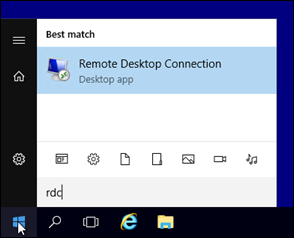
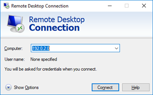
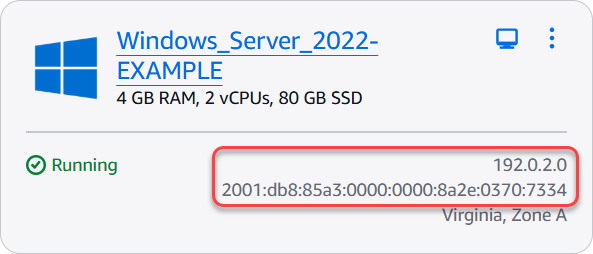
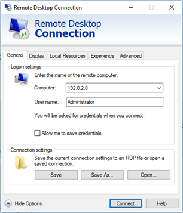
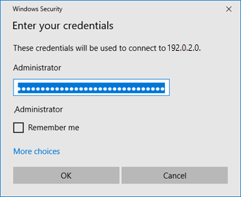
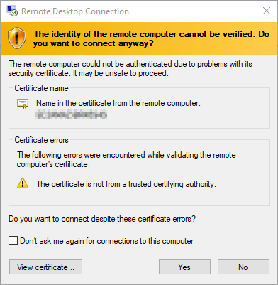
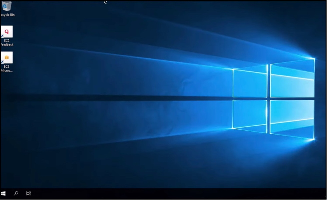

# Connect to a

Lightsail Windows instance from Windows with Remote Desktop

You can use the Remote Desktop Connection (RDC) client included with the Windows operating
system to connect to your Windows instance in Amazon Lightsail. RDC requires that you use the
administrator user name and password for the Windows instance, which could be the default
password assigned to the instance when it’s created or your own password if you changed the
default password.

This topic walks you through the steps to obtain your default administrator password from
the Lightsail console, and configure RDC to connect to your Windows instance. You can also
connect to your instance from within the Lightsail console using your browser. For more
information, see [Connect to your Windows instance with the web-based RDP client](connect-to-your-windows-based-instance-using-amazon-lightsail.md "connect-to-your-windows-based-instance-using-amazon-lightsail.md").

## Get the default administrator password for

your Windows instance

Complete the following steps to get the default administrator password for your Windows
instance, which is required to connect to the instance using RDC.

###### Note

If you changed the default administrator password, then the password that is displayed
in Lightsail console for your instance will not work. You’ll need to remember your
password. You cannot connect to your instance using RDC without your administrator
password.

1. Sign in to the [Lightsail console](https://lightsail.aws.amazon.com/ "https://lightsail.aws.amazon.com/").
2. Choose the Windows instance that you want to connect to.
3. In the **Connect** tab of the instance management page,
   choose **Show default password**.
4. Highlight the default password that is displayed, and copy it by pressing **Ctl+C**or **Cmd+C**. The password is
   now in your clipboard.

Continue to the next section of this guide to configure RDC, and paste the password
into the client.

## Configure RDC and connect to your Windows

instance

Complete the following steps to configure RDC and connect to your Windows instance.

1. Open the Windows menu, and then search for `Remote Desktop Connection` or
   `RDC`.
2. Choose **Remote Desktop Connection** in the search results.

 3. In the **Computer** text box, enter your Windows
instance’s public IP address.

The public IP is displayed next to your instance in the Lightsail console, as shown
in the following example:

 4. Choose **Show Options** to view additional connection options. 5. In the **User Name** text box, enter
`Administrator`, which is the default user name for all Windows instances in
Lightsail.

 6. Choose **Connect**. 7. In the prompt that appears, enter or paste the default administrator password that you
copied from the Lightsail console earlier in this procedure, and then choose
**OK**.

 8. In the prompt that appears, choose **Yes** to connect to the Windows
instance despite certificate errors.

After you’re connected to the instance, you should see a screen similar to the
following example:

