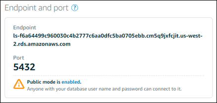
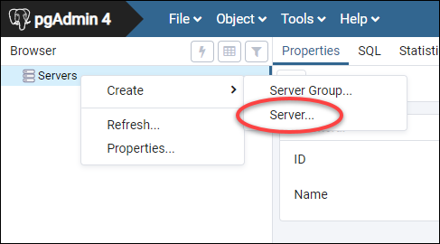
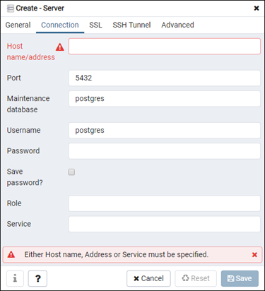
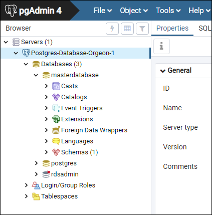

# Connect to your

Lightsail PostgreSQL database instance

After your PostgreSQL managed database is created in Amazon Lightsail, you can use any
standard PostgreSQL client application or utility to connect to it. You must get the database
endpoint, port, user name, and password from your database management page in the Lightsail
console. Specify those values when configuring the database connection in your client or web
application.

This guide shows you how to obtain the required connection information, and how to configure
the pgAdmin client to connect to your managed database.

###### Note

For more information about connecting to a MySQL database, see [Connect to your MySQL
database](amazon-lightsail-connecting-to-your-mysql-database.md "amazon-lightsail-connecting-to-your-mysql-database.md").

## Step 1: Get your PostgreSQL

database connection details

Get your database endpoint and port information from the Lightsail console. You use
these later when configuring your client to connect to your database.

###### To get your database connection details

1. Sign in to the [Lightsail console](https://lightsail.aws.amazon.com/ "https://lightsail.aws.amazon.com/").
2. In the left navigation pane, choose **Databases**.
3. Choose the name of the database that you want to connect to.
4. On the **Connect** tab, under the **Endpoint and
   port** section, note the endpoint and port information.

We recommend copying the endpoint to your clipboard to avoid entering it incorrectly.
To do that, highlight the endpoint and press **Ctrl+C** if you’re using
Windows, or **Cmd+C** if you’re using macOS, to copy it to your
clipboard. Then, press **Ctrl+V** or **Cmd+V** as
appropriate to paste it.

 5. On the **Connect** tab, under the **User name and
passwords** section, make note of the user name, then choose
**Show** under the **Password** section to view the
current database password.

Because managed passwords are complex, we also recommend copying and pasting it to
avoid entering it incorrectly. Highlight the managed password and press
**Ctrl+C** if you’re using Windows, or **Cmd+C** if
you’re using macOS, to copy it to your clipboard. Then, press **Ctrl+V**
or **Cmd+V** as appropriate to paste it.

## Step 2: Configure the public

availability of your PostgreSQL database

You must enable public mode for your database to connect to it externally, or from a
Lightsail instance in a different Region than your database. With public mode enabled,
anyone with the database user name and password can connect to your database. To configure the
public availability of your database, follow the steps in the [Configure the public mode for
your database](amazon-lightsail-configuring-database-public-mode.md "amazon-lightsail-configuring-database-public-mode.md") guide.

###### Note

Skip to step 3 if you plan to connect to your database from one of your Lightsail
instances that is in the same Region as your database.

## Step 3: Configure your database client

to connect to your PostgreSQL database

To connect to your PostgreSQL database, configure your database client to use the endpoint
and port that you obtained earlier. The following steps show you how to configure pgAdmin, but
these steps may be similar for other clients.

###### Note

For more information about using pgAdmin, see the [pgAdmin Documentation](https://www.pgadmin.org/docs/ "https://www.pgadmin.org/docs/").

###### To configure pgAdmin to connect to your database

1. Open **pgAdmin**.
2. Right-click **Servers** from the left navigation menu.
3. Choose **Create**, then choose **Server**.
4. 
5. In the **Create - Server** form, enter a name for the server. We
   recommend using a name for the connection that is similar to your database. This helps you
   identify it in the future.
6. Choose the **Connection** tab, then enter the following information
   into the form that displays:

    * **Host name/address** — Enter the database endpoint
     that you obtained earlier. If you copied the database endpoint from the Lightsail
     console, and it’s still in your clipboard, press **Ctrl+V** if you’re
     using Windows, or **Cmd+V** if you’re using macOS, to paste
     it.
    * **Port** — Enter the port for your database that you
     obtained earlier. The default port for PostgreSQL is 5432.
    * **Maintenance database** — Specify the name of the
     initial database to which the client will connect. This is the primary database name
     that you specified when you created your PostgreSQL database in Lightsail.

    Enter `postgres` if you can’t remember the name of your primary
     database. Every PostgreSQL managed database has a `postgres` database that
     you can connect to, after which you’ll be able to access all other databases on the
     PostgreSQL managed database.
    * **Username** — Enter the database user name that you
     obtained earlier.
    * **Password** — Enter your database password that you
     obtained earlier. If you copied your password from the Lightsail console, and it’s
     still in your clipboard, press **Ctrl+V** if you’re using Windows, or
     **Cmd+V** if you’re using macOS, to paste it. Choose **Save
     password** to save your password.
    * **Role** and **Service**
     — Leave these fields blank.

7. Choose **Save** to save the new server details.

Your new database connection appears on the left navigation menu of the pgAdmin
application, under the Servers section. 8. To connect to your database, double-click your new database connection.

If the connection is successful, you will see a list of available resources for that
database.

## Next steps

Here is a guide to help you import data into your database in Lightsail:

- [Import
  data into your PostgreSQL database](amazon-lightsail-importing-data-into-your-postgres-database.md "amazon-lightsail-importing-data-into-your-postgres-database.md")
