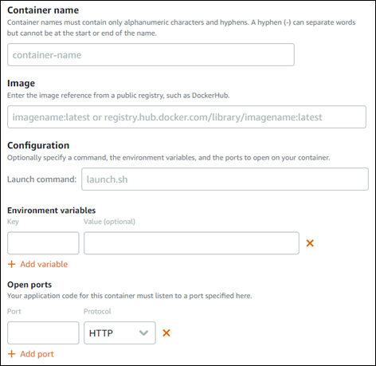
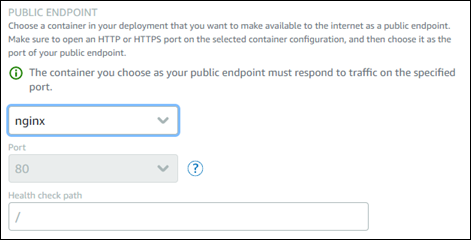
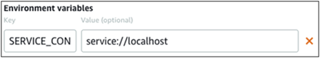
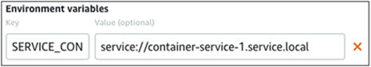
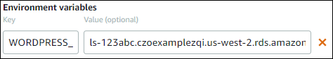
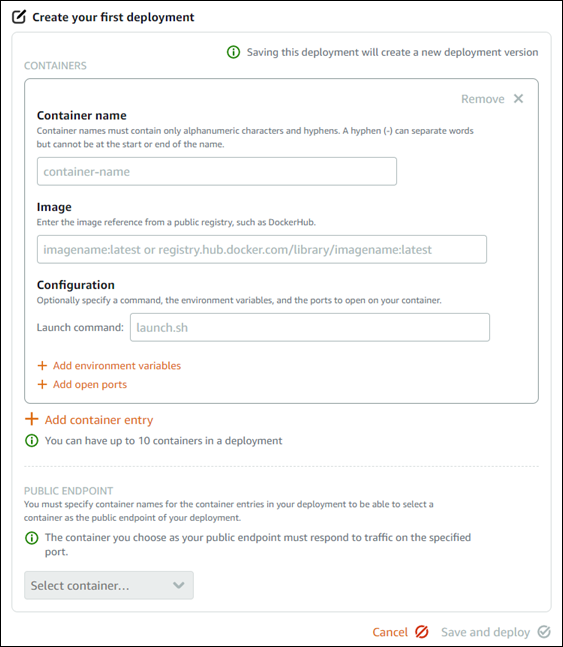

# Create and manage container

service deployments in Lightsail

Create a deployment when you're ready to launch containers on your Amazon Lightsail
container service. A deployment is a set of specifications for the containers that you wish to
launch on your service. Your container service can have one running deployment at a time, and a
deployment can have up to 10 container entries. You can create a deployment at the same time as
you create your container service, or you can create it after your service is up and
running.

###### Note

If you create a new deployment, then the existing utilization metrics of your container
service will disappear, and only metrics for the new current deployment will be shown.

For more information about container services, see [Container services in Amazon
Lightsail](amazon-lightsail-container-services.md "amazon-lightsail-container-services.md").

**Contents**

- [Prerequisites](#creating-container-deployments-prerequisites "#creating-container-deployments-prerequisites")
- [Deployment
  parameters](#creating-container-deployments-parameters "#creating-container-deployments-parameters")
  - [Container entry
    parameters](#creating-deployments-container-entry "#creating-deployments-container-entry")
  - [Public endpoint
    parameters](#creating-deployments-public-endpoint "#creating-deployments-public-endpoint")

- [Communication between
  containers](#communication-between-containers "#communication-between-containers")
- [Container
  logs](#creating-deployments-container-logs "#creating-deployments-container-logs")
- [Deployment
  versions](#creating-deployments-versions "#creating-deployments-versions")
- [Deployment status](#creating-deployment-status "#creating-deployment-status")
- [Deployment
  failures](#creating-deployment-failures "#creating-deployment-failures")
- [View your current
  container service deployment](#view-container-service-deployment "#view-container-service-deployment")
- [Create or modify
  your container service deployment](#creating-container-service-deployment "#creating-container-service-deployment")

## Prerequisites

Complete the following prerequisites before you get started with creating a deployment in
your container service:

- Create your container service in your Lightsail account. For more information, see
  [Creating Amazon Lightsail
  container services](amazon-lightsail-creating-container-services.md "amazon-lightsail-creating-container-services.md").
- Identify the container images that you want to use when you launch containers on your
  container service.
  - Find container images on a public registry, such as the Amazon ECR Public Gallery. For
    more information, see [Amazon ECR Public
    Gallery](https://gallery.ecr.aws/ "https://gallery.ecr.aws/") in the _Amazon ECR Public User Guide_.
  - Create container images on your local machine, then push them to your Lightsail
    container service. For more information, see the following guides:
    - [Installing software to
      manage container images for your Amazon Lightsail container
      services](amazon-lightsail-install-software.md "amazon-lightsail-install-software.md")
    - [Create container
      service images](amazon-lightsail-creating-container-images.md "amazon-lightsail-creating-container-images.md")
    - [Push and manage
      container images](amazon-lightsail-pushing-container-images.md "amazon-lightsail-pushing-container-images.md")

## Deployment parameters

This section describes the parameters that you can specify for the container entries and
the public endpoint of your deployment.

### Container entry parameters

You can add up to 10 container entries in your deployment. Each container entry has the
following parameters that you can specify:

- **Container name** – Enter a name for the container.
  All containers within a deployment must have unique names, and must contain only
  alphanumeric characters and hyphens. A hyphen can separate words but it cannot be at the
  start or end of the name.
- **Source image** – Specify a source container image for
  the container. You can specify container images from the following sources:
  - A public registry, such as the Amazon ECR Public Gallery, or some
    other public container image
    registry.

  For more information about Amazon ECR Public, see [What Is
  Amazon Elastic Container Registry Public?](../../../AmazonECR/latest/public/what-is-ecr.md "../../../AmazonECR/latest/public/what-is-ecr.md") in the _Amazon ECR Public
  User
  Guide_.
  - Images pushed from your local machine to your container service. To specify a
    stored image, choose **Choose stored image**, and then select the
    image that you want to use.

  If you create container images on your local machine, you can push them to your
  container service to use them when creating a deployment. For more information, see
  [Creating container
  images for your Amazon Lightsail container services](amazon-lightsail-creating-container-images.md "amazon-lightsail-creating-container-images.md") and [Pushing and managing container
  images on your Amazon Lightsail container services](amazon-lightsail-pushing-container-images.md "amazon-lightsail-pushing-container-images.md").

- **Launch command** – Specify a launch command to run a
  shell script or a bash script that configures your container when it's created. A launch
  command can do things like add software, update software, or configure your container in
  some other way.
- **Environment variables** – Specify environment
  variables, which are key-value parameters that provide dynamic configuration of the
  application or script run by the container.
- **Open ports** – Specify the ports and protocols to
  open on the container. You can specify to open any port over HTTP, HTTPS, TCP, and UDP.
  You must open an HTTP or HTTPS port for the container that you plan to use as the public
  endpoint of your container service. See the following section of this guide for more
  information.

### Public endpoint parameters

You can specify the container entry in the deployment that will serve as the public
endpoint of your container service. The application on the public endpoint container is
publicly accessible on the internet through a randomly generated default domain of your
container service. The default domain is formatted as
`https://`<ServiceName>`.`<RandomGUID>`.`<AWSRegion>`.cs.amazonlightsail.com`,
in which `<ServiceName>` is the name of your container
service, `<RandomGUID>` is a randomly generated globally
unique identifier of your container service in the AWS Region for your
Lightsail account, and `<AWSRegion>` is the AWS
Region in which the container service was created. The public endpoint of Lightsail
container services supports HTTPS only, and it does not support TCP or UDP traffic. Only one
container can be the public endpoint for a service. So make sure that you choose the
container that is hosting the front-end of your application as the public endpoint while
rest of the containers are internally accessible.

###### Note

You can use your own custom domain name with your container service. For more
information, see [Enabling and
managing custom domains for your Amazon Lightsail container services](amazon-lightsail-enabling-container-services-custom-domains.md "amazon-lightsail-enabling-container-services-custom-domains.md").

The public endpoint of your deployment, and container service, has the following
parameters that you can specify:

- **Endpoint container** – Select the name of the
  container in your deployment that will serve as the public endpoint of your container
  service. Only the containers that have an HTTP or HTTPS port open in the deployment are
  listed in the dropdown menu.
- **Port** – Select the HTTP or HTTPS port to use for the
  public endpoint. Only the HTTP and HTTPS ports that are open on the selected container
  are listed in the dropdown menu. Select an HTTP port if the selected container is not
  configured to support an HTTPS connection when first launched.

###### Note

The default domain for your container service uses HTTPS by default even if you
choose an HTTP port as the public endpoint port. This is because the load balancer of
your container service is configured for HTTPS by default, but it uses HTTP to
establish a connection with your containers.

The load balancer of your container service connects to your containers using
HTTP, but serves content to users using HTTPS.

- **Health check path** – Specify a path on the selected
  public endpoint container where your container service's load balancer will periodically
  check to make sure it's healthy.
- **Advanced health check settings** – You can configure
  the following health check settings for the selected public endpoint container:
  - **Health check timeout seconds** - The amount of
    time, in seconds, to wait for a response. If no response is received during this
    time, the health check fails. You can specify 2–60 seconds.
  - **Health check interval seconds** - The approximate
    interval, in seconds, between health checks of the container. You can specify
    5–300 seconds.
  - **Health check success codes** - The HTTP codes to
    use when checking for a successful response from a container. You can specify values
    between 200 and 499. You can specify multiple values (for example, 200,202) or a
    range of values (for example, 200–299).
  - **Health check healthy threshold** - The number of
    consecutive health check successes required before moving the container to the
    Healthy state.
  - **Health check unhealthy threshold** - The number
    of consecutive health check failures required before moving the container to the
    Unhealthy state.

**Private domain**

All container services also have a private domain that is formatted as
``<ServiceName>`.service.local`, in which
 `<ServiceName>`is the name of your container service. Use
 the private domain to access your container service from another one of your Lightsail
 resources in the same AWS Region as your service. The private domain is the only way to
 access your container service if you don't specify a public endpoint in the deployment of
 your service. A default domain is generated for your container service even if you don't
 specify a public endpoint, but it will show a`404 No Such Service` error message
when you try to browse to it.

To access a specific container using the private domain of your container service, you
must specify the open port of the container that will accept your connection request. You do
this by formatting the domain of your request as
``<ServiceName>`.service.local:`<PortNumber>``,
in which `<ServiceName>` is the name of your container
service and `<PortNumber>` is the open port of the container
that you wish to connect to. For example, if you create a deployment on your container
service named `container-service-1`, and you specify a Redis container with port
`6379` open, then you should format the domain of your request as
``container-service-1`.service.local:`6379``.

## Communication between containers

Using environment variables, you can open communications between containers within the
same container service, containers within different container services, or between a container
and other resources (for example, between a container and a managed database).

To open communication between containers within the same container service, add an
environment variable to your container deployment that references `localhost` as
shown in the following example.

To open communication between containers that are in different container services, add an
environment variable to your container deployment that references the private domain (for
example, `container-service-1.service.local`) of the other container service as
shown in the following example.

To open communication between containers and other resources, add an environment variable
to your container deployment that references the public endpoint URL of the resource. For
example, the public endpoint of a Lightsail managed database is typically
`ls-123abc.czoexamplezqi.us-west-2.rds.amazonaws.com`. So you should reference
that in the environment variable as shown in the following example.

## Container logs

Every container in your deployment generates a log. The container logs provide the
_stdout_ and _stderr_ streams of processes that run
inside the container. Access your containers' logs periodically to diagnose their operations.
For more information, see [Viewing the container
logs of your Amazon Lightsail container services](amazon-lightsail-viewing-container-service-container-logs.md "amazon-lightsail-viewing-container-service-container-logs.md").

## Deployment versions

Every deployment that you create in your container service is saved as a deployment
version. If you modify the parameters of an existing deployment, the containers are
re-deployed to your service and the modified deployment results in a new deployment version.
The latest 50 deployment versions for each container service are saved. You can use any of the
50 deployment versions to create a new deployment in the same container service. For more
information, see [Viewing and managing deployment versions of your Amazon Lightsail container
services](amazon-lightsail-container-services-deployment-versions.md "amazon-lightsail-container-services-deployment-versions.md").

## Deployment status

Your deployment can be in one of the following states after it's created:

- **Activating** – Your deployment is activating and your
  containers are being created.
- **Active** – Your deployment was successfully created,
  and it's currently running on your container service.
- **Inactive** – Your previously successfully created
  deployment is no longer running on your container.
- **Failed** – Your deployment failed because one or more
  of the containers specified in the deployment failed to launch.

## Deployment failures

Your deployment fails if one or more containers in your deployment fails to launch. If
your deployment fails, and there is a previous deployment running on your container service,
then your container service keeps the previous deployment as the active deployment. If there
is no previous deployment, then your container service remains in ready state with no
currently active deployment.

View the container logs of the failed deployment to diagnose and troubleshoot what went
wrong. For more information, see [Viewing the container
logs of your Amazon Lightsail container services](amazon-lightsail-viewing-container-service-container-logs.md "amazon-lightsail-viewing-container-service-container-logs.md").

## View your current container service

deployment

Complete the following procedure to view the current deployment on your Lightsail
container service.

1. Sign in to the [Lightsail console](https://lightsail.aws.amazon.com/ "https://lightsail.aws.amazon.com/").
2. In the left navigation pane, choose **Containers**.
3. Choose the name of the container service for which you want to view the current
   deployment.
4. On the container service management page, choose the **Deployments**
   tab.

The **Deployments** page lists your current deployment and deployment
versions. Both sections of the page are empty if you haven't created a deployment in your
container service.

## Create or modify your container

service deployment

Complete the following procedure to create or modify a deployment on your Lightsail
container service. Whether you create a new deployment or modify an existing one, your
container service saves your every deployment as a new deployment version. For more
information, see [Viewing and managing deployment versions of your Amazon Lightsail container
services](amazon-lightsail-container-services-deployment-versions.md "amazon-lightsail-container-services-deployment-versions.md").

1. Sign in to the [Lightsail console](https://lightsail.aws.amazon.com/ "https://lightsail.aws.amazon.com/").
2. In the left navigation pane, choose **Containers**.
3. Choose the name of the container service for which you want to create or modify a
   container service deployment.
4. On the container service management page, choose the Deployments tab.

The **Deployments** page lists your current deployment and deployment
versions, if any. 5. Choose one of the following options:

    * If your container service has an existing deployment, choose **Modify your
     deployment**.
    * If your container service has not had a deployment, choose **Create a
     deployment**.

    The deployment form opens, where you can edit existing deployment parameters, or
     enter new deployment parameters.

    

6. Enter the parameters of your deployment. For more information about the deployment
   parameters that you can specify, see the [Deployment
   parameters](#creating-container-deployments-parameters "#creating-container-deployments-parameters") section earlier in this guide.
7. Choose **Add container entry** to add more than one container entry
   to your deployment. You can have up to 10 container entries in your deployment.
8. Choose the container entry of your deployment to serve as the public endpoint
   container service. This includes specifying the HTTP or HTTPS port, the health check path
   on the selected container entry, and advanced health check settings. For more information,
   see [Public endpoint
   parameters](#creating-deployments-public-endpoint "#creating-deployments-public-endpoint") earlier in this guide.
9. When you're done entering the parameters of your deployment, choose **Save and
   deploy** to create the deployment on your container service.

The status of your container service changes to **Deploying** while
your deployment is being crated. After a few moments, the status of your container service
changes to one of the following depending on the status of your deployment:

    * If your deployment succeeds, the status of your container service changes to
     **Running** and the status of the deployment changes to
     **Active**. If you configured a public endpoint in your deployment,
     then the container chosen as the public endpoint is available through the default
     domain of your container service.
    * If your deployment fails, and there is a previous deployment running on your
     container service, the status of your container service changes to
     **Running** and your container service keeps the previous
     deployment as the active deployment. If there is no previous deployment, the status of
     your container service changes to **Ready** with no currently active
     deployment. View the container logs of the failed deployment to diagnose and
     troubleshoot what went wrong. For more information, see Viewing the container logs of
     your Amazon Lightsail container services.

###### Topics

- [Change container capacity](amazon-lightsail-changing-container-service-capacity.md "amazon-lightsail-changing-container-service-capacity.md")
- [Manage deployment versions](amazon-lightsail-container-services-deployment-versions.md "amazon-lightsail-container-services-deployment-versions.md")
- [View container logs](amazon-lightsail-viewing-container-service-container-logs.md "amazon-lightsail-viewing-container-service-container-logs.md")
