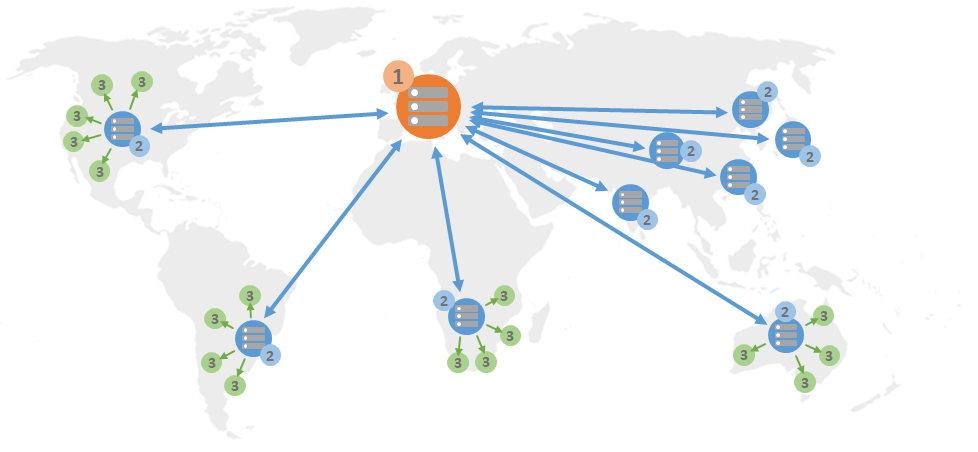
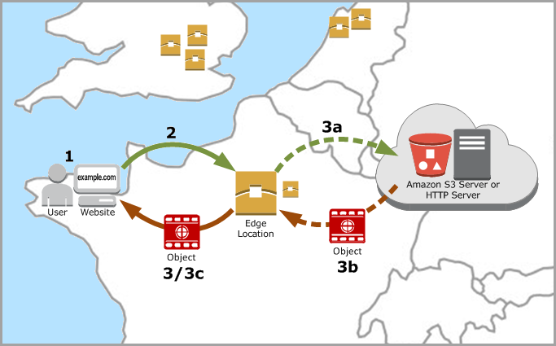

# Serve web content

globally with Lightsail content delivery distributions

A Lightsail distribution uses a globally distributed network of servers, also known as
_edge locations_, to provide faster delivery of your content to your users.
To use a distribution, you first create and host your website or web application on a
Lightsail instance or container service, or multiple instances attached to a Lightsail load
balancer, or store your static content on a Lightsail bucket. You then create and configure a
Lightsail distribution to pull, cache, and serve content from your instance, container
service, load balancer, or bucket. Your instance, container service, load balancer, or bucket,
also known as your distribution's _origin_, is the definitive source of your
content.

When your user requests content by visiting your website, which is being served through a
distribution, the request is routed to the nearest location in terms of latency. Your
distribution then performs one of the following actions:

- If the content is already being cached in the edge location, your distribution
  immediately serves it to your user.
- If the content is not yet being cached in that edge location, your distribution
  retrieves it from the specified origin, caches it, and serves it to your user.
  Your content is cached in edge locations for the duration of the cache lifespan (time to
  live) that you specify for your distribution, so that other requests at the same location are
  immediately fulfilled. Your cached content is cleared from the edge location when it reaches its
  cache lifespan. Your distribution retrieves, caches, and serves content the next time a content
  request is routed to the edge location.

In the following diagram:

- 1 represents the origin of your distribution, such as a Lightsail instance or
  container service that is hosting your website, a load balancer with instances attached to
  it, or a bucket that is hosting your static content.
- 2 represents your distribution, or the edge locations that pull, cache, and serve
  content from your origin.
- 3 represents your users who are served content from the edge locations.

###### Note

This diagram is for illustration purpose only and doesn't show actual edge locations. For
more information about edge locations, see [Edge
locations and IP address ranges](#edge-locations "#edge-locations") later in this guide.

For example, if your website is hosted in France, and a person from another area of France
wants to view your content, the page will load in milliseconds.

When your visitor isn't nearby, things get a little difficult.

If a person from Australia wants to view your content, the browser will have to fetch it
from a server that is located in France and then show it to that user thousands of miles away.
If users from different countries request the same content at the same time, the server becomes
clogged with requests and takes longer to load and serve the content. This affects the speed at
which the content loads for the end user.

A CDN resolves this situation by caching your website content at edge locations. This method
of serving content is faster and more efficient than the traditional method of serving content
from one central resource. When a viewer makes a request on your website or through your
application, DNS routes the request to the location that can best serve the user’s request. Your
users access your content from locations that are nearby, as opposed to all of your users
accessing the same central resource that may be far away.

## Use cases

**Deliver fast, secure websites**

A Lightsail distribution speeds up the delivery of your content (for example,
website pages, images, style sheets, JavaScript, and so on) to viewers
_worldwide_. By using a distribution, you can take advantage of the
AWS backbone network and edge servers to give your viewers a fast, safe, and reliable
experience when they visit your website.

**Improve your site’s security**

Strengthen your website and increase its performance by taking advantage of TLS
termination, which reduces the load on your origin by offloading the cryptographic
processing to your distribution. You can use your registered domain name together with a
Lightsail SSL/TLS certificate to enable Hypertext Transfer Protocol Secure (HTTPS) for
your distribution. Your users establish an encrypted HTTPS connection to your
distribution, while your distribution pulls content from your origin using HTTP.

**Application optimization**

Easily optimize your distributions for a variety of applications, including
WordPress and static websites. Using a distribution to cache and serve your content also
reduces the load on your origin, because most requests are served by your distribution
and not your instance, container service, load balancer, or bucket.

## Configure your distribution

These are the general steps to follow to serve your website or web application using a
Lightsail instance and a distribution.

1. Complete one of the following, depending on whether you want to use an instance,
   container service, or a bucket with your distribution.
   - **Create a Lightsail instance to host your
     content.** The instance serves as the origin of your distribution. The
     origin stores the original, definitive version of your content. For more information,
     see [Create an instance](how-to-create-amazon-lightsail-instance-virtual-private-server-vps.md "how-to-create-amazon-lightsail-instance-virtual-private-server-vps.md").

   Attach a Lightsail static IP to your instance. Your instance's default public IP
   address changes if you stop and start your instance, which will break the connection
   between your distribution and your origin instance. A static IP does not change if you
   stop and start your instance. For more information, see [Create a static IP and attach it to an
   instance](lightsail-create-static-ip.md "lightsail-create-static-ip.md").

   Upload your content and files to your instance. Your files, also known as
   _objects_, typically include web pages, images, and media files,
   but can be anything that can be served over HTTP.
   - **Create a Lightsail container service to host your website
     or web application.** The container service serves as the origin of your
     distribution. The origin stores the original, definitive version of your content. For
     more information, see [Create Amazon Lightsail container services](amazon-lightsail-creating-container-services.md "amazon-lightsail-creating-container-services.md").
   - **Create a Lightsail bucket to store your static
     content.** The bucket serves as the origin of your distribution. The origin
     stores the original, definitive version of your content. For more information, see
     [Create a bucket](amazon-lightsail-creating-buckets.md "amazon-lightsail-creating-buckets.md").

   Upload files to your bucket using the Lightsail console, AWS Command Line Interface (AWS CLI), and
   AWS APIs. For more information about uploading files, see [Upload files to a
   bucket](amazon-lightsail-uploading-files-to-a-bucket.md#amazon-lightsail-uploading-files-to-a-bucket.title "amazon-lightsail-uploading-files-to-a-bucket.md#amazon-lightsail-uploading-files-to-a-bucket.title").

2. **(Optional) Create a Lightsail load balancer if your website
   being hosted on an instance requires fault tolerance.** Then attach multiple
   copies of your instance to your load balancer. You can configure your load balancer (with
   one or more instances attached to it) as the origin of your distribution, instead of
   configuring your instance as the origin. For more information, see [Create a load
   balancer and attach instances to it](create-lightsail-load-balancer-and-attach-lightsail-instances.md "create-lightsail-load-balancer-and-attach-lightsail-instances.md").
3. **Create a Lightsail distribution, and configure your instance,
   container service, load balancer, or bucket as the origin.** At the same time,
   you specify details such as the cache lifespan of your content, and which elements of your
   website or web application are cached. For more information, see [Create a
   distribution](amazon-lightsail-creating-content-delivery-network-distribution.md "amazon-lightsail-creating-content-delivery-network-distribution.md").
4. (Optional) If your distribution's origin is a WordPress instance, you must edit the
   WordPress configuration file in your instance to make your WordPress website work with
   your distribution. For more information, see [Configure your WordPress
   instance to work with your distribution](amazon-lightsail-editing-wp-config-for-distribution.md "amazon-lightsail-editing-wp-config-for-distribution.md").
5. **(Optional) Create a Lightsail DNS zone to manage your domain's
   DNS in the Lightsail console.** This allows you to easily map your domain to
   your Lightsail resources. For more information, see [Create a DNS zone to manage your domain’s
   DNS records](lightsail-how-to-create-dns-entry.md "lightsail-how-to-create-dns-entry.md"). Alternately, you can continue hosting your domain's DNS where it's
   currently being hosted.
6. **Create a Lightsail SSL/TLS certificate for your domain to use
   it with your distribution.** Lightsail distributions require HTTPS, so you
   must request an SSL/TLS certificate for your domain before you can use it with your
   distribution. For more information, see [Create SSL/TLS certificates
   for your distribution](amazon-lightsail-create-a-distribution-certificate.md "amazon-lightsail-create-a-distribution-certificate.md").
7. **Enable custom domains for your distribution to use your
   registered domain names with your distributions.** Enabling custom domains
   requires that you specify the Lightsail SSL/TLS certificate that you created for your
   domains. This adds your domains to your distribution and enables HTTPS. For more
   information, see [Enable custom domains for your distribution](amazon-lightsail-enabling-distribution-custom-domains.md "amazon-lightsail-enabling-distribution-custom-domains.md").
8. **Add an alias record to your domain's DNS to begin routing
   traffic for your domain to your distribution.** After you add the alias record,
   users who visit your domain are routed through your distribution. For more information,
   see [Point your domain to a
   distribution](amazon-lightsail-point-domain-to-distribution.md "amazon-lightsail-point-domain-to-distribution.md").
9. **Test that your distribution is caching your content.**
   For more information, see [Test your
   distribution](amazon-lightsail-testing-distribution.md "amazon-lightsail-testing-distribution.md").

## Edge locations and IP address ranges

Lightsail distributions use the same edge servers and IP address ranges as Amazon CloudFront. For
a list of the locations of CloudFront edge servers, see the [Amazon CloudFront Product Details page](http://aws.amazon.com/cloudfront/details "http://aws.amazon.com/cloudfront/details"). For a
list of the CloudFront IP ranges, see the [CloudFront global IP
list](http://d7uri8nf7uskq.cloudfront.net/tools/list-cloudfront-ips "http://d7uri8nf7uskq.cloudfront.net/tools/list-cloudfront-ips").
