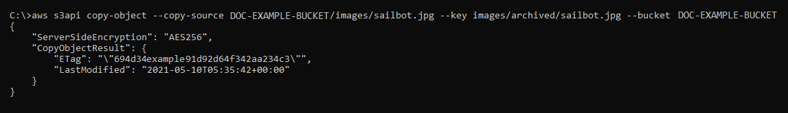

# Copy and move objects between Lightsail buckets

You can copy objects that are already stored in your bucket in the Amazon Lightsail object
storage service. In this guide, we show you how to copy objects using the Lightsail console
and using the AWS Command Line Interface (AWS CLI). Copy objects in your bucket to create duplicate copies of
objects, rename objects, or move objects across Lightsail locations (for example, moving
objects from one AWS Region to another one, in which Lightsail is available). You can copy
objects across locations only using the AWS APIs, AWS SDKs, and AWS Command Line Interface (AWS CLI).

For more information about buckets, see [Object
storage](buckets-in-amazon-lightsail.md "buckets-in-amazon-lightsail.md").

## Restrictions for copying

objects

You can create a copy of an object that is up to 2 GB in size by using the Lightsail
console. You can create a copy of an object that is up to 5 GB in size with a single copy
object action by using the AWS Command Line Interface (AWS CLI), AWS APIs, and AWS SDKs. To copy an object
that is greater than 5 GB in size, you must use the multipart upload action of the AWS CLI,
AWS APIs, and AWS SDKs. For more information, see [Upload files
to a bucket using multipart upload](amazon-lightsail-uploading-files-to-a-bucket-using-multipart-upload.md "amazon-lightsail-uploading-files-to-a-bucket-using-multipart-upload.md").

## Copy objects using the

Lightsail console

Complete the following procedure to copy an object stored in a bucket using the
Lightsail console. To move an object in a bucket, you should copy it to the new location,
and delete the original object.

1. Sign in to the [Lightsail console](https://lightsail.aws.amazon.com/ "https://lightsail.aws.amazon.com/").
2. In the left navigation pane, choose **Storage**.
3. Choose the name of the bucket for which you want to copy an object.
4. In the **Objects** tab, use the **Objects browser
   pane** to browse to the location of the object that you want to copy.
5. Add a check mark next to the object that you want to copy.
6. In the **Object information** pane, choose the actions (⋮) menu, and
   then choose **Copy to**.
7. In the **Select destination** pane that appears, browse to the
   location in the bucket where you want to copy the selected object. You can also create a
   new path by entering folder names into the **Destination path** text
   box.
8. Choose **Copy** to copy the object to the selected or specified
   destination. Otherwise, choose **No, cancel**.

A **Copy complete** message is displayed when the object is
successfully copied. You should delete the original object if your intent was to move the
object. For more information, see [Delete bucket objects](amazon-lightsail-deleting-bucket-objects.md "amazon-lightsail-deleting-bucket-objects.md").

## Copy objects using the AWS CLI

Complete the following procedure to copy objects in a bucket using the AWS Command Line Interface (AWS CLI).
You do this by using the `copy-object` command. For more information, see [copy-object](../../../cli/latest/reference/s3api/copy-object.md "../../../cli/latest/reference/s3api/copy-object.md") in the _AWS CLI Command Reference_.

###### Note

You must install the AWS CLI and configure it for Lightsail and Amazon S3 before continuing
with this procedure. For more information, see [Configure the AWS CLI to work with
Lightsail](lightsail-how-to-set-up-and-configure-aws-cli.md "lightsail-how-to-set-up-and-configure-aws-cli.md").

1. Open a Command Prompt or Terminal window.
2. Enter the following command to copy an object in your bucket.

```
aws s3api copy-object --copy-source `SourceBucketNameAndObjectKey` --key `DestinationObjectKey` --bucket `DestinationBucketName` --acl bucket-owner-full-control
```

In the command, replace the following example text with your own:

    * `SourceBucketNameAndObjectKey` - The name of the bucket
     in which the source object currently exists, and the full object key of the object to
     be copied. For example, to copy the object `images/sailbot.jpg` from the
     bucket `amzn-s3-demo-bucket`, specify
     `amzn-s3-demo-bucket/images/sailbot.jpg`.
    * `DestinationObjectKey` - The full object key of the new
     object copy.
    * `DestinationBucket` - The name of the destination
     bucket.

Examples:

    * Copying an object in a bucket to the same bucket:


    ```
    aws s3api copy-object --copy-source `amzn-s3-demo-bucket1/images/sailbot.jpg` --key `media/sailbot.jpg` --bucket `amzn-s3-demo-bucket` --acl bucket-owner-full-control
    ```
    * Copying an object from one bucket to another bucket:


    ```
    aws s3api copy-object --copy-source `amzn-s3-demo-bucket1/images/sailbot.jpg` --key `images/sailbot.jpg` --bucket `amzn-s3-demo-bucket2` --acl bucket-owner-full-control
    ```

You should see a result similar to the following example:



## Manage buckets and

objects

These are the general steps to manage your Lightsail object storage bucket:

1. Learn about objects and buckets in the Amazon Lightsail object storage service. For more
   information, see [Object storage in
   Amazon Lightsail](buckets-in-amazon-lightsail.md "buckets-in-amazon-lightsail.md").
2. Learn about the names that you can give your buckets in Amazon Lightsail. For more
   information, see [Bucket naming rules
   in Amazon Lightsail](bucket-naming-rules-in-amazon-lightsail.md "bucket-naming-rules-in-amazon-lightsail.md").
3. Get started with the Lightsail object storage service by creating a bucket. For more
   information, see [Creating buckets in
   Amazon Lightsail](amazon-lightsail-creating-buckets.md "amazon-lightsail-creating-buckets.md").
4. Learn about security best practices for buckets and the access permissions that you can
   configure for your bucket. You can make all objects in your bucket public or private, or you
   can choose to make individual objects public. You can also grant access to your bucket by
   creating access keys, attaching instances to your bucket, and granting access to other AWS
   accounts. For more information, see [Security Best Practices for
   Amazon Lightsail object storage](amazon-lightsail-bucket-security-best-practices.md "amazon-lightsail-bucket-security-best-practices.md") and [Understanding bucket
   permissions in Amazon Lightsail](amazon-lightsail-understanding-bucket-permissions.md "amazon-lightsail-understanding-bucket-permissions.md").

After learning about bucket access permissions, see the following guides to grant access
to your bucket:

    * [Block public access
     for buckets in Amazon Lightsail](amazon-lightsail-block-public-access-for-buckets.md "amazon-lightsail-block-public-access-for-buckets.md")
    * [Configuring bucket
     access permissions in Amazon Lightsail](amazon-lightsail-configuring-bucket-permissions.md "amazon-lightsail-configuring-bucket-permissions.md")
    * [Configuring
     access permissions for individual objects in a bucket in Amazon Lightsail](amazon-lightsail-configuring-individual-object-access.md "amazon-lightsail-configuring-individual-object-access.md")
    * [Creating access keys
     for a bucket in Amazon Lightsail](amazon-lightsail-creating-bucket-access-keys.md "amazon-lightsail-creating-bucket-access-keys.md")
    * [Configuring
     resource access for a bucket in Amazon Lightsail](amazon-lightsail-configuring-bucket-resource-access.md "amazon-lightsail-configuring-bucket-resource-access.md")
    * [Configuring
     cross-account access for a bucket in Amazon Lightsail](amazon-lightsail-configuring-bucket-cross-account-access.md "amazon-lightsail-configuring-bucket-cross-account-access.md")

5. Learn how to enable access logging for your bucket, and how to use access logs to audit
   the security of your bucket. For more information, see the following guides.
   - [Access logging for buckets in the
     Amazon Lightsail object storage service](amazon-lightsail-bucket-access-logs.md "amazon-lightsail-bucket-access-logs.md")
   - [Access log format for a bucket in
     the Amazon Lightsail object storage service](amazon-lightsail-bucket-access-log-format.md "amazon-lightsail-bucket-access-log-format.md")
   - [Enabling access logging for a
     bucket in the Amazon Lightsail object storage service](amazon-lightsail-enabling-bucket-access-logs.md "amazon-lightsail-enabling-bucket-access-logs.md")
   - [Using access logs for a bucket in
     Amazon Lightsail to identify requests](amazon-lightsail-using-bucket-access-logs.md "amazon-lightsail-using-bucket-access-logs.md")

6. Create an IAM policy that grants a user the ability to manage a bucket in Lightsail.
   For more information, see [IAM
   policy to manage buckets in Amazon Lightsail](amazon-lightsail-bucket-management-policies.md "amazon-lightsail-bucket-management-policies.md").
7. Learn about the way that objects in your bucket are labeled and identified. For more
   information, see [Understanding object key names in Amazon Lightsail](understanding-bucket-object-key-names-in-amazon-lightsail.md "understanding-bucket-object-key-names-in-amazon-lightsail.md").
8. Learn how to upload files and manage objects in your buckets. For more information, see
   the following guides.
   - [Uploading files to a
     bucket in Amazon Lightsail](amazon-lightsail-uploading-files-to-a-bucket.md "amazon-lightsail-uploading-files-to-a-bucket.md")
   - [Uploading files to a bucket in Amazon Lightsail using multipart upload](amazon-lightsail-uploading-files-to-a-bucket-using-multipart-upload.md "amazon-lightsail-uploading-files-to-a-bucket-using-multipart-upload.md")
   - [Viewing objects in a
     bucket in Amazon Lightsail](amazon-lightsail-viewing-objects-in-a-bucket.md "amazon-lightsail-viewing-objects-in-a-bucket.md")
   - [Copying or moving
     objects in a bucket in Amazon Lightsail](amazon-lightsail-copying-moving-bucket-objects.md "amazon-lightsail-copying-moving-bucket-objects.md")
   - [Downloading objects from
     a bucket in Amazon Lightsail](amazon-lightsail-downloading-bucket-objects.md "amazon-lightsail-downloading-bucket-objects.md")
   - [Filtering objects in a
     bucket in Amazon Lightsail](amazon-lightsail-filtering-bucket-objects.md "amazon-lightsail-filtering-bucket-objects.md")
   - [Tagging objects in a bucket
     in Amazon Lightsail](amazon-lightsail-tagging-bucket-objects.md "amazon-lightsail-tagging-bucket-objects.md")
   - [Deleting objects in a
     bucket in Amazon Lightsail](amazon-lightsail-deleting-bucket-objects.md "amazon-lightsail-deleting-bucket-objects.md")

9. Enable object versioning to preserve, retrieve, and restore every version of every
   object stored in your bucket. For more information, see [Enabling and suspending
   object versioning in a bucket in Amazon Lightsail](amazon-lightsail-managing-bucket-object-versioning.md "amazon-lightsail-managing-bucket-object-versioning.md").
10. After enabling object versioning, you can restore previous versions of objects in your
    bucket. For more information, see [Restoring previous versions of
    objects in a bucket in Amazon Lightsail](amazon-lightsail-restoring-bucket-object-versions.md "amazon-lightsail-restoring-bucket-object-versions.md").
11. Monitor the utilization of your bucket. For more information, see [Viewing metrics for your bucket in
    Amazon Lightsail](amazon-lightsail-viewing-bucket-metrics.md "amazon-lightsail-viewing-bucket-metrics.md").
12. Configure an alarm for bucket metrics to be notified when the utilization of your bucket
    crosses a threshold. For more information, see [Creating bucket metric alarms in
    Amazon Lightsail](amazon-lightsail-adding-bucket-metric-alarms.md "amazon-lightsail-adding-bucket-metric-alarms.md").
13. Change the storage plan of your bucket if it's running low on storage and network
    transfer. For more information, see [Changing the plan of your bucket in Amazon Lightsail](amazon-lightsail-changing-bucket-plans.md "amazon-lightsail-changing-bucket-plans.md").
14. Learn how to connect your bucket to other resources. For more information, see the
    following tutorials.
    - [Tutorial:
      Connecting a WordPress instance to an Amazon Lightsail bucket](amazon-lightsail-connecting-buckets-to-wordpress.md "amazon-lightsail-connecting-buckets-to-wordpress.md")
    - [Tutorial: Using an
      Amazon Lightsail bucket with a Lightsail content delivery network
      distribution](amazon-lightsail-using-distributions-with-buckets.md "amazon-lightsail-using-distributions-with-buckets.md")

15. Delete your bucket if you're no longer using it. For more information, see [Deleting buckets in
    Amazon Lightsail](amazon-lightsail-deleting-buckets.md "amazon-lightsail-deleting-buckets.md").
