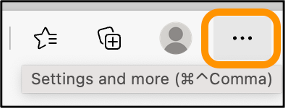

# Create HAR files to troubleshoot Lightsail issues

If you're experiencing difficulties with the Amazon Lightsail console or a Lightsail
virtual private server (VPS), Support might ask you to submit a HAR file from your web browser. A
HAR file contains critical information that can help troubleshoot common, and hard to diagnose
issues. The HAR file also allows Support to investigate or replicate these
issues.

###### Important

HAR files can capture sensitive information, such as user names, passwords, and keys. Be
sure to remove any sensitive information from a HAR file before you share it.

In this guide, you will learn how to create a HAR file from your web browser. An HTTP
Archive (HAR) file is a JSON file that contains the latest network activity recorded by your
browser. Follow this step-by-step procedure to create a HAR file.

**Contents**

- [Step 1: Create a HAR file in
  your browser](#create-a-har-file-in-browser "#create-a-har-file-in-browser")
- [Step 2: Edit the HAR file to remove
  sensitive information](#edit-har-file "#edit-har-file")
- [Step 3: Submit the HAR file for
  review](#submit-har-file "#submit-har-file")

## Step 1: Create a HAR file in your

browser

###### Note

These instructions were last tested on Google Chrome version 101.0.4951.64, Microsoft
Edge (Chromium) version 101.0.1210.47, and Mozilla Firefox version 91.9. Because these
browsers are third-party products, these instructions might not match the experience in the
latest versions or in the version that you use. In another browser, such as legacy Microsoft
Edge (EdgeHTML) or Apple Safari for macOS, the process to generate a HAR file might be
similar, but the steps will be different.

**Google Chrome**

1. In the browser, at the top right, choose **Customize and control Google
   Chrome**.

 2. Pause on **More tools**, and then choose **Developer
tools**. 3. With DevTools open in the browser, choose the **Network**
panel. 4. Select the **Preserve log** check box. 5. Choose **Clear** to clear all current network requests. 6. Reproduce the issue you are facing 7. In DevTools, open the context (right-click) menu on any network request. 8. Choose **Save all as HAR with content**, and then save the
file.

For more information, see [Open Chrome
DevTools](https://developers.google.com/web/tools/chrome-devtools/open "https://developers.google.com/web/tools/chrome-devtools/open") and [Save all network requests to a HAR file](https://developers.google.com/web/tools/chrome-devtools/network/reference#save-as-har "https://developers.google.com/web/tools/chrome-devtools/network/reference#save-as-har") on the Google Developers website.

**Microsoft Edge (Chromium)**

1. In the browser, at the top right, choose **Settings and
   more**.

 2. Pause on **More tools**, and then choose **Developer
tools**. 3. With DevTools open in the browser, choose the **Network**
panel. 4. Select the **Preserve log** check box. 5. Choose **Clear** to clear all current network requests. 6. Reproduce the issue you are facing 7. In DevTools, open the context (right-click) menu on any network request. 8. Choose **Save all as HAR with content**, and then save the
file.

**Mozilla Firefox**

1. In the browser, at the top right, choose **Open Application
   Menu**.

 2. Choose **More tools**, and then choose **Web Developer
tools**. 3. In the **Web Developer** menu, choose **Network**.
(In some versions of Firefox, the **Web Developer** menu is in the
**Tools** menu.) 4. Choose the gear icon, and then select **Persist Logs**. 5. Choose the trash can icon (**Clear**) to clear all current network
requests. 6. Reproduce the issue you are facing. 7. In the Network Monitor, open the context menu (right-click) on any network request in
the request list. 8. Choose **Save All As HAR**, and then save the file.

## Step 2: Edit the HAR file to remove sensitive

information

1. Open the HAR file in a text editor application.
2. Use the text editor's Find and Replace tools to identify and replace all sensitive
   information captured in the HAR file. This includes any user names, passwords, and keys
   that you entered in your browser while creating the file.
3. Save the edited HAR file with the sensitive information removed.

## Step 3: Submit the HAR file for review

1. In the [AWS Support Center Console](https://aws.amazon.com/support "https://aws.amazon.com/support"), under
   **Open support cases**, choose your support case.
2. In your support case, choose your preferred contact option, attach the edited HAR
   file, and then submit.
