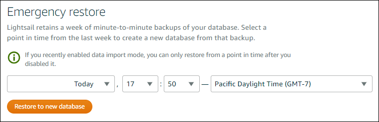
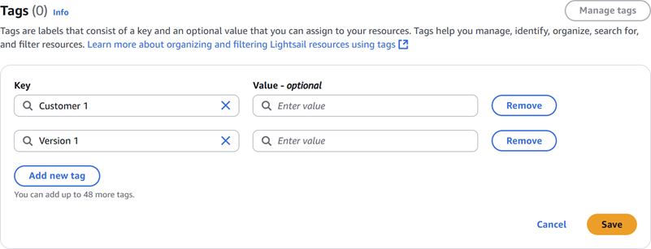
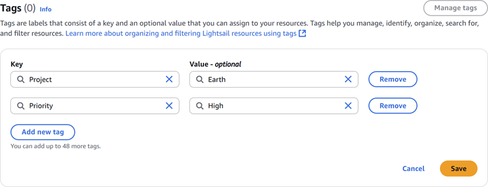

# Restore a

database from a point-in-time backup in Lightsail

You can create a new managed database by using a point-in-time backup in Amazon Lightsail.
Point-in-time backups of your database are available in 5-minute increments, and for the
previous seven days. This gives you the ability to restore a failed database to a specific date
and time in the last week.

You can also create a new database from a snapshot. For more information, see [Creating a database from a
snapshot in Amazon Lightsail](amazon-lightsail-creating-a-database-from-snapshot.md "amazon-lightsail-creating-a-database-from-snapshot.md").

###### To create a database from a point-in-time backup

1. Sign in to the [Lightsail console](https://lightsail.aws.amazon.com/ "https://lightsail.aws.amazon.com/").
2. In the left navigation pane, choose **Databases**.
3. Choose the name of the database for which you want to change plans.
4. Choose the **Snapshots and restore** tab.
5. Under the **Emergency restore** section, select the date and time of
   the backup that you want to use for your new database.

 6. Choose **Restore to new database**. 7. On the **Create a new database** page, choose **Change
zone** to select a different Availability Zone. Your new database is then created
in the same AWS Region as the snapshot that you selected earlier. 8. Choose your new database plan.

Pick a high availability or a standard database plan. A database created with a high
availability plan has a primary database and a secondary standby database in another
Availability Zone for failover support. For more information, see [High availability
databases](amazon-lightsail-high-availability-databases.md "amazon-lightsail-high-availability-databases.md").

###### Note

You cannot choose a database plan that is smaller than the plan of the original
database. 9. Enter a name for your database.

Resource names:

    * Must be unique within each AWS Region in your Lightsail account.
    * Must contain 2 to 255 characters.
    * Must start and end with an alphanumeric character or number.
    * Can include alphanumeric characters, numbers, periods, dashes, and
     underscores.

10. Choose one of the following options to add tags to your database:
    - **Add key-only tags** or **Manage tags**
      (if tags have already been added). Enter your new tag into the tag key text box, and
      press **Enter**. Choose **Save** when you’re done
      entering your tags to add them, or choose **Cancel** to not add
      them.

    
    - **Create a key-value tag**, then enter a key into the
      **Key** text box, and a value into the **Value**
      text box. Choose **Save** when you’re done entering your tags, or
      choose **Cancel** to not add them.

    Key-value tags can only be added one at a time before saving. To add more than one
    key-value tag, repeat the previous steps.

    

###### Note

For more information about key-only and key-value tags, see [Tags](amazon-lightsail-tags.md "amazon-lightsail-tags.md"). 11. Choose **Create database**.

Within minutes, your new Lightsail database is ready with the new database plan or
bundle.

## Next steps

Complete the following actions after your new database is up and running:

- Delete the original database if you no longer need it. For more information, see [Delete your database](amazon-lightsail-deleting-your-database.md "amazon-lightsail-deleting-your-database.md").
- Databases created from a point-in-time backup are configured to use a strong password
  created by Lightsail. For more information, see [Manage your database
  password](amazon-lightsail-managing-database-password.md "amazon-lightsail-managing-database-password.md").
