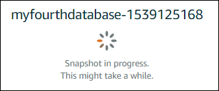
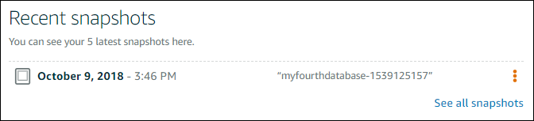

# Back up your Lightsail

database with snapshots

You can create a snapshot of your managed database in Amazon Lightsail. A snapshot is a copy
of your database that you can use to restore it if something goes wrong. You can also use a
snapshot to create a new database using a different plan, such as a high availability or
standard plan.

When you create a snapshot of a standard database, the database becomes unavailable from a
few seconds to a few minutes, depending on the size. High availability databases are not
affected by snapshot operations because the snapshot is created using the standby
database.

###### To create a snapshot of your database

1. Sign in to the [Lightsail console](https://lightsail.aws.amazon.com/ "https://lightsail.aws.amazon.com/").
2. In the left navigation pane, choose **Databases**.
3. Choose the name of the database for which you want to create a snapshot.
4. Choose the **Snapshots & restore** tab.
5. Under the **Manual snapshots** section of the page, choose
   **Create snapshot**, then enter a name for your snapshot.

Resource names:

    * Must be unique within each AWS Region in your Lightsail account.
    * Must contain 2 to 255 characters.
    * Must start and end with an alphanumeric character or number.
    * Can include alphanumeric characters, numbers, periods, dashes, and
     underscores.

6. Choose **Create**.

The snapshot creation process begins and a status of **Snapshot in
progress** is shown.

After the snapshot creation process is complete, the new snapshot is listed under the
**Recent snapshots** section. You can also view all of the snapshots for
your account in the Lightsail home page, under the **Snapshots**
tab.

## Next steps

After your snapshot is ready, you can create a new database from the snapshot, which is a
duplicate of the original database. For more information, see [Create a database from a
snapshot](amazon-lightsail-creating-a-database-from-snapshot.md "amazon-lightsail-creating-a-database-from-snapshot.md").

###### Topics

- [Restore database](amazon-lightsail-creating-a-database-from-point-in-time-backup.md "amazon-lightsail-creating-a-database-from-point-in-time-backup.md")
- [Create database from snapshot](amazon-lightsail-creating-a-database-from-snapshot.md "amazon-lightsail-creating-a-database-from-snapshot.md")
