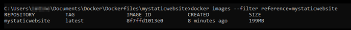
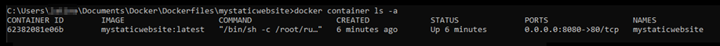
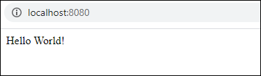

# Build and test Docker images for

Lightsail container services

With Docker, you can build, run, test, and deploy distributed applications that are based on
containers. Amazon Lightsail container services use Docker container images in deployments to
launch containers.

In this guide, we show you how to create a container image on your local machine using a
Dockerfile. After your image is created, you can then push it to your Lightsail container
service to deploy it.

To complete the procedures in this guide you should possess a basic understanding of what
Docker is and how it works. For more information about Docker, see [What is Docker?](https://aws.amazon.com/docker/ "https://aws.amazon.com/docker/") and the [Docker overview](https://docs.docker.com/get-started/overview/ "https://docs.docker.com/get-started/overview/").

**Contents**

- [Step 1: Complete the
  prerequisites](#create-container-image-prerequisite "#create-container-image-prerequisite")
- [Step 2: Create a
  Dockerfile and build a container image](#create-container-image-create-dockerfile "#create-container-image-create-dockerfile")
- [Step 3: Run your new
  container image](#create-container-image-run-container "#create-container-image-run-container")
- [(Optional) Step 4: Clean up
  the containers running on your local machine](#create-container-image-cleanup "#create-container-image-cleanup")
- [Next steps after
  creating container images](#create-container-image-next-steps "#create-container-image-next-steps")

## Step 1: Complete the

prerequisites

Before you get started, you must install the software required to create containers and
then push them to your Lightsail container service. For example, you must install and use
Docker to create and build your container images that you can then use with your Lightsail
container service. For more information, see [Installing software to manage container images for your Amazon Lightsail container
services](amazon-lightsail-install-software.md "amazon-lightsail-install-software.md").

## Step 2: Create a Dockerfile and

build a container image

Complete the following procedure to create a Dockerfile, and build a
`mystaticwebsite` Docker container image from it. The container image will be for
a simple static website hosted on an Apache web server on Ubuntu.

1. Create a `mystaticwebsite` folder on your local machine where you will
   store your Dockerfile.
2. Create a Dockerfile in the folder you just created.

The Dockerfile does not use a file extension, such as `.TXT`. The full file
name is `Dockerfile`. 3. Copy one of the following code blocks depending on how you want to configure your
container image, and paste it into your Dockerfile:

    * **If you want to create a simple static website container
     image with a Hello World message**, then copy the following code block and
     paste it into your Dockerfile. This code sample uses the Ubuntu 18.04 image. The
     `RUN` instructions updates the package caches, and installs and
     configures Apache, and prints a Hello World message to the web server's document root.
     The `EXPOSE` instruction exposes port 80 on the container, and the
     `CMD` instruction starts the web server.


    ```
    FROM ubuntu:18.04

    # Install dependencies
    RUN apt-get update && \
     apt-get -y install apache2

    # Write hello world message
    RUN echo 'Hello World!' > /var/www/html/index.html

    # Open port 80
    EXPOSE 80

    # Start Apache service
    CMD ["/usr/sbin/apache2ctl", "-D", "FOREGROUND"]
    ```
    * **If you want to use your own set of HTML files for your
     static website container image**, create an `html` folder in the
     same folder where you store your Dockerfile. Then put your HTML files in that
     folder.


    After your HTML files are in the `html` folder, copy the following code
     block and paste into to your Dockerfile. This code sample uses the Ubuntu 18.04 image.
     The `RUN` instructions updates the package caches, and installs and
     configures Apache. The `COPY` instruction copies the contents of the html
     folder to the web server's document root. The `EXPOSE` instruction exposes
     port 80 on the container, and the `CMD` instruction starts the web
     server.


    ```
    FROM ubuntu:18.04

    # Install dependencies
    RUN apt-get update && \
     apt-get -y install apache2

    # Copy html directory files
    COPY html /var/www/html/

    # Open port 80
    EXPOSE 80

    CMD ["/usr/sbin/apache2ctl", "-D", "FOREGROUND"]
    ```

4. Open a command prompt or terminal window and change the directory to the folder in
   which you are storing your Dockerfile.
5. Enter the following command to build your container image using the Dockerfile in the
   folder. This command builds a new Docker container image named
   `mystaticwebsite`.

```
docker build -t mystaticwebsite .
```

You should see a message that confirms your image was successfully built. 6. Enter the following command to view the container images on your local machine.

```
docker images --filter reference=mystaticwebsite
```

You should see a result similar to the following example, showing the new container
image created.



Your newly built container image is ready to be tested by using it to run a new
container on your local machine. Continue to the next [Step 3: Run your new
container image](#create-container-image-run-container "#create-container-image-run-container") section of this guide.

## Step 3: Run your new container

image

Complete the following steps to run the new container image you created.

1. In a command prompt or terminal window, enter the following command to run the
   container image that you built in the previous [Step 2: Create a
   Dockerfile and build a container image](#create-container-image-create-dockerfile "#create-container-image-create-dockerfile") section of this guide. The `-p
8080:80` option maps the exposed port 80 on the container to port 8080 on your
   local machine. The `-d` option specifies that the container should run in
   detached mode.

```
docker container run -d -p 8080:80 --name mystaticwebsite mystaticwebsite:latest
```

2. Enter the following command to view your running containers.

```
docker container ls -a
```

You should see a result similar to the following example, showing the new running
container.

 3. To confirm that the container is up and running, open a new browser window and browse
to `http://localhost:8080`. You should see a message similar to the following
example. This confirms that your container is up and running on your local machine.



Your newly built container image is ready to be pushed to your Lightsail account so
that you can deploy it to your Lightsail container service. For more information, see
[Pushing and managing container
images on your Amazon Lightsail container services](amazon-lightsail-pushing-container-images.md "amazon-lightsail-pushing-container-images.md").

## (Optional) Step 4: Clean up the containers

running on your local machine

Now that you've created a container image that you can push to your Lightsail container
service, it's time to clean up the containers that are running on your local machine as a
result of following the procedures in this guide.

Complete the following steps to clean up the containers running on your local
machine:

1. Run the following command to view the containers that are running on your local
   machine.

```
docker container ls -a
```

You should see a result similar to the following, which lists the names of the
containers running on your local machine.

 2. Run the following command to remove the running container that you created earlier in
this guide. This forces the container to be stopped, and permanently deletes it.

```
docker container rm <ContainerName> --force
```

In the command, replace <ContainerName> with the name of the container you want
to stop, and delete.

Example:

```
docker container rm `mystaticwebsite` --force
```

The container that was created as a result of this guide should now be deleted.

## Next steps after creating container

images

After you create your container images, push them to your Lightsail container service
when you're ready to deploy them. For more information, see [Manage Lightsail container service
images](amazon-lightsail-pushing-container-images.md "amazon-lightsail-pushing-container-images.md").

###### Topics

- [Manage container images](amazon-lightsail-pushing-container-images.md "amazon-lightsail-pushing-container-images.md")
- [Install container services plugin](amazon-lightsail-install-software.md "amazon-lightsail-install-software.md")
- [ECR private repository access](amazon-lightsail-container-service-ecr-private-repo-access.md "amazon-lightsail-container-service-ecr-private-repo-access.md")
