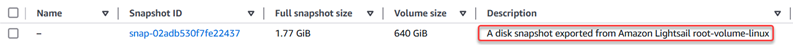

# Create Amazon Elastic Block Store

volumes from exported Lightsail disk snapshots

After a Lightsail block storage disk snapshot is exported and available in Amazon EC2 (as an
EBS snapshot), you can create an EBS volume from the snapshot using the Amazon EC2 console.

###### Note

To create EC2 instances from exported instance snapshots, see [Creating
Amazon EC2 instances from exported snapshots in Lightsail](amazon-lightsail-creating-ec2-instances-from-exported-snapshots.md#amazon-lightsail-creating-ec2-instances-from-exported-snapshots.title "amazon-lightsail-creating-ec2-instances-from-exported-snapshots.md#amazon-lightsail-creating-ec2-instances-from-exported-snapshots.title").

You can also create new EBS volumes using the Amazon EC2 API, AWS CLI, or SDKs. For more
information, see [Launch an
Instance Using the Launch Instance Wizard](../../../AWSEC2/latest/UserGuide/launching-instance.md "../../../AWSEC2/latest/UserGuide/launching-instance.md") or [Restoring
an Amazon EBS Volume from a Snapshot](../../../AWSEC2/latest/UserGuide/ebs-restoring-volume.md "../../../AWSEC2/latest/UserGuide/ebs-restoring-volume.md") in the Amazon EC2 documentation.

###### Important

We recommend getting familiar with the Lightsail export process before completing the
steps in this guide. For more information, see [Export snapshots to Amazon EC2](amazon-lightsail-exporting-snapshots.md "amazon-lightsail-exporting-snapshots.md").

## Prerequisites

Export a Lightsail block storage disk snapshot to Amazon EC2. For more information, see [Export snapshots to
Amazon EC2](amazon-lightsail-exporting-snapshots-to-amazon-ec2.md "amazon-lightsail-exporting-snapshots-to-amazon-ec2.md").

## Create an EBS volume from an

exported Lightsail block storage disk snapshot

Use the Amazon EC2 console to create a new EBS volume from an exported Lightsail block
storage disk snapshot.

###### Note

These steps are also in the Amazon EC2 documentation. To learn more, see [Restoring an Amazon EBS Volume from a Snapshot](../../../AWSEC2/latest/UserGuide/ebs-restoring-volume.md "../../../AWSEC2/latest/UserGuide/ebs-restoring-volume.md") in the Amazon EC2
documentation.

###### To create an EBS volume from an exported Lightsail block storage disk

snapshot

1. Sign in to the [Amazon EC2 console](https://console.aws.amazon.com/ec2/ "https://console.aws.amazon.com/ec2/").
2. From the navigation bar, select the region that your snapshot is located in.
3. In the left navigation pane, under **Elastic Block Store**, choose
   **Snapshots**.
4. Locate and select the exported Lightsail block storage disk snapshot.

Exported disk snapshot can be identified by the _A disk snapshot exported
from Amazon Lightsail_ description of the EBS snapshot as shown in the
following screenshot:

 5. Choose **Actions**, then choose **Create
Volume**. 6. Choose a volume type from the **Volume Type** drop-down menu. For
more information, see [Amazon EBS
Volume Types](../../../AWSEC2/latest/UserGuide/EBSVolumeTypes.md "../../../AWSEC2/latest/UserGuide/EBSVolumeTypes.md") in the Amazon EC2 documentation. 7. For **Size (GiB)**, type the size of the volume, or verify that the
default size of the snapshot is adequate. 8. With a Provisioned IOPS SSD volume, for **IOPS**, type the maximum
number of input/output operations per second (IOPS) that the volume should support. 9. For **Availability Zone**, choose the Availability Zone in which to
create the volume. EBS volumes can only be attached to EC2 instances in the same
Availability Zone. 10. (Optional) Choose **Create additional tags** to add tags to the
volume. For each tag, provide a tag key and a tag value. 11. Choose **Create Volume**. After your volume is created, it is listed
in the **Elastic Block Store > Volumes** section of the Amazon EC2
console.
