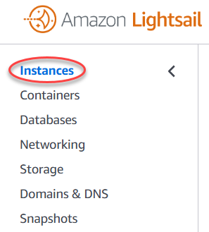
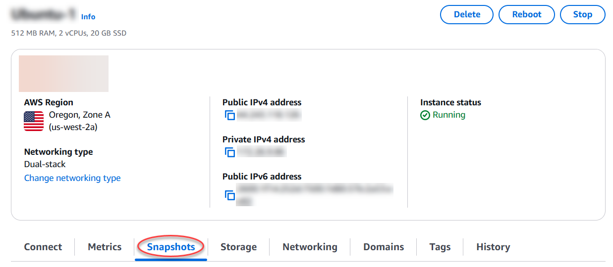
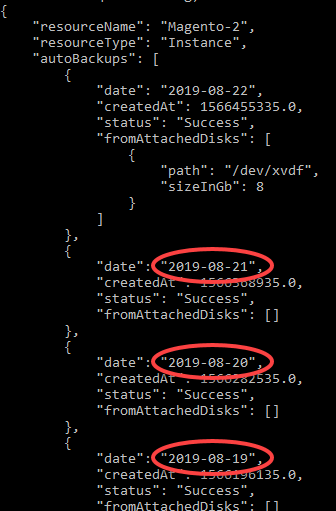
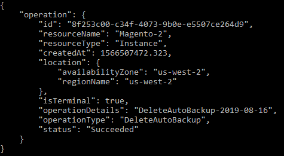

# Delete unused Lightsail

instance and disk snapshots

You can delete automatic snapshots of an instance or block storage disk in Amazon Lightsail
at any time; whether the feature is enabled, or if it's disabled after it had been enabled. You
will be billed the [snapshot storage
fee](https://aws.amazon.com/lightsail/pricing/ "https://aws.amazon.com/lightsail/pricing/") for the automatic snapshots stored on your Lightsail account. Follow the steps
in this guide to delete automatic snapshots if you no longer need them. For example, if you've
[copied an automatic snapshot to a
manual snapshot](amazon-lightsail-keeping-automatic-snapshots.md "amazon-lightsail-keeping-automatic-snapshots.md") and you no longer need the original, or if you've [disabled the automatic snapshots
feature](amazon-lightsail-configuring-automatic-snapshots.md "amazon-lightsail-configuring-automatic-snapshots.md") for your resource and you don't need the existing automatic snapshots that were
kept.

**Contents**

- [Delete automatic
  snapshots restriction](#deleting-automatic-snapshots-restrictions "#deleting-automatic-snapshots-restrictions")
- [Delete
  automatic snapshots of an instance using the Lightsail console](#deleting-automatic-snapshots-using-console "#deleting-automatic-snapshots-using-console")
- [Delete automatic
  snapshots of an instance or block storage disk using the AWS CLI](#deleting-automatic-snapshots-using-cli "#deleting-automatic-snapshots-using-cli")

## Delete automatic snapshots

restriction

Automatic snapshots of block storage disks cannot be deleted using the Lightsail
console. To delete an automatic snapshot of a block storage disk, you must use the Lightsail
API, AWS Command Line Interface (AWS CLI), or SDKs. For more information, see [Delete automatic snapshots of
an instance or block storage disk using the AWS CLI](#deleting-automatic-snapshots-using-cli "#deleting-automatic-snapshots-using-cli").

## Delete automatic snapshots of an

instance using the Lightsail console

Complete the following steps to delete automatic snapshots of an instance using the
Lightsail console.

1. Sign in to the [Lightsail console](https://lightsail.aws.amazon.com/ "https://lightsail.aws.amazon.com/").
2. In the left navigation pane, choose **Instances**.

 3. Choose the name of the instance for which you want to delete automatic
snapshots. 4. On the instance management page, choose the **Snapshots** tab.

 5. Under the **Automatic snapshots** section, choose the ellipsis icon
next to the automatic snapshot that you want to delete, then choose **Delete
snapshot**. 6. At the prompt, choose **Yes** to confirm that you want to delete the
snapshot.

The automatic snapshot is deleted after a few moments.

## Delete automatic snapshots of an

instance or block storage disk using the AWS CLI

Complete the following steps to delete automatic snapshots of an instance or block storage
disk using the AWS CLI.

1. Open a Terminal or Command Prompt window.

If you haven't already, [install the AWS CLI and configure it to work
with Lightsail](lightsail-how-to-set-up-and-configure-aws-cli.md "lightsail-how-to-set-up-and-configure-aws-cli.md"). 2. Enter the following command to get the dates of the available automatic snapshots for
a specific resource. You will need the date of the automatic snapshot to specify as the
`date` parameter in the subsequent command.

```
aws lightsail --region `Region` get-auto-snapshots --resource-name `ResourceName`
```

In the command, replace:

    * `Region` with the AWS Region in which the resource is
     located.
    * `ResourceName` with the name of the resource.

**Example:**

```
aws lightsail --region `us-west-2` get-auto-snapshots --resource-name `MyFirstWordPressWebsite01`
```

You should see a result similar to the following, which lists the available automatic
snapshots:

 3. Enter the following command to delete an automatic snapshot:

```
aws lightsail --region `Region` delete-auto-snapshot --resource-name `ResourceName` --date `YYYY-MM-DD`
```

In the command, replace:

    * `Region` with the AWS Region in which the resource is
     located.
    * `ResourceName` with the name of the resource.
    * `YYYY-MM-DD` with the date of the available auto snapshot
     that you obtained using the preceding command.

**Example:**

```
aws lightsail --region `us-west-2` delete-auto-snapshot --resource-name `MyFirstWordPressWebsite01` --date `2019-09-16`
```

You should see a result similar to the following example:



The automatic snapshot is deleted after a few moments.

###### Note

For more information about the GetAutoSnapshots and DeleteAutoSnapshot API
operations in these commands, see [GetAutoSnapshots](../../2016-11-28/api-reference/API_GetAutoSnapshots.md "../../2016-11-28/api-reference/API_GetAutoSnapshots.md") and [DeleteAutoSnapshot](../../2016-11-28/api-reference/API_DeleteAutoSnapshot.md "../../2016-11-28/api-reference/API_DeleteAutoSnapshot.md") in the Lightsail API documentation.
