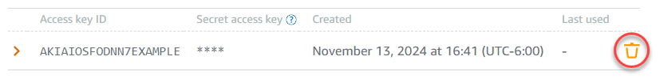

# Delete access keys for a Lightsail object

storage bucket

Access keys are a set of credentials that grant full access to a bucket and its objects.
Access keys consist of an access key ID and a secret access key as a set. If your secret
access key is copied, is lost, or becomes compromised, you should delete your access
key.

## Delete access keys for a bucket

You can use the following procedure to delete a bucket access
key.

###### Warning

After you delete an access key, it's gone forever and can't be restored. You can
only replace it with a new access key.

###### To delete an existing Lightsail object storage bucket access key

1. Sign in to the [Lightsail
   console](https://lightsail.aws.amazon.com/ "https://lightsail.aws.amazon.com/").
2. In the left navigation pane, choose **Storage**.
3. Choose the name of the bucket for which you want to delete an access
   key.
4. Choose the **Permissions** tab.
5. Under **Access keys**, choose the remove icon for the access
   key that you want to delete.

 6. Choose **Yes, delete** to proceed with deleting the access
key.

Once the existing key is deleted, you can create a new access key and configure it for
your software or plugin. For more information, see [Rotate bucket access keys](amazon-lightsail-bucket-security-best-practices.md#bucket-security-best-practices-rotate-bucket-access-keys "amazon-lightsail-bucket-security-best-practices.md#bucket-security-best-practices-rotate-bucket-access-keys").
