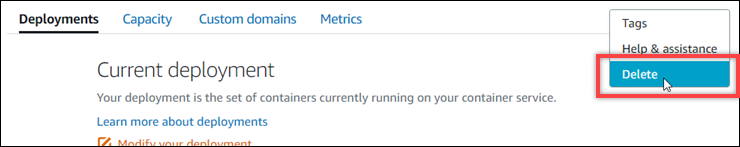

# Delete a Lightsail container

service

You can delete your Amazon Lightsail container service at any time if you're no longer using
it. When you delete your container service, all deployments and registered container images
associated with that service are permanently destroyed. However, the SSL/TLS certificates and
domains that you created remain in your Lightsail account so that you can use them with another
resource. For more information about container services, see [Container services in Amazon
Lightsail](amazon-lightsail-container-services.md "amazon-lightsail-container-services.md").

## Delete a container service

Complete the following procedure to delete your container service.

1. Sign in to the [Lightsail console](https://lightsail.aws.amazon.com/ "https://lightsail.aws.amazon.com/").
2. In the left navigation pane, choose **Containers**.
3. Choose the name of the container service you want to delete.
4. Choose the ellipsis icon in the tab menu, then choose the
   **Delete**.

 5. Choose **Delete container service** to delete your service. 6. In the prompt that appears, choose **Yes, delete** to confirm that
the deletion is permanent.

Your container service is deleted after a few moments.
