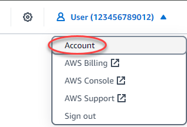

# Delete notification contacts in Lightsail

Delete your email and mobile phone number notification contacts from Amazon Lightsail to stop
receiving email and SMS text message notifications for your Lightsail resources. For more
information about notifications, see [Notifications](amazon-lightsail-notifications.md "amazon-lightsail-notifications.md").

You can also disable, or delete an alarm to stop receiving notifications for a specific
alarm. For more information, see [Delete or disable metric alarms](amazon-lightsail-deleting-health-metric-alarms.md "amazon-lightsail-deleting-health-metric-alarms.md").

**Contents**

- [Deleting
  notification contacts using the Lightsail console](#deleting-notification-contacts-console "#deleting-notification-contacts-console")
- [Deleting notification
  contacts using the AWS CLI](#deleting-notification-contacts-cli "#deleting-notification-contacts-cli")
- [Next steps after
  deleting your notification contacts](#next-steps-deleting-notification-contacts "#next-steps-deleting-notification-contacts")

## Deleting notification contacts using

the Lightsail console

Complete the following steps to delete notification contacts using the Lightsail
console.

1. Sign in to the [Lightsail console](https://lightsail.aws.amazon.com/ "https://lightsail.aws.amazon.com/").
2. On the Lightsail home page, choose your user or role on the top navigation
   menu.
3. Choose **Account** in the drop-down menu.

 4. Choose the delete icon next to the email address or mobile phone number that you want
to delete in the **Notification contacts** section on the
**Profile & contacts** tab. 5. Choose **Yes** to confirm that you want to delete the notification
contact.

## Deleting notification contacts using the

AWS CLI

Complete the following steps to delete notification contacts for Lightsail using the
AWS Command Line Interface (AWS CLI).

1. Open a Terminal or Command Prompt window.

If you haven't already, [install the AWS CLI and configure it to work
with Lightsail](lightsail-how-to-set-up-and-configure-aws-cli.md "lightsail-how-to-set-up-and-configure-aws-cli.md"). 2. Enter the following command to delete a notification contact:

```
aws lightsail delete-contact-method --region `Region` --notificationProtocol `Protocol`
```

In the command, replace:

    * `Region` with the AWS Region in which the notification
     contact should be deleted.
    * `Protocol` with the notification protocol for the contact
     that you want to delete, such as Email or SMS.

Example:

```
aws lightsail delete-contact-method --region `us-west-2` --notificationProtocol `SMS`
```

When you press enter, you will see an operation response with details about your
request.

## Next steps after deleting your

notification contacts

There are a couple of additional tasks that you can perform after deleting your
notification contacts:

- Deleting notification contacts stops email and SMS text messaging notifications, but
  it does not stop notification banners from displaying in the Lightsail console. To stop
  notification banners, and to also stop email and SMS text messaging notifications, disable
  or delete the alarms that are causing them. For more information, see [Delete or disable metric alarms](amazon-lightsail-deleting-health-metric-alarms.md "amazon-lightsail-deleting-health-metric-alarms.md").
- Add your email address and mobile phone number in Lightsail as notification contacts
  to start receiving email and SMS text messaging notifications again. For more information,
  see [Add notification contacts](amazon-lightsail-adding-editing-notification-contacts.md "amazon-lightsail-adding-editing-notification-contacts.md").
