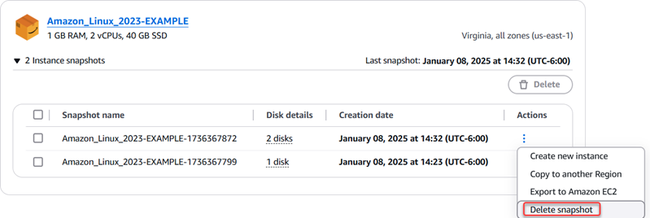
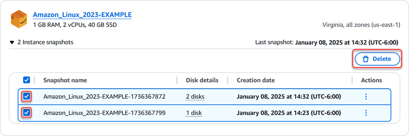

# Delete unused Lightsail snapshots to

avoid monthly charges

Delete instance, database, and disk snapshots in Amazon Lightsail if you no longer need them
to avoid incurring a monthly charge.

###### Delete an individual snapshot

###### Important

This is a permanent operation and can't be undone. You will lose all data on the
snapshots when you delete them.

1. On the [Lightsail console](https://lightsail.aws.amazon.com/ "https://lightsail.aws.amazon.com/"), choose
   **Snapshots** tab.
2. Find the Lightsail resource whose snapshot you want to delete, and choose the
   right-arrow to expand the list of available snapshots for that resource.
3. Choose the actions menu icon (⋮) next to the snapshot you want to delete, and
   choose **Delete snapshot**.

 4. Choose **Yes** to confirm that you want to delete the snapshot.

###### Delete multiple snapshots

###### Important

This is a permanent operation and can't be undone. You will lose all data on the
snapshots when you delete them.

1. From the Lightsail home page, choose **Snapshots**.
2. Find the Lightsail resource whose snapshots you want to delete and expand the
   snapshots section for the resource.
3. Select the snapshots for the resource to delete, then choose
   **Delete**.

 4. Choose **Yes** to confirm that you want to delete the snapshots.
