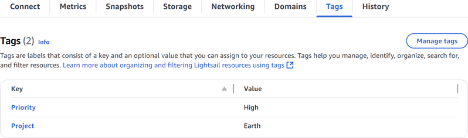
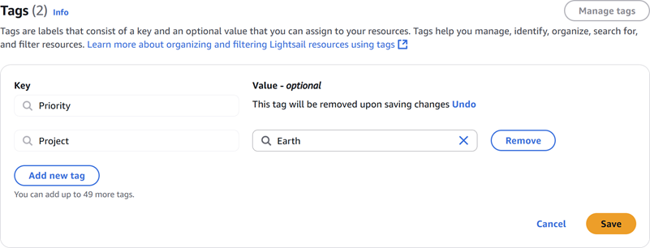

# Remove tags from Lightsail resources

You can delete tags from an Amazon Lightsail resource. Deleting a tag from one resource does
not delete the same tag from all other resources. To completely delete a tag from all resources,
you must remove that tag from each resource. This guide provides the steps to delete tags from a
resource.

###### Note

For more information about tags, what resources can be tagged, and the tag restrictions,
see [Tags](amazon-lightsail-tags.md "amazon-lightsail-tags.md").

###### To delete tags from a resource

1. Sign in to the [Lightsail console](https://lightsail.aws.amazon.com/ "https://lightsail.aws.amazon.com/").
2. In the left navigation pane, choose the resource type that you want to
   delete tags from. For example, to delete tags from a DNS zone, choose
   **Networking**. Or choose **Instances** to
   delete tags from an instance.

###### Note

Instances, container services, CDN distributions, buckets, databases, disks, DNS
zones, and load balancers can be tagged using the Lightsail console. However, more
Lightsail resources can be tagged using the [Lightsail API operations](../../2016-11-28/api-reference/Welcome.md "../../2016-11-28/api-reference/Welcome.md"), or the [AWS Command Line
Interface](../../../cli/latest/reference/lightsail.md "../../../cli/latest/reference/lightsail.md") (AWS CLI) or SDKs. For a full list of Lightsail resources that support
tagging, see [Tags](amazon-lightsail-tags.md "amazon-lightsail-tags.md"). 3. Choose the resource that you want to delete tags from. 4. On the management page for the resource you selected, choose the
**Tags** tab.

 5. Choose **Manage tags**. 6. Choose **Remove** for the tags that you want to delete from the resource. 7. Choose **Save** to delete the selected tags from the resource, or choose **Cancel** to keep them.

