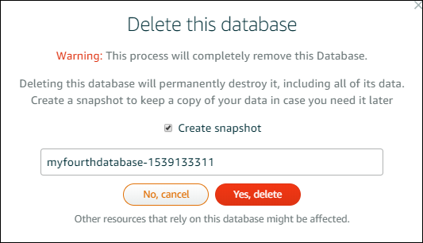

# Delete a Lightsail database and

create a final snapshot

Delete your managed database in Amazon Lightsail if you no longer need it. You stop incurring
charges for the database as soon as it’s deleted.

###### Note

You can’t recover a deleted database. You can create a final snapshot of your database as
part of the steps covered in this guide, or you can create a snapshot separately from the
deletion process. For more information, see [Create a snapshot of your
database](amazon-lightsail-creating-a-database-snapshot.md "amazon-lightsail-creating-a-database-snapshot.md").

###### To delete your database

1. Sign in to the [Lightsail console](https://lightsail.aws.amazon.com/ "https://lightsail.aws.amazon.com/").
2. In the left navigation pane, choose **Databases**.
3. Choose the name of the database that you want to delete.
4. Choose the **Delete** tab.
5. Add a check mark next to **Create snapshot before deletion** to create
   a final snapshot before deleting the database. Then enter a name for your snapshot.

Resource names:

    * Must be unique within each AWS Region in your Lightsail account.
    * Must contain 2 to 255 characters.
    * Must start and end with an alphanumeric character or number.
    * Can include alphanumeric characters, numbers, periods, dashes, and
     underscores.

6. Choose **Delete database**.
7. Choose **Yes, delete** to confirm the deletion.

If you opted to create a snapshot before deleting, you can view it on the
**Snapshots** section of the Lightsail home page.
