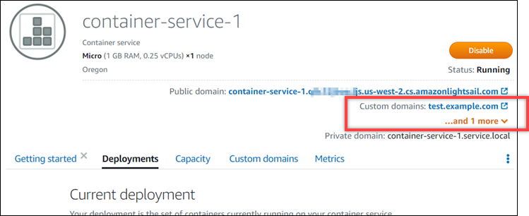

# Enable secure web

access with custom domains in Lightsail

Enable custom domains for your Amazon Lightsail container service to use your registered
domain names with your service. Before you enable custom domains, your container service accepts
traffic only for the default domain that is associated with your service when you first create
it (e.g., `containerservicename.123456abcdef.us-west-2.cs.amazonlightsail.com`). When
you enable custom domains, you choose the Lightsail SSL/TLS certificate that you created for
the domains that you want to use with your container service, and then you choose the domains
you want to use from that certificate. After you enable custom domains, your container service
accepts traffic for all of the domains that are associated with the certificate that you
chose.

###### Important

If you choose a Lightsail container service as the origin of your distribution,
Lightsail automatically adds the default domain name of your distribution as a custom domain
on your container service. This enables traffic to be routed between your distribution and
your container service. However, there are some circumstances in which you might need to
manually add the default domain name of your distribution to your container service. For more
information, see [Add the
default domain of a distribution to a container service](amazon-lightsail-adding-distribution-default-domain-to-container-service.md "amazon-lightsail-adding-distribution-default-domain-to-container-service.md").

**Contents**

- [Container
  service custom domain limits](#container-service-custom-domains-prerequisites "#container-service-custom-domains-prerequisites")
- [Prerequisites](#container-service-custom-domains-prerequisites "#container-service-custom-domains-prerequisites")
- [View custom domains
  for a container service](#container-service-view-custom-domains "#container-service-view-custom-domains")
- [Enable custom
  domains for a container service](#container-service-enable-custom-domains "#container-service-enable-custom-domains")
- [Disable custom
  domains for a container service](#container-service-disable-custom-domains "#container-service-disable-custom-domains")

## Container service custom domain

limits

The following limits apply to container service custom domains:

- You can use up to 4 custom domains with each of your Lightsail container services,
  and you cannot use the same domains on more than one service.
- If you use a Lightsail DNS zone to manage the DNS of your domain, then you can route
  traffic for the apex of your domain (e.g., `example.com`) and for subdomains
  (e.g., `www.example.com`) to your container services.

## Prerequisites

Before you get started, you need to create a Lightsail container service. For more
information, see [Creating
Amazon Lightsail container services](amazon-lightsail-creating-container-services.md "amazon-lightsail-creating-container-services.md").

You also should have created and validated an SSL/TLS certificate for your container
service. For more information, see [Create container service
SSL/TLS certificates](amazon-lightsail-creating-container-services-certificates.md "amazon-lightsail-creating-container-services-certificates.md") and [Validate container
service SSL/TLS certificates](amazon-lightsail-validating-container-services-certificates.md "amazon-lightsail-validating-container-services-certificates.md").

## View custom domains for a container

service

Complete the following procedure to view the custom domains that are currently enabled for
your container service.

1. Sign in to the [Lightsail console](https://lightsail.aws.amazon.com/ "https://lightsail.aws.amazon.com/").
2. In the left navigation pane, choose **Containers**.
3. Choose the name of the container service for which you want to view the enabled custom
   domains.
4. Locate the custom domain values in the heading of the container service management
   page, as shown in the following example. These are the custom domains that are currently
   enabled for the container service.

 5. On the container service management page, choose the **Custom
domains** tab.

The custom domains being used under each attached certificate, are listed under the
**Custom domain SSL/TLS certificates** section of the page. The
certificates currently attached to your container service, are listed under the
**Attached certificates** section.

## Enable custom domains for a

container service

Complete the following procedure to enable custom domains for your Lightsail container
service by attaching a certificate to your service.

1. Sign in to the [Lightsail console](https://lightsail.aws.amazon.com/ "https://lightsail.aws.amazon.com/").
2. In the left navigation pane, choose **Containers**.
3. Choose the name of the container service for which you want to enable custom
   domains.
4. On the container service management page, choose the **Custom
   domains** tab.

The **Custom domains** page displays the SSL/TLS certificates
currently attached to your container service, if
any. 5. Choose **Attach certificate**.

If you have no certificates, then you must first create and validate an SSL/TLS
certificate for your domains, before you can attach it to your container service. For more
information, see [Create container service SSL/TLS certificates](amazon-lightsail-creating-container-services-certificates.md "amazon-lightsail-creating-container-services-certificates.md"). 6. In the dropdown menu that appears, select a valid certificate for the domain(s) that
you want to use with your container service. 7. Verify the certificate information is correct, then choose
**Attach**. 8. The container service's **Status** will change to
**Updating**. After the status changes to **Ready**,
the certificate's domain will appear in the **Custom domains**
section. 9. Choose **Add domain assignment** to point the domain to your
container service. 10. Verify the certificate and DNS information are correct, then choose **Add
assignment**. After a few moments, traffic for the domain that you selected
will begin to be accepted by your container service. 11. After you've added the domain assignment, open a new browser window and browse to the
custom domain that you enabled for your container service. The application that is running
on your container service, if any, should load.

## Disable custom domains for a

container service

Complete the following procedure to disable custom domains for your Lightsail container
service by detaching a certificate from your service, or by deselecting a previously selected
domain.

1. Sign in to the [Lightsail console](https://lightsail.aws.amazon.com/ "https://lightsail.aws.amazon.com/").
2. In the left navigation pane, choose **Containers**.
3. Choose the name of the container service for which you want to disable custom
   domains.
4. On the container service management page, choose the **Custom
   domains** tab.

The **Custom domains** page displays the SSL/TLS certificates
currently attached to your container service, if any. 5. Choose one of the following options:

    1. Choose **Configure container service domains** to either deselect
     domains that were previously selected, or to select more domains that are associated
     to the container service.
    2. Choose **Detach** to detach the certificate from the container
     service, and remove all of its associated domains from the
     service.

###### Important

If you haven't already done so, modify the DNS records of your domain so that
traffic routes stops routing to your container service and instead routes to another
resource.

###### Topics

- [Point Lightsail domain to container](amazon-lightsail-point-domain-to-container-service.md "amazon-lightsail-point-domain-to-container-service.md")
- [Point Route 53 domain to container](amazon-lightsail-route-53-alias-record-for-container-service.md "amazon-lightsail-route-53-alias-record-for-container-service.md")
