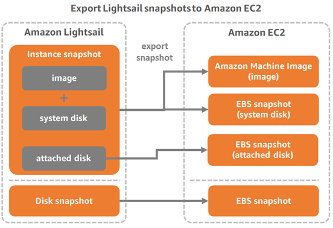
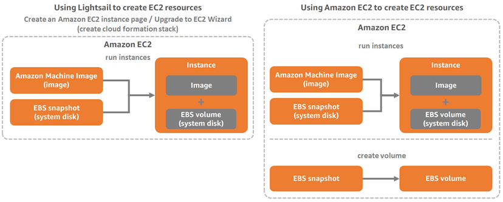

# Learn how to export Lightsail snapshots

to Amazon EC2

You can export Lightsail snapshots to Amazon EC2, create EC2 resources from exported
snapshots, choose compatible EC2 instance types, connect to EC2 instances, and secure EC2
instances created from Lightsail snapshots. Amazon Lightsail instance and block storage disk
snapshots can be exported to Amazon Elastic Compute Cloud (Amazon EC2) using one of the following methods:

- The Lightsail console. For more information, see [Export snapshots to
  Amazon EC2](amazon-lightsail-exporting-snapshots-to-amazon-ec2.md "amazon-lightsail-exporting-snapshots-to-amazon-ec2.md").
- The Lightsail API, AWS Command Line Interface (AWS CLI), or SDKs. For more information, see the [ExportSnapshot operation](../../2016-11-28/api-reference/API_ExportSnapshot.md "../../2016-11-28/api-reference/API_ExportSnapshot.md") in the Lightsail API documentation, or the [export-snapshot command](../../../cli/latest/reference/lightsail/export-snapshot.md "../../../cli/latest/reference/lightsail/export-snapshot.md") in the AWS CLI documentation.
  You can export instance snapshots and block storage disk snapshots. However, snapshots of
  cPanel & WHM (CentOS 7) instances cannot be exported to Amazon EC2. Snapshots are exported to the same
  AWS Region from Lightsail to Amazon EC2. To export snapshots to a different Region, first copy
  the snapshot to a different Region in Lightsail, then perform the export. For more
  information, see [Copy snapshots from one AWS Region to another](amazon-lightsail-copying-snapshots-from-one-region-to-another.md "amazon-lightsail-copying-snapshots-from-one-region-to-another.md").

Exporting a Lightsail instance snapshot results in an Amazon Machine Image (AMI) and an
Amazon Elastic Block Store (Amazon EBS) snapshot being created in Amazon EC2. This is because Lightsail instances consist of an image and a system disk,
which are grouped together as a single instance entity in the Lightsail console for more efficient management. If the source
Lightsail instance had one or more block storage disks attached to it when the snapshot was
created, then additional EBS snapshots for each attached disk will be created in Amazon EC2.
Exporting a Lightsail block storage disk snapshot results in a single EBS snapshot being
created in Amazon EC2. All exported resources in Amazon EC2 have their own distinct unique identifiers
that are different than their Lightsail counterparts.

###### Note

Lightsail uses an AWS Identity and Access Management (IAM) service-linked role (SLR) to export snapshots to
Amazon EC2. For more information about SLRs, see [Service-linked roles](amazon-lightsail-using-service-linked-roles.md "amazon-lightsail-using-service-linked-roles.md").

The export process can take a while. It depends on the size and configuration of the source
instance or block storage disk. Use the **Exports** section in the Lightsail
console to track the status of your export. For more information, see [Track snapshot export status in
Lightsail](amazon-lightsail-task-monitor.md "amazon-lightsail-task-monitor.md").

## Create Amazon EC2 resources

from exported Lightsail snapshots

After a Lightsail snapshot is exported and available in Amazon EC2 (as an AMI, EBS snapshot,
or both), you can create Amazon EC2 resources from the snapshot using one of the following
methods:

- The **Create an Amazon EC2 instance** page in the Lightsail console,
  also known as the Upgrade to Amazon EC2 Wizard. For more information, see [Create Amazon EC2
  instances from exported snapshots](amazon-lightsail-creating-ec2-instances-from-exported-snapshots.md "amazon-lightsail-creating-ec2-instances-from-exported-snapshots.md").
- The Lightsail API, AWS CLI, or SDKs. For more information, see the [CreateCloudFormationStack operation](../../2016-11-28/api-reference/API_CreateCloudFormationStack.md "../../2016-11-28/api-reference/API_CreateCloudFormationStack.md") in the Lightsail API documentation, or
  the [create-cloud-formation-stack command](../../../cli/latest/reference/lightsail/create-cloud-formation-stack.md "../../../cli/latest/reference/lightsail/create-cloud-formation-stack.md") in the AWS CLI documentation.

###### Note

Lightsail can be used to create Amazon EC2 instances from exported instance snapshots,
but it cannot be used to create EBS volumes from exported block storage disk snapshots.
For this, you must use the Amazon EC2 console, API, or AWS CLI. For more information, see [Create Amazon EBS
volumes from exported disk snapshots](amazon-lightsail-creating-ebs-volumes-from-exported-snapshots.md "amazon-lightsail-creating-ebs-volumes-from-exported-snapshots.md").

- The Amazon EC2 console, Amazon EC2 API, AWS CLI, or SDKs. For more information, see [Launching an Instance Using the Launch Instance Wizard](../../../AWSEC2/latest/UserGuide/launching-instance.md "../../../AWSEC2/latest/UserGuide/launching-instance.md") or [Restoring an Amazon EBS Volume from a Snapshot](../../../AWSEC2/latest/UserGuide/ebs-restoring-volume.md "../../../AWSEC2/latest/UserGuide/ebs-restoring-volume.md") in the Amazon EC2 documentation.

Creating an Amazon EC2 instance from an exported instance snapshot (AMI and EBS snapshot)
results in a single EC2 instance being launched. The AMI and EBS snapshot that resulted from
exporting the Lightsail instance snapshot are automatically linked together to form the EC2
instance. The exported Lightsail block storage disk snapshot (EBS snapshot) can be used to
create an EBS volume in Amazon EC2.

###### Note

Lightsail uses a CloudFormation stack to create instances and their related resources
in EC2. For more information, see [AWS CloudFormation stacks for Lightsail](amazon-lightsail-cloudformation-stacks.md "amazon-lightsail-cloudformation-stacks.md").

The process to create Amazon EC2 resources from an exported snapshot can take a while. It
depends on the size and configuration of the source instance. Use the
**Exports** section in the Lightsail console to track the status of your
export. For more information, see [Track snapshot export status in
Lightsail](amazon-lightsail-task-monitor.md "amazon-lightsail-task-monitor.md")..

## Choosing an Amazon EC2 instance type

Amazon EC2 offers a wider range of instance options than are available in Lightsail. In
Amazon EC2, you can choose instance types that are optimized for compute (C5), memory (R5), or a
balance of both (T3 and M5). Lightsail provides these options in the **Create an
Amazon EC2 instance** page; however, more instance type options are available if you use
Amazon EC2 to create new instances from an exported snapshot. For more information about EC2
instance types, see [Instance
Types](../../../AWSEC2/latest/UserGuide/instance-types.md "../../../AWSEC2/latest/UserGuide/instance-types.md") in the Amazon EC2 documentation.

Before you create EC2 instances from exported snapshots, it is important to understand the
instance price differences between Lightsail and Amazon EC2. For more information about instance
pricing, see the [Lightsail
pricing](https://aws.amazon.com/lightsail/pricing/ "https://aws.amazon.com/lightsail/pricing/") and [Amazon EC2
pricing](https://aws.amazon.com/ec2/pricing/on-demand/ "https://aws.amazon.com/ec2/pricing/on-demand/") pages.

**Lightsail and Amazon EC2 instance type compatibility**

Some Lightsail instances are incompatible with the current generation EC2 instance types
(T3, M5, C5, or R5) because they are not enabled for enhanced networking. If your source
Lightsail instance is incompatible, you will need to choose a previous generation instance
type (T2, M4, C4, or R4) when creating an EC2 instance from your exported snapshot. These
options are presented to you when creating an EC2 instance using the **Create an Amazon EC2
instance** page in the Lightsail console.

To use the latest generation EC2 instance types when the source Lightsail instance is
incompatible, you need to create the new EC2 instance using a previous generation instance
type (T2, M4, C4, or R4), update the networking driver, and then upgrade the instance to the
desired current generation instance type. For more information, see [Enhanced networking for Amazon EC2
instances](amazon-lightsail-updating-ec2-instances.md "amazon-lightsail-updating-ec2-instances.md").

## Connect to Amazon EC2 instances

You can connect to Amazon EC2 instances similar to how you connect to Lightsail instances.
This means using SSH for Linux and Unix instances and RDP for Windows Server instances.
However, the browser-based SSH/RDP client that you might have used in the Lightsail console
might not be available in Amazon EC2 depending on the browser version that you're using, so you may
need to configure your own SSH/RDP client to connect to your EC2 instances. For more
information, see the following guides:

- [Connect
  to an Amazon EC2 Linux or Unix instance that was created from a Lightsail
  snapshot](amazon-lightsail-connecting-to-linux-unix-amazon-ec2-instances.md "amazon-lightsail-connecting-to-linux-unix-amazon-ec2-instances.md")
- [Connect to an Amazon EC2 Windows Server instance that was created from a Lightsail
  snapshot](amazon-lightsail-connecting-to-windows-server-amazon-ec2-instances.md "amazon-lightsail-connecting-to-windows-server-amazon-ec2-instances.md")

## Secure an Amazon EC2 instance

After you create an EC2 instance from an exported Lightsail snapshot, you may need to
perform a few actions to improve the security of your new instances. The actions are different
depending on the operating system of your EC2 instance.

**Securing Linux and Unix instances in Amazon EC2**

If you create a Linux or Unix instance in Amazon EC2 from an exported snapshot using EC2 (the
EC2 console, the EC2 API, AWS CLI for EC2, or SDKs for EC2), the new EC2 instance may contain
residual SSH keys from the Lightsail service. We recommend removing these keys to better
secure the new instance.

For more information, see [Secure an Amazon EC2 Linux or
Unix instance that was created from a Lightsail snapshot](amazon-lightsail-securing-linux-unix-amazon-ec2-instances.md "amazon-lightsail-securing-linux-unix-amazon-ec2-instances.md").

**Securing Windows Server instances in Amazon EC2**

After you create a Windows Server instance in Amazon EC2 from an exported snapshot, any user in
your AWS account with access to Lightsail and EC2 will be able to retrieve the default
administrator password first assigned to the source instance, which is also the password for
the new EC2 instance. For increased security, we recommend that you change the default
administrator password for your Amazon EC2 instance, if you haven’t already done so.

For more information, see [Secure an Amazon EC2
Windows Server instance that was created from a Lightsail snapshot](amazon-lightsail-securing-windows-server-amazon-ec2-instances.md "amazon-lightsail-securing-windows-server-amazon-ec2-instances.md").
