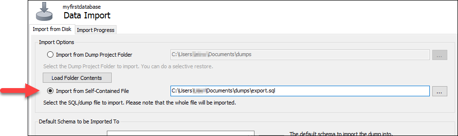
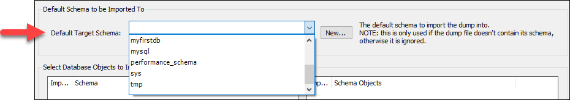
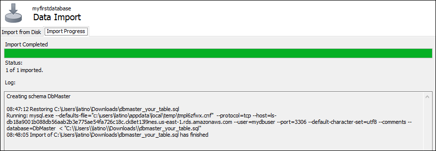

# Import SQL data into

Lightsail MySQL databases

You can import a SQL file (.SQL) into your MySQL managed database in Amazon Lightsail using
MySQL Workbench.

###### Note

To learn how to connect MySQL Workbench to your database, see [Connect to your MySQL
database](amazon-lightsail-connecting-to-your-mysql-database.md "amazon-lightsail-connecting-to-your-mysql-database.md").

###### To import data into your database

1. Open MySQL Workbench.
2. In the list of MySQL Connections, choose your MySQL managed database.
3. Choose **Data Import/Restore** from the left-navigation menu.
4. In the Data Import pane, choose **Import from Self-Contained File**
   under the **Import Options** section.

 5. Choose the ellipsis button to browse your local drive for the .SQL file that you want to
import. 6. Choose the .SQL file to import, then choose **Open**. 7. Choose the **Default Target Schema** drop-down menu, then select the
existing database to import the file to. You can also create a new database by choosing
**New**.

 8. Choose **Start Import** to start the import.

Your import may take a few minutes or more depending on the size of the .SQL file. After
the import is complete, you should see a message similar to the following:

