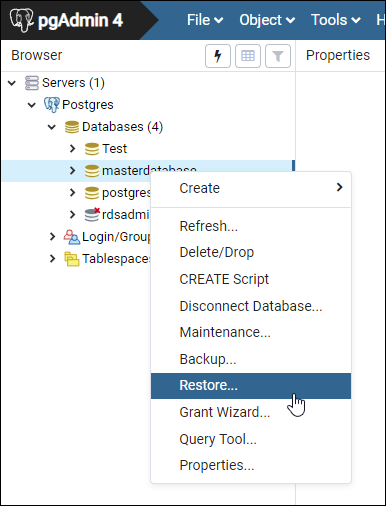
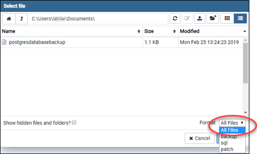
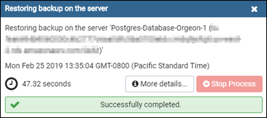

# Import PostgreSQL

database backups to Lightsail managed databases

You can import a database backup file into your PostgreSQL managed database in
Amazon Lightsail using pgAdmin.

###### Note

To learn how to connect pgAdmin to your database, see [Connect to your PostgreSQL
database](amazon-lightsail-connecting-to-your-postgres-database.md "amazon-lightsail-connecting-to-your-postgres-database.md"). For more information about creating a PostgreSQL database backup that you
can import to another database, see [Backup
Dialog](https://www.pgadmin.org/docs/ "https://www.pgadmin.org/docs/") in the pgAdmin documentation.

###### To import a backup file into your database

1. Open pgAdmin.
2. In the list of server connections, double-click your PostgreSQL managed database in
   Amazon Lightsail to connect to it.
3. Expand the **Databases** node
4. Right-click the database in which you would like to import data from a database backup
   file, then choose **Restore**.

 5. In the **Restore** form, complete the following fields:

    * **Format** — Choose the format of your backup
     file.
    * **Filename** — Choose the ellipsis icon, then locate
     and choose the database backup file on your local drive. After the file is highlighted,
     choose **Select** to go back to the **Restore**
     prompt.

    ###### Note

    Choose the **Format** drop-down menu, and select **All
     files** to view all file formats on your local drive. Your backup file
     might be saved as a file type that is different than what is selected by default
     (sql).

    
    * **Number of jobs** and **Role
     name** — Leave these fields blank.

6. Choose **Restore** to start the import.

Your import may take a few minutes or more depending on the size of the database backup
file. After the import is complete, you should see a message similar to the
following:

