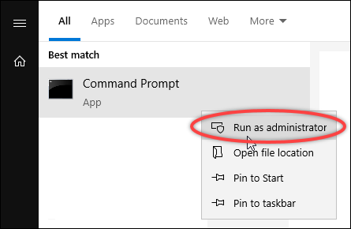
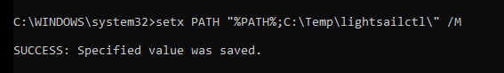
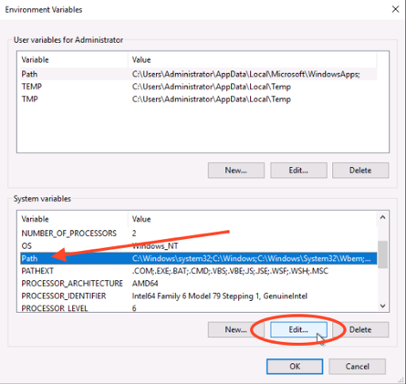
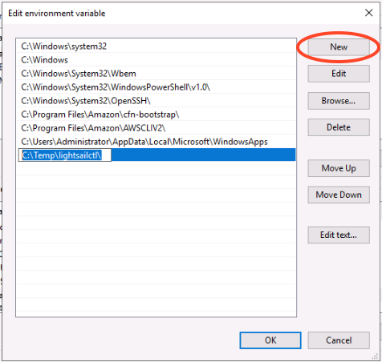

# Install Docker, AWS CLI, and the Lightsail

Control plugin for containers

You can use the Amazon Lightsail console to create your Lightsail container services, and
create deployments using container images from an online public registry, such as Amazon ECR Public
Gallery. To create your own container images, and push them to your container service, you must
install the following additional software on the same computer on which you plan to create your
container images:

- **Docker** – Run, test, and create your own container
  images that you can then use with your Lightsail container service.
- **AWS Command Line Interface (AWS CLI)** – Specify parameters of the container
  images you create, and then push them to your Lightsail container service. Version 2.1.1
  and later will work with the Lightsail Control plugin.
- **Lightsail Control (lightsailctl) plugin** – Enables the
  AWS CLI to access the container images that are on the local machine.
  The following sections of this guide describe where to go to download these software
  packages, and how to install them. For more information about container services, see [Container services](amazon-lightsail-container-services.md "amazon-lightsail-container-services.md").

**Contents**

- [Install Docker](#install-software-docker "#install-software-docker")
- [Install the AWS CLI](#install-software-aws-cli "#install-software-aws-cli")
- [Install the Lightsail
  Control plugin](#install-software-lightsailctl "#install-software-lightsailctl")
  - [Install the
    lightsailctl plugin on Windows](#install-lightsailctl-on-windows "#install-lightsailctl-on-windows")
  - [Install the lightsailctl
    plugin on macOS](#install-lightsailctl-on-macos "#install-lightsailctl-on-macos")
  - [Install the lightsailctl
    plugin on Linux](#install-lightsailctl-on-linux "#install-lightsailctl-on-linux")

## Install Docker

Docker is a technology that allows you to build, run, test, and deploy distributed
applications that are based on Linux containers. You must install and use Docker software if
you want to create your own container images that you can then use with your Lightsail
container service. For more information, see [Create container images for your
Lightsail container services](amazon-lightsail-creating-container-images.md "amazon-lightsail-creating-container-images.md").

Docker is available for many different operating systems, including most modern Linux
distributions, like Ubuntu, and even macOS and Windows. For more information about how to
install Docker on your particular operating system, see the [Docker installation
guide](https://docs.docker.com/engine/installation/#installation "https://docs.docker.com/engine/installation/#installation").

###### Note

Always install the latest version of Docker. Older versions of Docker are not guaranteed
to work with the AWS CLI and Lightsail Control (lightsailctl) plugin described later in this
guide.

## Install the AWS CLI

The AWS CLI is an open source tool that enables you to interact with AWS services, such as
Lightsail, using commands in your command-line shell. You must install and use the AWS CLI to
push your container images, created on your local machine, to your Lightsail container
service.

The AWS CLI is available in the following versions:

- **Version 2.x** – The current, generally available
  release of the AWS CLI. This is the most recent major version of the AWS CLI and supports all
  of the latest features, including the ability to push container images to your Lightsail
  container services. Version 2.1.1 and later will work with the Lightsail Control
  plugin.
- **Version 1.x** – The previous version of the AWS CLI that
  is available for backwards compatibility. This version does not support the ability to
  push your container images to your Lightsail container services. Therefore, you must
  install the AWS CLI version 2 instead.

The AWS CLI version 2 is available for Linux, macOS, and Windows operating systems. For
instructions on how to install the AWS CLI on those operating systems, see [Installing the
AWS CLI version 2](../../../cli/latest/userguide/install-cliv2.md "../../../cli/latest/userguide/install-cliv2.md") in the _AWS CLI User Guide_.

## Install the Lightsail Control plugin

The Lightsail Control (lightsailctl) plugin is a lightweight application that allows the
AWS CLI to access the container images that you created on your local machine. It allows you to
push container images to your Lightsail container service, so that you can deploy them to
your service.

**System requirements**

- A Windows, macOS, or Linux operating system with 64-bit support.
- AWS CLI version 2 must be installed on your local machine in order to use the
  lightsailctl plugin. For more information, see the [Install the AWS CLI](#install-software-aws-cli "#install-software-aws-cli") section
  earlier in this guide.

**Use the latest version of the lightsailctl plugin**

The lightsailctl plugin is updated occasionally with enhanced functionality. Each time you
use the lightsailctl plugin, it performs a check to confirm you're using the latest version.
If it finds that a new version is available, it prompts you to update to the latest version to
take advantage of the latest features. When an updated version is available, you must repeat
the installation process to get the latest version of the lightsailctl plugin.

The following lists all releases of the lightsailctl plugin and the features and
enhancements included with each version.

- **v1.0.0 (released November 12, 2020)** – Initial release
  adds functionality for the AWS CLI version 2 to push container images to a Lightsail
  container service.

### Install the lightsailctl plugin on

Windows

Complete the following procedure to install the lightsailctl plugin on Windows.

1. Download the executable from the following URL, and save it to the
   `C:\Temp\lightsailctl\` directory.

```
https://s3.us-west-2.amazonaws.com/lightsailctl/latest/windows-amd64/lightsailctl.exe
```

2. Choose the **Windows Start** button, and then search for
   `cmd`.
3. Right-click the **Command Prompt** application in the results, and
   choose **Run as administrator**.



###### Note

You may see a prompt that asks if you want to allow Command Prompt to make changes
to your device. You must choose **Yes** to continue with the
installation. 4. Enter the following command to set a path environment variable that points to the
`C:\Temp\lightsailctl\` directory where you saved the lightsailctl
plugin.

```
setx PATH "%PATH%;C:\Temp\lightsailctl" /M
```

You should see a result similar to the following example.



The `setx` command will truncate beyond 1024 characters. Use the following
procedure to manually set the path environment variable if you already have multiple
variables set in your PATH.

1. On the **Start** menu, open **Control
   Panel**.
2. Choose **System and Security**, then
   **System**.
3. Choose **Advanced system settings**.
4. On the **Advanced** tab of the **System
   Properties** dialog box, choose **Environment
   Variables**.
5. In the **System Variables** box of the **Environment
   Variables** dialog box, select **Path**.
6. Choose the **Edit** button located under the **System
   Variables** box.

 7. Choose **New**, then enter the following path:
`C:\Temp\lightsailctl\`

 8. Choose **OK** in three successive dialog boxes, and then close the
**System** dialog box.

You are now ready to use the AWS Command Line Interface (AWS CLI) to push container images to your
Lightsail container service. For more information, see [Push and manage container
images](amazon-lightsail-pushing-container-images.md "amazon-lightsail-pushing-container-images.md").

### Install the lightsailctl plugin on

macOS

Complete one of the following procedures to download and install the lightsailctl plugin
on macOS.

###### Homebrew download and install

1. Open a terminal window.
2. Enter the following command to download and install the lightsailctl plugin.

```
brew install aws/tap/lightsailctl
```

###### Note

For more information about Homebrew, see the [Homebrew](https://brew.sh/ "https://brew.sh/") website.

###### Manual download and install

1. Open a terminal window.
2. Enter the following command to download the lightsailctl plugin and copy it to the
   bin folder.

```
curl "https://s3.us-west-2.amazonaws.com/lightsailctl/latest/darwin-amd64/lightsailctl" -o "/usr/local/bin/lightsailctl"
```

3. Enter the following command to make the plugin executable.

```
chmod +x /usr/local/bin/lightsailctl
```

4. Enter the following command to clear extended attributes for the plugin.

```
xattr -c /usr/local/bin/lightsailctl
```

You are now ready to use the AWS CLI to push container images to your Lightsail
container service. For more information, see [Push and manage container
images](amazon-lightsail-pushing-container-images.md "amazon-lightsail-pushing-container-images.md").

### Install the lightsailctl plugin on

Linux

Complete the following procedure to install the Lightsail container services plugin on
Linux.

1. Open a terminal window.
2. Enter the following command to download the lightsailctl plugin.
   - For the AMD 64-bit architecture version of the plugin:

   ```
   curl "https://s3.us-west-2.amazonaws.com/lightsailctl/latest/linux-amd64/lightsailctl" -o "/usr/local/bin/lightsailctl"
   ```

   - For the ARM 64-bit architecture version of the plugin:

   ```
   curl "https://s3.us-west-2.amazonaws.com/lightsailctl/latest/linux-arm64/lightsailctl" -o "/usr/local/bin/lightsailctl"
   ```

3. Enter the following command to make the plugin executable.

```
sudo chmod +x /usr/local/bin/lightsailctl
```

You are now ready to use the AWS CLI to push container images to your Lightsail
container service. For more information, see [Push and manage container
images](amazon-lightsail-pushing-container-images.md "amazon-lightsail-pushing-container-images.md").
