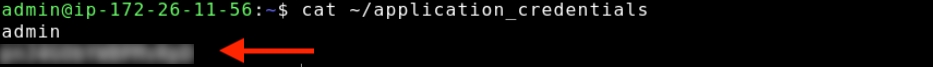
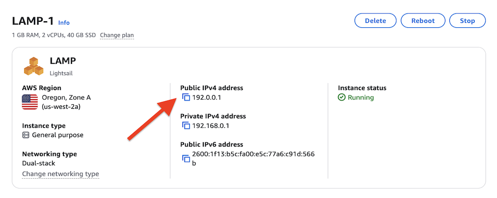

# Launch and configure a LAMP instance

###### Did you know?

Lightsail stores seven daily snapshots and automatically replaces the oldest with the newest when you enable
automatic snapshots for your instance. For more information, see
[Configure automatic snapshots for Lightsail instances and disks](amazon-lightsail-configuring-automatic-snapshots.md "amazon-lightsail-configuring-automatic-snapshots.md")
.

Here are a few steps you should take to get started after your LAMP instance is up and
running on Amazon Lightsail.

## Step 1: Get the default application password for your LAMP instance

You need the default application password to access pre-installed applications or services
on your instance.

1. On your instance management page, under the **Connect** tab, choose
   **Connect using SSH**.
2. After you're connected, enter the following command to get the default application
   password:

```
cat ~/application_credentials
```

You should see a response similar to this, which contains the default application
password:



## Step 2: Attach a static IP address to your LAMP instance

The default dynamic public IP address attached to your instance changes every time you
stop and start the instance. You can create a static IP address and attach it to your instance to
keep the public IP address from changing. Later, when you use your domain name with your
instance, you don’t have to update your domain’s DNS records each time you stop and start the
instance. You can attach only one static IP address to each instance.

On the instance management page, under the **Networking** tab,
choose **Create a static IP** or **Attach static
IP** (if you previously created a static IP that you can attach to your
instance), then follow the instructions on the page. For more information, see [Create a static IP and attach it to an
instance](lightsail-create-static-ip.md "lightsail-create-static-ip.md").


## Step 3: Visit your LAMP instance welcome page

Navigate to the static IP address of your instance to access the application installed on
your instance.

1. On your instance management page, copy the static IP address:

 2. Paste the static IP address into your browser address, for example
`http://192.0.0.1`.

## Step 4: Map your domain name to your LAMP instance

To map your domain name, such as `example.com`, to your instance, you add a
record to the domain name system (DNS) of your domain. DNS records are typically managed and
hosted at the registrar where you registered your domain. However, we recommend that you
transfer management of your domain's DNS records to Lightsail so that you can administer it
using the Lightsail console.

On the Lightsail console home page, under the **Networking** tab,
choose **Create DNS zone**, then follow the instructions on the page.

For more information, see [Create a DNS
zone to manage your domain's DNS records](lightsail-how-to-create-dns-entry.md "lightsail-how-to-create-dns-entry.md").

For enabling HTTPS, see [Enable HTTPS on your LAMP instance with Let's Encrypt and Certbot](amazon-lightsail-lets-encrypt-certbot-lamp-lightsail.md "amazon-lightsail-lets-encrypt-certbot-lamp-lightsail.md").

## Step 5: Deploy your application

1. Follow the instructions from
   [Transfer files between Linux instances on Lightsail using scp](amazon-lightsail-transfer-files-between-linux-instances.md "amazon-lightsail-transfer-files-between-linux-instances.md")
   to copy your application to
   `/var/www/html`
2. On your instance management page, under the **Connect** tab, choose
   **Connect using SSH**.
3. Run `sudo systemctl restart apache2`
4. Navigate to your instance's static IP address

## Step 6: Create a snapshot of your LAMP instance

After you configure your website the way you want it, create
periodic snapshots of your instance to back it up. A snapshot is a copy of the system disk and original configuration of an instance. A
snapshot contains all of the data that is needed to restore your instance (from the moment
when the snapshot was taken).

You can create [snapshots manually](understanding-snapshots-in-amazon-lightsail.md#manual-snapshots "understanding-snapshots-in-amazon-lightsail.md#manual-snapshots"), or
[enable automatic snapshots](understanding-snapshots-in-amazon-lightsail.md#automatic-snapshots "understanding-snapshots-in-amazon-lightsail.md#automatic-snapshots") to have Lightsail create daily snapshots for you. If
something goes wrong with your instance, you can create a new replacement instance using
the snapshot.

You can work with snapshots on your instance's management page on the **Snapshots** tab.
For more information, see [Snapshots in Amazon Lightsail](understanding-snapshots-in-amazon-lightsail.md "understanding-snapshots-in-amazon-lightsail.md").


