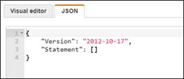
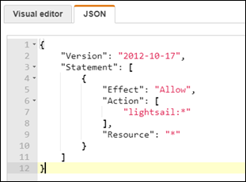
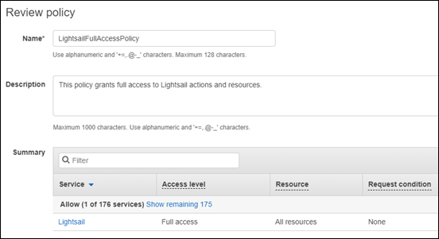
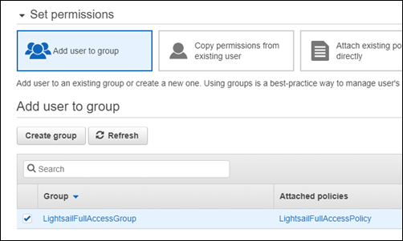
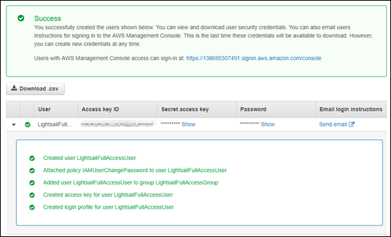

# Grant Lightsail access for

an IAM user

As an [AWS
account root user](../../../IAM/latest/UserGuide/id_root-user.md "../../../IAM/latest/UserGuide/id_root-user.md"), or an AWS Identity and Access Management (IAM) user with administrator access, you can
create one or more IAM users in your AWS account, and those users can be configured with
different levels of access to services offered by AWS.

For Amazon Lightsail, you might want to create an IAM user who can access only the
Lightsail service. You do this when someone joins your team who requires access to view,
create, edit, or delete Lightsail resources but doesn’t need access to other services offered
by AWS. To configure this, you must first create an IAM policy that grants access to
Lightsail, then create an IAM group, and attach the policy to the group. You then create
IAM users and make them members of the group, which gives them access to Lightsail.

When someone leaves your team, you can remove the user from the Lightsail access group to
revoke their access to Lightsail, if for example, they left your team but still work at your
company. Or you can delete the user from IAM, if for example, they left your company and will
not require access again.

###### Warning

This scenario requires IAM users with programmatic access and long-term credentials, which presents a security risk. To help mitigate this risk, we recommend that you provide these users with only the permissions they require to perform the task and that you remove these users when they are no longer needed. Access keys can be updated if necessary. For more information, see [Update access keys](../../../IAM/latest/UserGuide/id-credentials-access-keys-update.md "../../../IAM/latest/UserGuide/id-credentials-access-keys-update.md") in the _IAM User Guide_.

**Contents**

- [Create an IAM
  policy for Lightsail access](#create-an-iam-policy-for-lightsail-access "#create-an-iam-policy-for-lightsail-access")
- [Create an IAM
  group for Lightsail access and attach the Lightsail access policy](#create-an-iam-group-for-lightsail-access "#create-an-iam-group-for-lightsail-access")
- [Create an IAM
  user and add the user to the Lightsail access group](#create-an-iam-user-for-lightsail-access "#create-an-iam-user-for-lightsail-access")

## Create an IAM policy for

Lightsail access

Follow these steps to create an IAM policy for Lightsail access. For more information,
see [Creating IAM Policies](../../../IAM/latest/UserGuide/access_policies_create.md "../../../IAM/latest/UserGuide/access_policies_create.md") in the IAM documentation.

1. Sign in to the [IAM console](https://console.aws.amazon.com/iam/ "https://console.aws.amazon.com/iam/").
2. Choose **Policies** in the left navigation pane.
3. Choose **Create Policy**.
4. In the **Create Policy** page, choose the **JSON**
   tab.

 5. Highlight the contents of the text box, and then copy and paste the following policy
configuration text.

JSON

```
`{
 "Version":"2012-10-17",
 "Statement": [
 {
 "Effect": "Allow",
 "Action": [
 "lightsail:*"
 ],
 "Resource": "*"
 }
 ]
}`

```

The result should look like the following example:



This grants access to all Lightsail actions and resources. Actions that require
access to other services offered by AWS, such as enabling VPC peering, exporting
Lightsail snapshots to Amazon EC2, or creating Amazon EC2 resources using Lightsail,
require additional permissions not included in this policy. For more information, see the
following guides:

    * [Set up
     Amazon VPC peering to work with AWS resources outside of
     Amazon Lightsail](lightsail-how-to-set-up-vpc-peering-with-aws-resources.md "lightsail-how-to-set-up-vpc-peering-with-aws-resources.md")
    * [Exporting
     Amazon Lightsail snapshots to Amazon EC2](amazon-lightsail-exporting-snapshots-to-amazon-ec2.md "amazon-lightsail-exporting-snapshots-to-amazon-ec2.md")
    * [Creating Amazon EC2 instances from exported snapshots in Lightsail](amazon-lightsail-creating-ec2-instances-from-exported-snapshots.md "amazon-lightsail-creating-ec2-instances-from-exported-snapshots.md")

For examples of action-specific and resource-specific permissions that you can grant,
see [Amazon Lightsail
Resource-Level Permissions Policy Examples](security_iam_resource-based-policy-examples.md "security_iam_resource-based-policy-examples.md"). 6. Choose **Review Policy**. 7. In the **Review Policy** page, name the policy. Give it a descriptive
name; for example, `LightsailFullAccessPolicy`. 8. Add a description, and review the policy settings. If you need to make changes, choose
**Previous** to modify the policy.

 9. After you confirm the policy settings are correct, choose **Create
Policy**.

The policy is now created and can be added to an existing IAM group, or you can
create a new IAM group using the steps in the following section of this guide.

## Create an IAM group for

Lightsail access and attach the Lightsail access policy

Follow these steps to create an IAM group for Lightsail access, then attach the
Lightsail access policy created in the previous section of this guide. For more information,
see [Creating IAM Groups](../../../IAM/latest/UserGuide/id_groups_create.md "../../../IAM/latest/UserGuide/id_groups_create.md") and [Attaching a Policy to an IAM Group](../../../IAM/latest/UserGuide/id_groups_manage_attach-policy.md "../../../IAM/latest/UserGuide/id_groups_manage_attach-policy.md") in the IAM documentation.

1. In the [IAM console](https://console.aws.amazon.com/iam/ "https://console.aws.amazon.com/iam/"), choose
   **Groups** in the left navigation pane.
2. Choose **Create New Group**.
3. In the **Set Group Name** page, name the group. Give it a descriptive
   name; for example, `LightsailFullAccessGroup`.
4. In the **Attach Policy** page, search for the Lightsail policy you
   created earlier in this guide; for example, `LightsailFullAccessPolicy`.
5. Add a checkmark next to the policy, then choose **Next step**.
6. Review the group settings. If you need to make changes, choose
   **Previous** to modify the group policies.
7. After you confirm the group settings are correct, choose **Create
   Group**.

The group is now created, and users added to the group will have access to Lightsail
actions and resources. You can add existing IAM users to the group, or you can create
new IAM users using the steps in the following section of this guide.

## Create an IAM user and add the

user to the Lightsail access group

Follow these steps to create an IAM user and add the user to the Lightsail access
group. For more information, see [Creating an
IAM User in Your AWS Account](../../../IAM/latest/UserGuide/id_users_create.md "../../../IAM/latest/UserGuide/id_users_create.md") and [Adding and Removing Users in an IAM Group](../../../IAM/latest/UserGuide/id_groups_manage_add-remove-users.md "../../../IAM/latest/UserGuide/id_groups_manage_add-remove-users.md") in the IAM documentation.

1. In the [IAM console](https://console.aws.amazon.com/iam/ "https://console.aws.amazon.com/iam/"), choose
   **Users** in the left navigation pane.
2. Choose **Add user**.
3. In the **Set user details** section of the page, name the
   user.
4. Under the **Select AWS access type** section of the page, choose
   from the following options:
   1. Choose **Programmatic Access** to enable an access key ID and a
      secret access key for the AWS API, CLI, SDK, and other development tools, which can
      be used for Lightsail actions and resources. For more information, see [Configure the AWS CLI to work
      with Lightsail](lightsail-how-to-set-up-and-configure-aws-cli.md "lightsail-how-to-set-up-and-configure-aws-cli.md").
   2. Choose **AWS Management Console access** to enable a password
      that allows the user to sign in to the AWS Management Console, and thereby the
      Lightsail console. The following password options appear when this option is
      selected:
      1. Choose **Autogenerated password** to have IAM generate the
         password, or choose Custom password to enter your own password.
      2. Choose **Require password reset** to have the user create a
         new password (reset their password) at the next sign in.###### Note

   If you choose the **Programmatic Access** option only, the user
   will not be able to sign in to the AWS console, and the Lightsail
   console.

5. Choose **Next: Permissions**.
6. Under the **Set permissions** section of the page, choose
   **Add user to group**, and then select the Lightsail access group you
   created earlier in this guide; for example, `LightsailFullAccessGroup`.

 7. Choose **Next: Tags**. 8. (Optional) Add metadata to the user by attaching tags as key-value pairs. For more
information about using tags in IAM, see Tagging IAM Entities. 9. Choose **Next: Review**. 10. Review the user settings. If you need to make changes, choose
**Previous** to modify the user’s groups or policies. 11. After you confirm the user settings are correct, choose **Create
user**.

The user is created, and the user will have access to Lightsail. To revoke the
user’s Lightsail access, remove the user from the Lightsail access group. For more
information, see [Adding and Removing Users in an IAM Group](../../../IAM/latest/UserGuide/id_groups_manage_add-remove-users.md "../../../IAM/latest/UserGuide/id_groups_manage_add-remove-users.md") in the IAM documentation. 12. To get the user’s credentials, choose the following options:

    1. Choose **Download .csv** to download a file containing the user
     name, password, access key ID, secret access key, and the AWS console login link for
     your account.
    2. Choose **Show** under **Secret access key** to
     view the access key that can be used to access Lightsail programmatically (using the
     AWS API, CLI, SDK, and other development tools).


    ###### Important

    This is your only opportunity to view or download the secret access keys, and
     you must provide this information to your users before they can use the AWS API.
     Save the user's new access key ID and secret access key in a safe and secure place.
     You will not have access to the secret keys again after this step.
    3. Choose **Show** under **Password** to view the
     user’s password if it was generated by IAM. You should provide the password to the
     user so that they can sign in for the first time.
    4. Choose **Send email** to send an email to the user letting them
     know they now have access to Lightsail.


    
