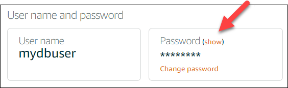
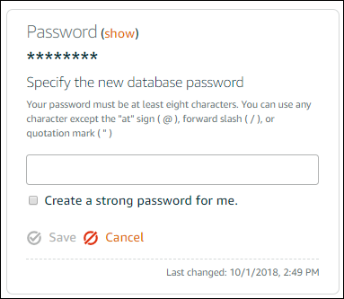

# Change your Lightsail database

password

When you create a new database in Amazon Lightsail, you can let Lightsail create a strong
password for you or specify your own. You can view or change the current database password at
any time in the Lightsail console.

###### To manage your database password

1. Sign in to the [Lightsail console](https://lightsail.aws.amazon.com/ "https://lightsail.aws.amazon.com/").
2. In the left navigation pane, choose **Databases**.
3. Choose the name of the database for which you want to manage the password.
4. On the **Connect** tab, under the **User name and
   passwords** section, choose **Show** to view the current
   database password.

 5. To change the database password, choose **Change password**.

You can opt to have Lightsail create a strong password for you, or you can enter your
own password into the text box. The password can include any printable ASCII character
except "/", """, or "@". For MySQL databases, the password must contain from 8 to 41
characters. For PostgreSQL, the password must contain from 8 to 128 characters.

 6. Choose **Save** when you’re done.

A database password change is applied immediately. If you entered your own password, the
password is saved immediately. If Lightsail created the password for you, it is generated
within a few seconds. Choose **Show** to view the new password.

## Next steps

Here are a few guides to help you manage your database in Lightsail:

- [Connect to your
  MySQL database](amazon-lightsail-connecting-to-your-mysql-database.md "amazon-lightsail-connecting-to-your-mysql-database.md")
- [Connect to your
  PostgreSQL database](amazon-lightsail-connecting-to-your-postgres-database.md "amazon-lightsail-connecting-to-your-postgres-database.md")
- [Create a snapshot of
  your database](amazon-lightsail-creating-a-database-snapshot.md "amazon-lightsail-creating-a-database-snapshot.md")
