# Migrate data from a MySQL

5.6 database to a newer version in Lightsail

In this tutorial, we show you how to migrate data from a MySQL 5.6 database to a new MySQL
5.7 database in Amazon Lightsail. To perform the migration, you connect to your MySQL 5.6
database and export the existing data. You then connect to the MySQL 5.7 database and import the
data. After the new database has the required data, you can reconfigure your application to
connect to the new database.

**Contents**

- [Step 1:
  Understand the changes](#migrate-mysql-5-6-understand-the-changes "#migrate-mysql-5-6-understand-the-changes")
- [Step 2:
  Complete the prerequisites](#migrate-mysql-5-6-complete-the-prerequisites "#migrate-mysql-5-6-complete-the-prerequisites")
- [Step 3: Connect to
  your MySQL 5.6 database and export the data](#migrate-mysql-5-6-connect-to-mysql-5-6 "#migrate-mysql-5-6-connect-to-mysql-5-6")
- [Step 4: Connect to
  your MySQL 5.7 database and import the data](#migrate-mysql-5-6-connect-to-mysql-5-7 "#migrate-mysql-5-6-connect-to-mysql-5-7")
- [Step 5: Test your
  application and complete the migration](#migrate-mysql-5-6-test-your-application "#migrate-mysql-5-6-test-your-application")

## Step 1: Understand the

changes

Going from a MySQL 5.6 database to a MySQL 5.7 database is considered a major version
upgrade. Major version upgrades can contain database changes that are not backward-compatible
with existing applications. We recommend that you thoroughly test any upgrade before applying
it to your production instances. For more information, see [Changes in
MySQL 5.7](https://dev.mysql.com/doc/refman/5.7/en/upgrading-from-previous-series.html "https://dev.mysql.com/doc/refman/5.7/en/upgrading-from-previous-series.html") in the _MySQL documentation_.

We recommend that you first migrate your data from your existing MySQL 5.6 database to a
new MySQL 5.7 database. Then test your application with your new MySQL 5.7 database on a
pre-production instance. If your application behaves as expected, apply the change to your
application in the production instance. To take it a step further, you can then migrate your
data from your existing MySQL 5.7 database to a new MySQL 8.0 database, test your application
in pre-production again, and apply the change to your application in production.

## Step 2: Complete the

prerequisites

You must complete the following prerequisites before continuing to the next sections of
this tutorial:

- Install MySQL Workbench on your local computer, which you will use to connect to your
  databases to export and import data. For more information, see [MySQL Workbench download](https://dev.mysql.com/downloads/workbench/ "https://dev.mysql.com/downloads/workbench/") on the
  _MySQL website_.
- Create a MySQL 5.7 database in Lightsail. For more information, see [Creating a database in
  Amazon Lightsail](amazon-lightsail-creating-a-database.md "amazon-lightsail-creating-a-database.md").
- Enable public mode for your databases. This allows you to connect to them using MySQL
  Workbench. When you're done exporting and importing data, you can disable public mode for
  your databases. For more information, see [Configure the public mode
  for your database](amazon-lightsail-configuring-database-public-mode.md "amazon-lightsail-configuring-database-public-mode.md").
- Configure your MySQL Workbench to connect to your databases. For more information, see
  [Connect to your MySQL
  database](amazon-lightsail-connecting-to-your-mysql-database.md "amazon-lightsail-connecting-to-your-mysql-database.md").

## Step 3: Connect to your MySQL 5.6

database and export the data

In this section of the tutorial, you will connect to your MySQL 5.6 database and export
data from it using MySQL Workbench. For more information about using MySQL Workbench to export
data, see [SQL Data
Export and Import Wizard](https://dev.mysql.com/doc/workbench/en/wb-admin-export-import-management.html "https://dev.mysql.com/doc/workbench/en/wb-admin-export-import-management.html") on the _MySQL Workbench Manual_.

1. Connect to your MySQL 5.6 database using MySQL Workbench.

MySQL Workbench uses mysqldump to export data. The version of mysqldump used by MySQL
Workbench must be the same (or later) as the version of the MySQL database from which you
will export data. For example, if you're exporting data from a MySQL 5.6.51 database, then
you must use mysqldump version 5.6.51 or later. You might need to download and install the
appropriate version of MySQL server on your local computer in order to ensure you're using
the correct version of mysqldump. To download a specific version of MySQL server, see
[MySQL Community Downloads](https://dev.mysql.com/downloads/mysql/ "https://dev.mysql.com/downloads/mysql/") on
the _MySQL website_. The **MySQL Installer for
Windows MSI** offers the option to download any version of MySQL server.

Complete the following steps to choose the correct version of mysqldump to use in
MySQL Workbench:

    1. In MySQL Workbench, choose **Edit**, and then choose
     **Preferences**.

    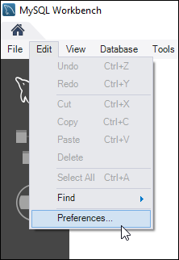
    2. Choose **Administration** in the navigation pane.
    3. In the **Workbench Preferences** window that appears, choose the
     ellipsis button next to the **Path to mysqldump Tool** text box.

    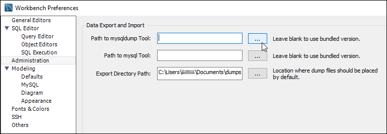
    4. Browse to the location of the appropriate `mysqldump` executable file,
     and double-click it.

    In Windows, the `mysqldump.exe` file is typically located in the
     `C:\Program Files\MySQL\MySQL Server 5.6\bin` directory. In Linux, enter
     `which mysqldump` in the terminal to see where the
     **mysqldump** file is located.

    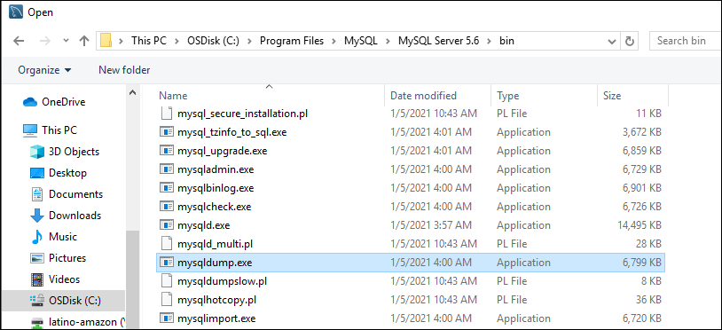
    5. Choose **OK** in the in the **Workbench Preferences
     window**.

    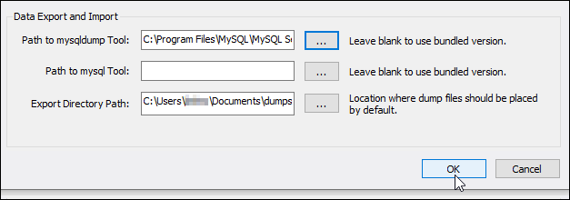

2. Choose **Data Export** in the **Navigator**
   pane

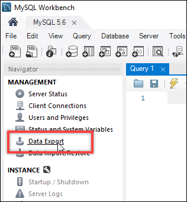 3. In the **Data Export** tab that appears, add a check mark next to the
tables that you wish to export.

###### Note

In this example, we chose the `bitnami_wordpress` table that contains
data for a WordPress website on a "Certified by Bitnami" WordPress instance.

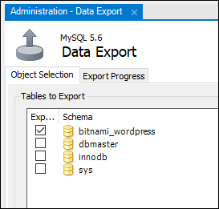 4. In the **Export Options** section, choose **Export to
Self-Contained File**, and then make a note of the directory in which the
export file will be saved.

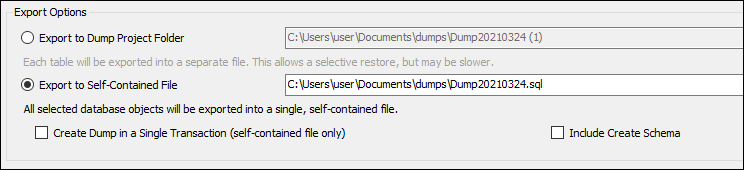 5. Choose **Start Export**. 6. Wait for the export to complete before continuing to the next section of this
tutorial.

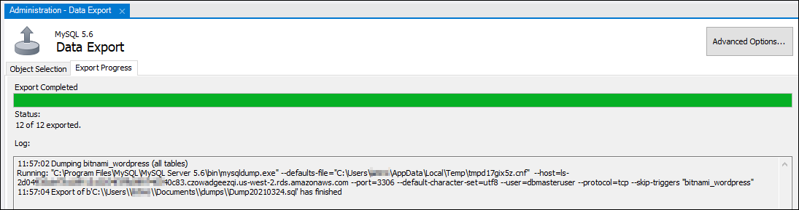

## Step 4: Connect to your MySQL 5.7

database and import the data

In this section of the tutorial, you will connect to your MySQL 5.7 database and import
data to it using MySQL Workbench.

1. Connect to your MySQL 5.7 database using MySQL Workbench on your local
   computer.
2. Choose **Data Import/Restore** in the **Navigator**
   pane.

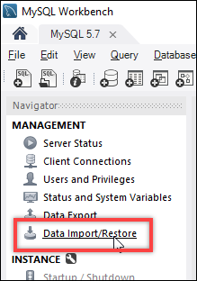 3. In the **Data Import** tab that appears, choose **Import from
Self-Contained File**, and then choose the ellipsis button next to the text
box.

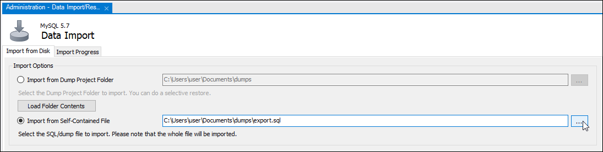 4. Browse to the location where the export file was saved, and double-click it.

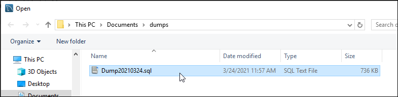 5. Choose **New** in the **Default Schema to be imported
To** section.

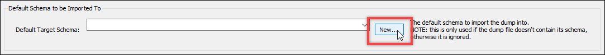 6. Enter the name of the schema in the **Create Schema** window that
appears.

###### Note

In this example, we enter `bitnami_wordpress` because that is the name of
the database table that we exported.

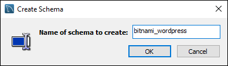 7. Choose **Start Import**.

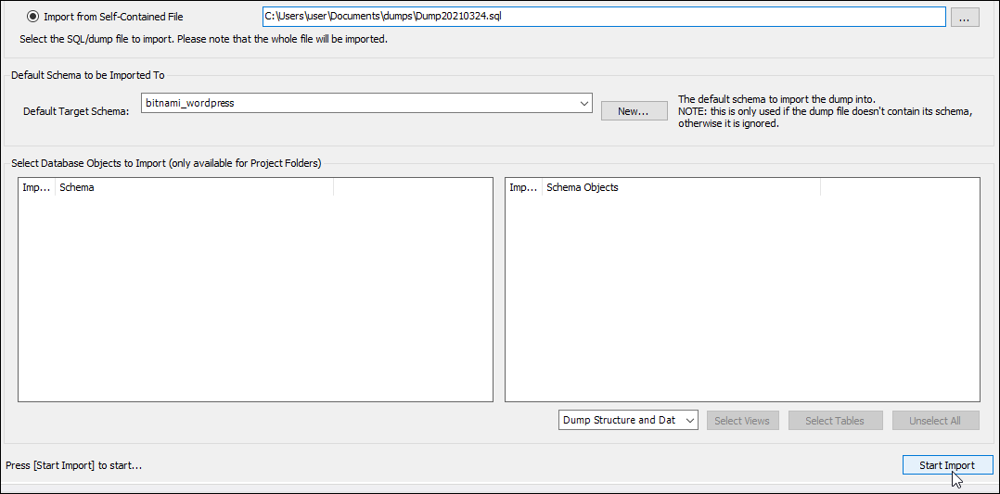 8. Wait for the import to complete before continuing to the next section of this
tutorial.

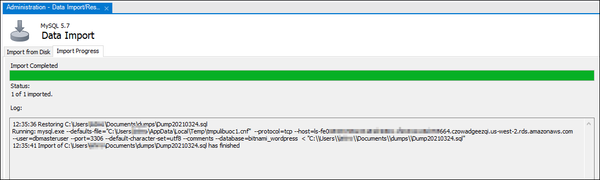

## Step 5: Test your application and

complete the migration

At this point, your data is now in your new MySQL 5.7 database. Configure your application
in a pre-production environment, and test the connection between your application and your new
MySQL 5.7 database. If your application behaves as expected, then proceed to make the change
to your application in the production environment.

When you're finished with the migration, you should disable the public mode for your
databases. You can delete your MySQL 5.6 database when you are certain you no longer need it.
However, you should create a snapshot of your MySQL 5.6 database before you delete it. While
you're at it, you should also create a snapshot of your new MySQL 5.7 database. For more
information, see [Create a
database snapshot](amazon-lightsail-creating-a-database-snapshot.md "amazon-lightsail-creating-a-database-snapshot.md").
