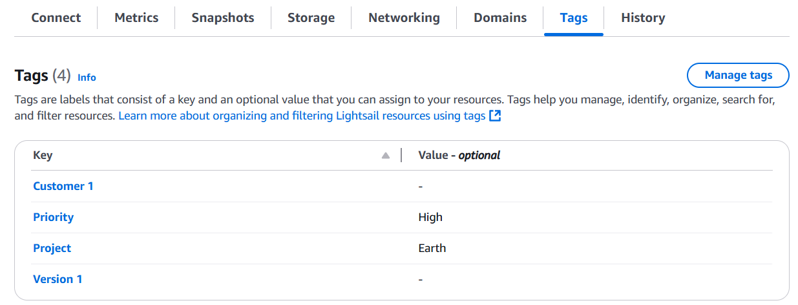
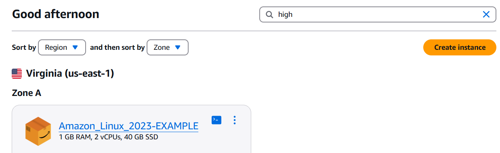
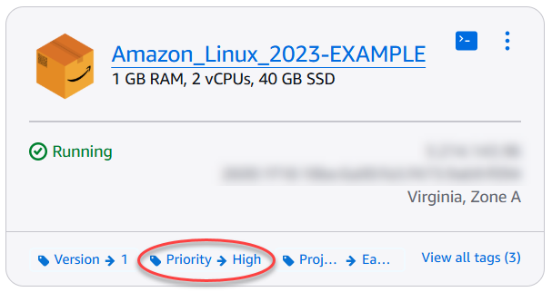

# Tag Lightsail resources for

organization and filtering

After you tag your Amazon Lightsail resources, you can filter your resources by the tags you
have added. You do this in the Lightsail console by choosing or searching for a tag. This
guide shows you how to view and filter your Lightsail resources by tags.

###### Note

For more information about tags, what resources can be tagged, and tag restrictions, see
[Tags](amazon-lightsail-tags.md "amazon-lightsail-tags.md").

## View tags for a resource

Instances, container services, CDN distributions, buckets, databases, disks, DNS zones,
and load balancers can be tagged using the Lightsail console and therefore contain a
**Tags** tab. That tab is accessible through the resource’s management
page, as shown in the following example for an instance resource. On the
**Tags** tab, you can add, edit, or delete tags. For more information, see
[Add tags to a resource](amazon-lightsail-adding-tags-to-a-resource.md "amazon-lightsail-adding-tags-to-a-resource.md"),
and [Delete tags](amazon-lightsail-deleting-tags.md "amazon-lightsail-deleting-tags.md").

###### Note

Instances, container services, CDN distributions, buckets, databases, disks, DNS zones,
and load balancers can be tagged using the Lightsail console. However, more Lightsail
resources can be tagged using the [Lightsail API operations](../../2016-11-28/api-reference/Welcome.md "../../2016-11-28/api-reference/Welcome.md"), or the [AWS Command Line Interface](../../../cli/latest/reference/lightsail.md "../../../cli/latest/reference/lightsail.md")
(AWS CLI) or SDKs. For a full list of Lightsail resources that support tagging, see [Tags](amazon-lightsail-tags.md "amazon-lightsail-tags.md").

## Filter resources using tags

The following options are available in the Lightsail console to filter your resources
using tags. All of these options refresh the Lightsail home page to display only the tag
that you searched for or selected.

###### Note

These filtering options are persistent. If you filter by a tag, and then navigate
between sections of the Lightsail home page, the filter is still applied.

- On the Lightsail home page, enter the key-only tag or the value that you want to
  filter by into the **Search** text box, and press
  **Enter**.

- Choose a tag that is displayed under a resource on the Lightsail home page.

