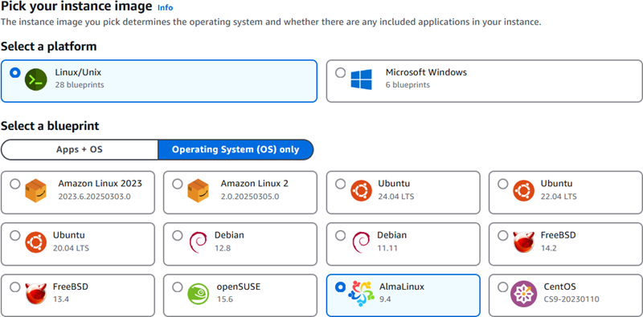
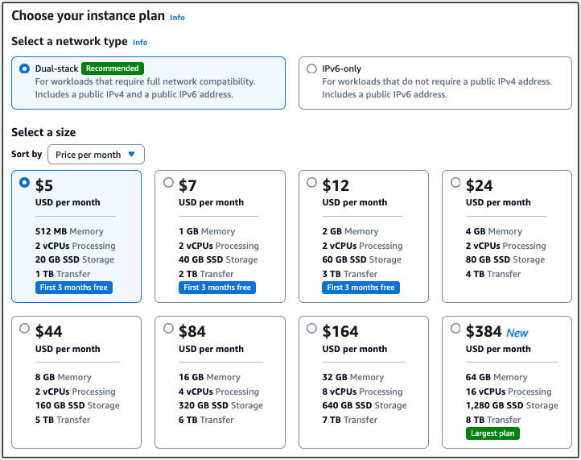
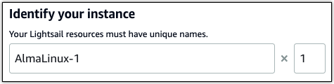

# Launch and set up an

AlmaLinux instance on Lightsail

###### Did you know?

Lightsail stores seven daily snapshots and automatically replaces the oldest with the newest when you enable
automatic snapshots for your instance. For more information, see
[Configure automatic snapshots for Lightsail instances and disks](amazon-lightsail-configuring-automatic-snapshots.md "amazon-lightsail-configuring-automatic-snapshots.md")
.

This quick start guide provides step-by-step instructions for creating and configuring an
AlmaLinux instance on the Amazon Lightsail platform. This topic covers the key steps,
including selecting your instance location and plan, setting up networking and security, and
transitioning from CentOS to AlmaLinux. By following these steps, you can quickly get your
AlmaLinux instance up and running on Lightsail.

###### Topics

- [Prerequisites](#amazon-lightsail-quick-start-guide-almalinux-prerequisites "#amazon-lightsail-quick-start-guide-almalinux-prerequisites")
- [Create an
  AlmaLinux instance in Lightsail](#amazon-lightsail-quick-start-guide-almalinux-create-instance "#amazon-lightsail-quick-start-guide-almalinux-create-instance")
- [(Optional) Additional
  setup](#amazon-lightsail-additional-setup-almalinux "#amazon-lightsail-additional-setup-almalinux")
- [Migrate data from CentOS
  to AlmaLinux on Lightsail](amazon-lightsail-migrate-centos-to-almalinux.md "amazon-lightsail-migrate-centos-to-almalinux.md")

## Prerequisites

- If you're a new AWS customer, complete the setup prerequisites before you
  start using Amazon Lightsail. For more information, see [Set up AWS account and administrative users for
  Lightsail](setting-up.md "setting-up.md").
- Read the AlmaLinux documentation on the [_AlmaLinux
  Wiki_](https://wiki.almalinux.org/ "https://wiki.almalinux.org/") site.

## Create an

AlmaLinux instance in Lightsail

Complete the following procedure to create an AlmaLinux instance by using the [Lightsail console](https://lightsail.aws.amazon.com/ "https://lightsail.aws.amazon.com/").

1. Sign in to the [Lightsail
   console](https://lightsail.aws.amazon.com/ "https://lightsail.aws.amazon.com/").
2. On the home page, choose **Create instance**.
3. Select a location for your instance (an AWS Region and Availability Zone).
   Choose an AWS Region that is closest to your physical location for reduced
   latency.

Choose **Change your Availability Zone** to create your
instance in another location. 4. Choose the Linux platform. 5. Choose **Operating System (OS) only**, then pick the
**AlmaLinux** blueprint.

 6. Optionally, you can:

    1. Add a shell script that will run on your instance the first time it
     launches by selecting **Add launch script**. For more
     information, see [Configure Linux/Unix instances with launch scripts in Lightsail](lightsail-how-to-configure-server-additional-data-shell-script.md "lightsail-how-to-configure-server-additional-data-shell-script.md").
    2. To change the SSH key pair for your instance, choose a key from the
     dropdown list below **SSH key**. For more information,
     see [Set up SSH keys for Lightsail](lightsail-how-to-set-up-ssh.md "lightsail-how-to-set-up-ssh.md").
    3. Enable **Automatic Snapshots** for your instance and
     the attached disks by selecting **Enable Automatic
     Snapshots**. For more information, see [Configure automatic snapshots
     for Lightsail instances and disks](amazon-lightsail-configuring-automatic-snapshots.md "amazon-lightsail-configuring-automatic-snapshots.md").

7. Choose your instance plan. You can choose whether your instance uses
   dual-stack (IPv4 and IPv6), or IPv6-only networking. The AlmaLinux blueprint
   supports both dual-stack and IPv6-only bundles. To learn more about IPv6-only
   networking, see [Configure IPv6-only networking for
   Lightsail instances](amazon-lightsail-ipv6-only-plans.md "amazon-lightsail-ipv6-only-plans.md").

 8. Enter a name for your instance.

Resource names:

    * Must be unique within each AWS Region in your Lightsail
     account.
    * Must contain 2 to 255 characters.
    * Must start and end with an alphanumeric character or number.
    * Can include alphanumeric characters, numbers, periods, dashes, and
     underscores.

 9. (Optional) Choose **Add new tag** to add a tag to your instance. Repeat this step as needed to add additional tags. For
more information on tag usage, see [Tags](amazon-lightsail-tags.md "amazon-lightsail-tags.md").

    1. For **Key**, enter a tag key.

    
    2. (Optional) For **Value**, enter a tag value.

    

10. Choose **Create instance**.

Within minutes, your Lightsail instance is ready and you can connect to it.

## (Optional) Additional

setup

Here are a few steps you should take to get started after your AlmaLinux instance is
up and running on Lightsail:

- Attach a static IP address to your instance
  – The default dynamic public IP address attached to your instance changes
  every time you stop and start the instance. Create a static IP address, and
  attach it to your instance, to keep the public IP address from changing. Later,
  when you use your domain name with your instance, you don’t have to update your
  domain’s DNS records each time you stop and start the instance. You can attach
  one static IP to an instance.

The default dynamic public IP address attached to your instance changes every time you
stop and start the instance. You can create a static IP address and attach it to your instance to
keep the public IP address from changing. Later, when you use your domain name with your
instance, you don’t have to update your domain’s DNS records each time you stop and start the
instance. You can attach only one static IP address to each instance.

On the instance management page, under the **Networking** tab,
choose **Create a static IP** or **Attach static
IP** (if you previously created a static IP that you can attach to your
instance), then follow the instructions on the page. For more information, see [Create a static IP and attach it to an
instance](lightsail-create-static-ip.md "lightsail-create-static-ip.md").

- Register a domain in Lightsail Register and
  manage domain names in Lightsail. Lightsail uses Amazon Route 53, a highly
  available and scalable Domain Name System (DNS) web service, to register domains
  for you. After your domain is registered, you can assign it to your Lightsail
  resources or manage DNS records for it. For more information, see [Register and manage domains for your website in Lightsail](amazon-lightsail-domain-registration.md "amazon-lightsail-domain-registration.md").
- Map your domain name to your instance –
  To map your domain name, such as `example.com`, to your instance, you
  add a record to the domain name system (DNS) of your domain. DNS records are
  typically managed and hosted at the registrar where you registered your domain.
  However, we recommend that you transfer management of your domain's DNS records
  to Lightsail so that you can administer it using the Lightsail
  console.

On the Lightsail console home page, on the **Domains &
DNS** section, choose **Create DNS zone**, then
follow the instructions on the page. For more information, see [Create a DNS zone to manage domain records
for Lightsail instances](lightsail-how-to-create-dns-entry.md "lightsail-how-to-create-dns-entry.md").

- Create a snapshot of your instance – A
  snapshot is a copy of the system disk and original configuration of an instance.
  The snapshot includes such information as memory, CPU, disk size, and data
  transfer rate. You can use a snapshot as a baseline for new instances, or as a
  data backup.

Under the **Snapshot** tab of your instance’s management
page, enter a name for the snapshot, then choose **Create
snapshot**. For more information, see [Back up Linux/Unix
Lightsail instances with snapshots](lightsail-how-to-create-a-snapshot-of-your-instance.md "lightsail-how-to-create-a-snapshot-of-your-instance.md").

To learn how to migrate from CentOS to AlmaLinux, continue to the next topic: [Migrate data from CentOS
to AlmaLinux on Lightsail](amazon-lightsail-migrate-centos-to-almalinux.md "amazon-lightsail-migrate-centos-to-almalinux.md").
