# Get started with OpenClaw on Lightsail

OpenClaw is an AI-powered chat gateway that runs on Amazon Lightsail, giving you a private,
self-hosted AI assistant accessible from your browser, Telegram, WhatsApp, and more. This tutorial
walks you through launching an Amazon Lightsail OpenClaw instance, pairing your browser,
enabling AI capabilities, and optionally connecting messaging channels.

###### Did you know?

Your Lightsail OpenClaw instance comes pre-configured with Amazon Bedrock as the
default AI model provider. Once you complete setup, you can start chatting with your AI
assistant immediately — no additional configuration required.

## Step 1: Create an OpenClaw instance

In this step, you create a Lightsail instance running OpenClaw.

###### To create a Lightsail instance with OpenClaw

1. Sign in to the [Lightsail
   console](https://lightsail.aws.amazon.com "https://lightsail.aws.amazon.com").
2. On the **Instances** section of the Lightsail home page, choose
   **Create instance**.
3. Choose the AWS Region and Availability Zone for your instance.
4. Choose the image for your instance as follows:

   - Under **Select a platform**, choose
     **Linux/Unix**.
   - Under **Select a blueprint**, choose
     **OpenClaw**.

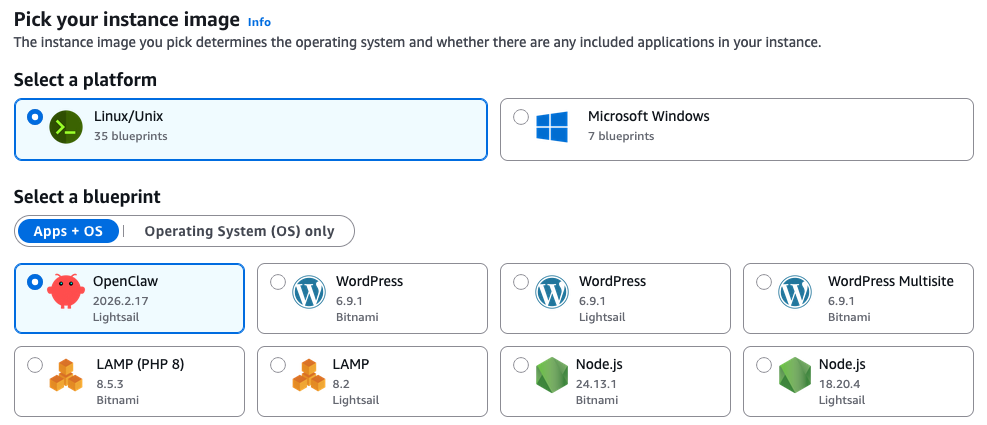 5. Under **Choose your instance plan**, select an instance plan (4 GB
memory plan is recommended for optimal performance). 6. Enter a name for your instance, or use the default name provided.

###### Note

Instance names must be unique within your Lightsail account, 2–255 characters,
start and end with an alphanumeric character, and contain only alphanumeric characters,
periods, dashes, or underscores. 7. Choose **Create instance**.

Your instance will be in a **Starting** state for a few minutes while it
starts up. Wait until the status shows **Running** before proceeding to the
next step.

## Step 2: Pair your browser with OpenClaw

Before you can use the OpenClaw dashboard, you need to pair your browser with OpenClaw.
This creates a secure connection between your browser session and OpenClaw.

###### Tip

Have your browser ready on the same device you'll use to access the OpenClaw dashboard.
You will copy a token from Lightsail, and paste it in the OpenClaw dashboard during this
step.

The default public IP address for your OpenClaw instance changes if you stop and start
your instance. When you attach a static IP address to your instance, it stays the same
even if you stop and start your instance. For more information, see
[View and manage IP
addresses for Lightsail resources](understanding-public-ip-and-private-ip-addresses-in-amazon-lightsail.md "understanding-public-ip-and-private-ip-addresses-in-amazon-lightsail.md").

###### To pair your browser with OpenClaw

1. On the **Instances** section of the Lightsail console, choose the
   name of your OpenClaw instance to open the instance management page.
2. In the **Getting started** tab, under **Pair your browser to
   OpenClaw**, choose **Connect using SSH**. A browser-based SSH
   terminal opens.

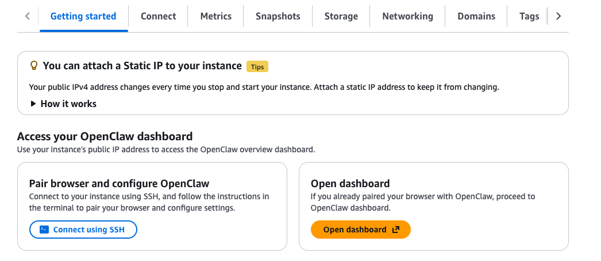

###### Did you know?

The Message of the Day (MOTD) service running on your OpenClaw instance manages several
automated configuration tasks, including origin detection, certificate management, and token rotation.
You can check your MOTD version by connecting to your instance via SSH.

Your OpenClaw instance automatically configures the gateway to accept connections
from the instance’s IP address. MOTD version 2.0.0 includes an automatic origin detection
feature that runs during instance startup and configures the allowed origin to be the instance's
current IP address. When you attach a static IP address to your instance, the system automatically
updates the allowed origin to use the static IP address instead.

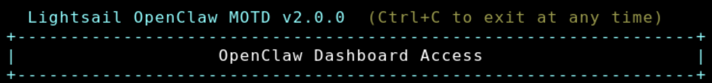 3. In the SSH terminal, locate the **Dashboard URL** displayed in the
welcome message. Copy this URL and open it in a new browser tab.

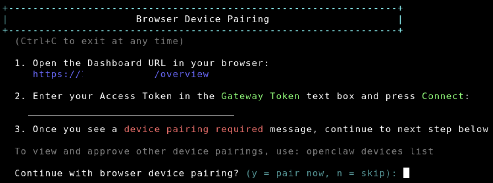 4. In the OpenClaw dashboard that opens, locate the **Gateway Token**
field. 5. Back in the SSH terminal, copy the **Access Token** displayed. 6. Paste the copied access token into the **Gateway Token** field in the
OpenClaw dashboard, then click **Connect**.

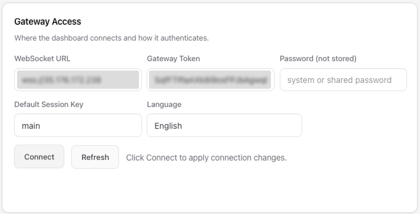 7. Return to the SSH terminal. When prompted, press `y` to approve the OpenClaw CLI.
This will allow the SSH terminal to manage OpenClaw running on your instance.

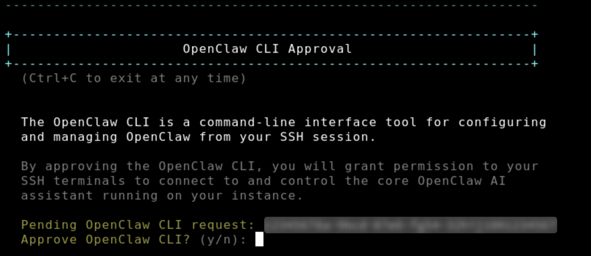 8. Then, press `y` again when prompted, to continue
with device pairing. 9. Press `a` to approve the device pairing request.

When pairing is complete, the status in the OpenClaw dashboard will show
**OK**. Your browser is now connected to your OpenClaw instance.

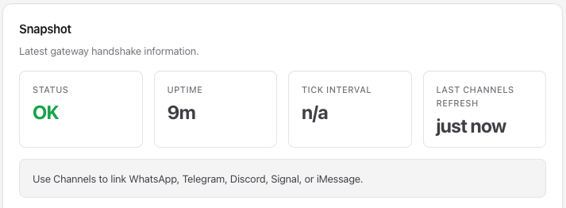

###### Tip

If you need to pair an additional browser later, simply SSH into your instance again and
repeat the pairing steps above.

## Step 3: Enable AI capabilities with Amazon Bedrock

Your Lightsail OpenClaw instance is configured to use Amazon Bedrock to power its AI
assistant. In this step, you will grant your instance the permissions it needs to call the
Bedrock API.

###### To enable Bedrock API access

1. On your OpenClaw instance management page, choose the **Getting
   started** tab.
2. Under **Enable Amazon Bedrock as your model provider**, click the
   **Copy the script** button. Then click the **Launch
   CloudShell** button to open CloudShell.

###### What does the setup script do?

The setup script performs the following actions: creates an IAM role specifically
for your OpenClaw instance, attaches a policy granting access to Amazon Bedrock APIs,
attaches a policy granting AWS Marketplace permissions (required for third-party models),
and configures the instance profile to use this role. You can review the IAM policy details
in the [IAM console](https://console.aws.amazon.com/iam/ "https://console.aws.amazon.com/iam/") after running the
script. The IAM role will be named `LightsailRoleFor-[your-instance-id]`.

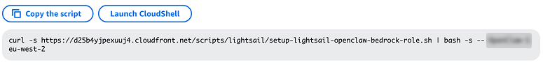 3. Paste the copied command into the CloudShell terminal and press
**Enter**. 4. Wait for the script to complete. When you see **Done** in the output,
the permissions have been applied successfully.

Once this step is complete, navigate to **Chat** in the OpenClaw
dashboard to start using your AI assistant.

**Note:** Your Lightsail OpenClaw instance uses Anthropic Claude Sonnet 4.6 by default. If this is your
first time using Anthropic models in Amazon Bedrock, you'll need to complete the First
Time Use (FTU) form to gain access. [Learn more
on how to access Anthropic models](../../../bedrock/latest/userguide/model-access.md "../../../bedrock/latest/userguide/model-access.md").

## Step 4: Connect a messaging channel (optional)

You can extend OpenClaw to work with messaging apps like Telegram and WhatsApp, so you can
interact with your AI assistant directly from your phone or messaging client. Before you can
connect OpenClaw to a messaging channel, you need to pair your browser with OpenClaw (see Step
2).

### Connect Telegram

###### To add a Telegram channel

1. Open Telegram and search for `@BotFather`.
2. Send the command `/newbot` and follow the prompts to create a new bot.
   BotFather will provide a **bot token** and a **deep link** for your bot.

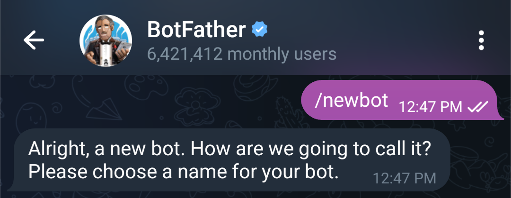 3. Connect to your OpenClaw instance using SSH. A browser-based SSH terminal
opens. 4. In the SSH terminal connected to your OpenClaw instance, run:

```
openclaw channels add
```

5. Select **Telegram** from the list of available channels.

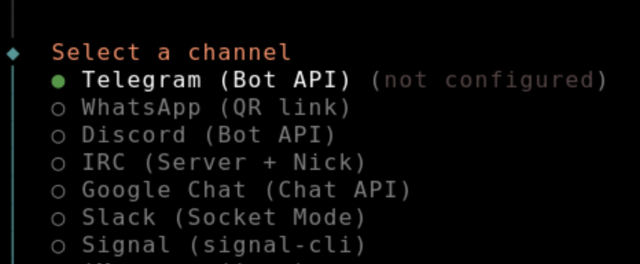 6. When prompted, enter the **bot token** you received
from BotFather in step 2. 7. In the OpenClaw dashboard, navigate to the **Channels** section,
and add your **Telegram user ID** to the allow list.

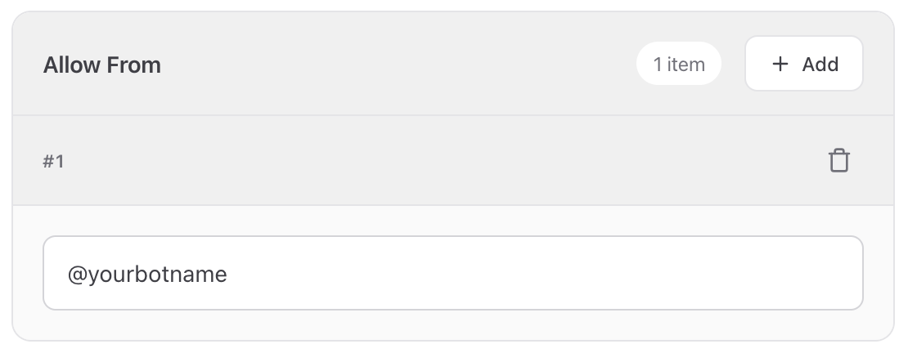 8. Test the integration by sending a message to your bot in Telegram in Step 2. 9. You will see a message in Telegram to approve OpenClaw pairing. In the SSH terminal, run:

```
openclaw pairing approve telegram [pairing code]
```

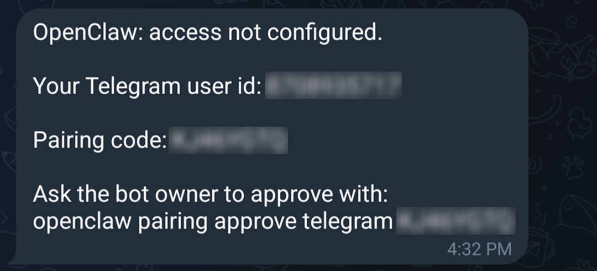 10. Test the integration again by sending a message to the bot you created in Telegram in Step 2

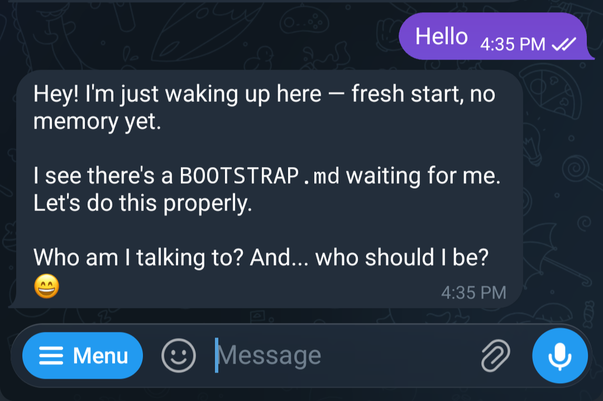

### Connect WhatsApp

###### To add a WhatsApp channel

1. Connect to your OpenClaw instance using SSH. A browser-based SSH terminal
   opens.
2. In the SSH terminal connected to your OpenClaw instance, run:

```
openclaw channels add
```

3. Select **WhatsApp** from the list of available channels.
4. Follow the on-screen instructions. A **QR code** will
   be displayed in the terminal.
5. On your phone, open WhatsApp, and use the **Linked Devices**
   feature to scan the QR code.
6. Complete the pairing on your phone.
7. Test the integration by sending a message to your OpenClaw assistant directly through WhatsApp by
   messaging the contact number you paired in above steps.

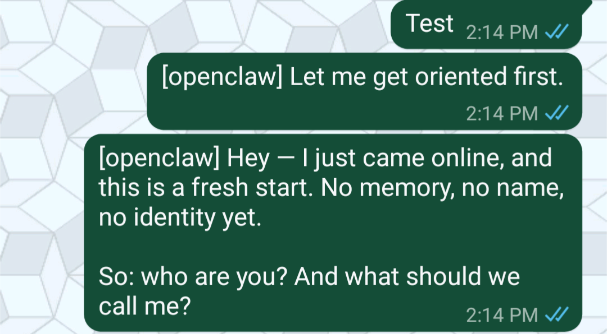

## Step 5: Create a snapshot of your instance (optional)

After completing the setup, we recommend creating a snapshot of your OpenClaw instance.
Snapshots are point-in-time backups that let you restore your instance from a good known
state, providing a reliable recovery mechanism. You can also create new instances of your
desired plan from the snapshots.

###### To create a manual snapshot

1. On the **Instances** section of the Lightsail console, choose the
   name of your OpenClaw instance.
2. Choose the **Snapshots** tab.
3. Under **Manual snapshots**, choose **Create
   snapshot**.
4. Enter a name for your snapshot and choose **Create**.

###### Did you know?

Lightsail stores seven daily snapshots and automatically replaces the oldest with the newest when you enable
automatic snapshots for your instance. For more information, see
[Configure automatic snapshots for Lightsail instances and disks](amazon-lightsail-configuring-automatic-snapshots.md "amazon-lightsail-configuring-automatic-snapshots.md")
.

## Frequently asked questions (FAQ)

**How do I pair an additional browser with my OpenClaw instance?**

You can pair as many browsers as you need. To pair a new browser, SSH into your OpenClaw instance again (from the instance management page in the Lightsail console, choose **Connect using SSH**). Follow the same pairing steps from Step 2: navigate to the Dashboard URL, copy the access token from the terminal, paste it into the Gateway Token field in the OpenClaw dashboard on the new browser, and approve the pairing request.

**Can I customize the IAM permissions granted to my OpenClaw instance?**

Yes. The setup script in Step 3 creates an IAM role with a policy that grants access to Amazon Bedrock. You can view, edit, or restrict this policy at any time:

- Open the [IAM console](https://console.aws.amazon.com/iam/ "https://console.aws.amazon.com/iam/") and navigate to **Roles**.
- Find the role created for your OpenClaw instance, e.g. `LightsailRoleFor-i-0d15d5483571b95bb`.
- Choose the role to view its attached policies.
- Choose the policy name to edit its permissions.

Be careful when modifying permissions — removing required Bedrock permissions will prevent OpenClaw from generating AI responses. For more information, see [IAM policies](../../../IAM/latest/UserGuide/access_policies.md "../../../IAM/latest/UserGuide/access_policies.md") in the AWS documentation.

**Can I ask OpenClaw questions about itself — like what it can do or how to use it?**

Yes, OpenClaw's built-in chat assistant can answer questions about OpenClaw itself. If you're not sure what OpenClaw can do, just ask it directly in the Chat interface. For example, you can type:

- _"What can you help me with?"_
- _"What channels can I connect to OpenClaw?"_
- _"How do I add a new messaging channel?"_

OpenClaw will respond with guidance based on its capabilities. This is a great way to explore features without leaving the OpenClaw dashboard.

**Note:** You will need to either complete the **Enable AI capabilities with Amazon Bedrock** step (Step 3 in the getting started guide) or configure your own model provider for chat to work. The Bedrock setup involves running a one-click script from your instance's Getting started tab to grant the necessary permissions, and — if it's your first time using Anthropic models — submitting a brief First Time Use form in the Amazon Bedrock console. Without this step, the Chat interface will not have an AI model to connect to.

**What does running OpenClaw on Lightsail cost?**

Here is a breakdown of costs:

- **Lightsail instance** — You pay for the instance plan you selected (e.g. the 4 GB plan). Lightsail plans are billed on an on-demand hourly rate, so you pay only for what you use. For every Lightsail plan you use, we charge you the fixed hourly price, up to the maximum monthly plan cost.
- **AI model usage (tokens)** — Every message sent to and received from the OpenClaw assistant is processed through Amazon Bedrock using a token-based pricing model. Costs vary by model — some models are more expensive per token than others.
- **Third-party model subscriptions** — If you select a third-party model distributed through AWS Marketplace (such as Anthropic Claude or Cohere), there may be additional software fees on top of the per-token cost. These appear as separate line items under **AWS Marketplace** in your bill.
- **Data transfer overages** — [Each Lightsail plan](amazon-lightsail-bundles.md#linux-unix-bundles "amazon-lightsail-bundles.md#linux-unix-bundles") includes a monthly data transfer allowance. If your OpenClaw instance sends or receives more data than your plan includes, [overage charges apply for data transfer out.](amazon-lightsail-faq-data-transfer-allowance.md "amazon-lightsail-faq-data-transfer-allowance.md")
- **Snapshots** — Manual and automatic snapshots of your Lightsail instance are billed based on the amount of storage used.

**I want to use an Anthropic model. Is there anything extra I need to do?**

Anthropic has one additional requirement beyond the standard permissions: you must complete a [**First Time Use (FTU) form**](../../../bedrock/latest/userguide/model-access.md "../../../bedrock/latest/userguide/model-access.md") before invoking an Anthropic model for the first time. This is an Anthropic requirement and applies once per AWS account — or once at the AWS Organization's management account level, which is then inherited by all member accounts in the organization. Your OpenClaw instance uses Anthropic Claude-Sonnet 4.6 by default.

Lightsail takes care of the underlying IAM and Marketplace permissions for you as part of the setup in Step 3. The CloudShell script creates an IAM role that includes the three required AWS Marketplace permissions (`aws-marketplace:Subscribe`, `aws-marketplace:Unsubscribe`, and `aws-marketplace:ViewSubscriptions`). These are needed for Amazon Bedrock to automatically enable third-party models the first time they are invoked. Once a model has been enabled in your account, all users in the account can invoke it without needing Marketplace permissions themselves — the subscription only needs to happen once.

To complete the Anthropic-specific FTU requirement:

- Open the [Amazon Bedrock console](https://console.aws.amazon.com/bedrock/ "https://console.aws.amazon.com/bedrock/").
- Navigate to the **Model catalog** and select an Anthropic model (such as Claude).
- You will be prompted to submit use case details. Complete and submit the form.

Access to Anthropic models is granted immediately after the form is successfully submitted. Once done, you can select any Anthropic model in the OpenClaw dashboard and start using it right away.

###### Note

Models from Amazon, Meta, Mistral AI, DeepSeek, and Qwen are not sold through AWS Marketplace and do not require this step.

For more information, see [Access Amazon Bedrock foundation models](../../../bedrock/latest/userguide/model-access.md "../../../bedrock/latest/userguide/model-access.md") in the Amazon Bedrock User Guide.

**How does HTTPS work with my OpenClaw instance?**

Your OpenClaw instance comes with a built-in HTTPS endpoint secured by a Let's Encrypt certificate. When your instance is created, a Let's Encrypt certificate is automatically issued for your instance's IPv4 address — no manual setup is required.

**What happens to my SSL certificate if my instance's IP address changes?**

Your OpenClaw instance includes a built-in certificate management daemon (`lightsail-manage-certd`)
that monitors your instance's IP address. If the IP address changes — for example, when you attach or detach
a static IP — the daemon automatically detects the change and issues a new Let's Encrypt certificate for the
new IP address. No manual action is required for your SSL certificate.

Note: The gateway access token will remain the same, but you will need to re-pair your browsers again by
following the steps in **Step 2: Pair your browser with OpenClaw**

**How often is my SSL certificate renewed?**

Let's Encrypt certificates issued for your OpenClaw instance are valid for 7 days. The certificate management daemon automatically renews your certificate 2 days before it expires, so your instance stays secured without any interruption or manual intervention.

**Can I install plugins on OpenClaw?**

Yes. OpenClaw supports plugin installation, and some plugins or configuration changes may require you to manually restart the OpenClaw gateway service for the changes to take effect.

To manage the gateway after installing a plugin or updating a configuration, SSH into your OpenClaw instance and use the following commands:

- Stop the OpenClaw gateway service: `openclaw gateway stop`
- Start the OpenClaw gateway service: `openclaw gateway start`
- Check the current status of the service: `openclaw gateway status`

**Note:**If you are using MOTD 1.0.0 (OpenClaw 2026.2.17), use the following commands instead:

- Stop the OpenClaw gateway service: `sudo systemctl stop openclaw-gateway`
- Start the OpenClaw gateway service: `sudo systemctl start openclaw-gateway`
- Check the current status of the service: `sudo systemctl status openclaw-gateway`

**What happens if my gateway token is compromised?**

If the token is ever exposed — for example, leaked in logs, accidentally shared, or exposed through a prompt injection attack — anyone who has it can access your OpenClaw gateway until you manually regenerate it.

**Is my gateway token automatically rotated?**

Yes. It is automatically rotated at 3:00 UTC every day. This rotation will require you to re-pair your browser with your OpenClaw instance.

**How do I manually rotate my gateway token?**

To rotate your gateway token:

- SSH into your OpenClaw instance from the Lightsail console.
- Run the following command to regenerate the token:

```
openclaw token rotate
```

- The old token is immediately invalidated. Any browsers or clients currently paired with the old token will be disconnected.
- Re-pair your browsers again using the new token by following the steps in **Step 2: Pair your browser with OpenClaw.**

###### Tip

After rotating your token, check that all trusted devices have been re-paired before resuming use.

**How does automatic token rotation work?**

MOTD 2.0.0 includes automatic token rotation that enhances security by rotating your gateway access token every day.

**Important implications:**

- When the token is automatically rotated, all paired browsers and devices will be disconnected.
- You will need to re-pair your browser again by following the steps in Step 2: Pair your browser with OpenClaw.

If you don't want the token to be rotated, you can disable it in the MOTD by changing the security settings.

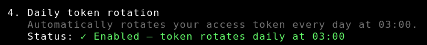

**How do I rotate my messaging channel credentials (Telegram, WhatsApp, Slack)?**

If a messaging platform token or credential stored on your OpenClaw instance is compromised — for example, your Telegram bot token, WhatsApp session credentials, or Slack token — you should rotate it immediately to prevent unauthorized access to your messaging channels.

Credentials for connected channels are stored in `~/.openclaw/credentials/` on your instance. To rotate a credential:

- Revoke the compromised token at the source:

  - Telegram: Open Telegram, message `@BotFather`, and use `/revoke` to invalidate your existing bot token and generate a new one.
  - WhatsApp: Log out the linked device session from WhatsApp on your phone (`Settings` → `Linked Devices` → select your OpenClaw session → `Log out`). Then re-link using the QR code pairing flow.

- Update the credential on your OpenClaw instance: SSH into your instance and run:

```
openclaw channels update
```

Select the channel you want to update and enter the new token or credential when prompted.

- Verify the channel is working by sending a test message through the updated channel.

###### Note

Rotating a messaging credential does not affect your gateway token or other connected channels — each credential is managed independently.

**What does the `setup-lightsail-openclaw-bedrock-role.sh` script do?**

It creates an IAM role that permits only your OpenClaw instance to use foundational models available via Amazon Bedrock and the AWS Marketplace.

**How do I restore an OpenClaw instance from a snapshot?**

- Create a new instance from an existing OpenClaw snapshot. For more information, see
  [Creating an instance from a snapshot](lightsail-how-to-create-instance-from-snapshot.md "lightsail-how-to-create-instance-from-snapshot.md").
- SSH into your new OpenClaw instance from the Lightsail console
- Run the following command to get the instance ID for your Lightsail instance, e.g. `i-1234567890abcdef1`:

```
TOKEN=`curl -s -X PUT "http://169.254.169.254/latest/api/token" -H "X-aws-ec2-metadata-token-ttl-seconds: 21600"` && curl -w "\n" -s -H "X-aws-ec2-metadata-token: $TOKEN" http://169.254.169.254/latest/meta-data/instance-id
```

- Run the following command to get the IAM role associated with the instance:

```
grep 'role_arn' /home/ubuntu/.aws/config | head -1 | awk '{print $3}'
```

- Find the role you retrieved in the previous step on the [IAM console](https://console.aws.amazon.com/iam/ "https://console.aws.amazon.com/iam/"), e.g. `LightsailRoleFor-i-0d15d5483571b95bb`
- Select `Trust relationships`
- Select `Edit trust policy`
- Update the trust policy with the ARN of the instance ID retrieved earlier, e.g. `"arn:aws:sts::0123456789012:assumed-role/AmazonLightsailInstance/i-1234567890abcdef1"`.
- Select `Update policy`

**How do I configure AllowedOrigin for my OpenClaw instance?**

AllowedOrigin is a security setting that controls which web addresses (origins) are permitted to connect to your OpenClaw gateway. This prevents unauthorized websites from accessing your instance and protects against cross-origin security issues.

**MOTD 2.0.0 (OpenClaw 2026.3.2 and later):** AllowedOrigin is automatically managed by the MOTD service. When your instance starts or when the IP address changes, the service automatically detects the correct origin, and updates the configuration. No manual action is required.

**MOTD 1.0.0 (OpenClaw 2026.2.17):** You need to manually configure AllowedOrigin if you are accessing OpenClaw from a specific domain. SSH into your instance and edit the OpenClaw configuration file by following below instructions to add your allowed origins.

- SSH into your OpenClaw instance from the Lightsail console
- Open the configuration file: `~/.openclaw/openclaw.json`
- Add or modify the AllowedOrigin setting:

```
{
    "gateway": {
        "controlUi": {
            "allowedOrigins": [
                "https://<your-domain.com>"
            ]
        }
    }
}
```

- Restart the OpenClaw gateway service: `sudo systemctl restart openclaw-gateway`

**How do I update OpenClaw to the latest version?**

To update your OpenClaw gateway to the latest version:

- SSH into your OpenClaw instance
- Run the update command: `sudo openclaw update --no-restart && openclaw gateway restart`

**Important notes:**

- The OpenClaw blueprint installs the gateway globally on the instance, which is why sudo privileges are required
- The "Update" button in the OpenClaw control UI dashboard will not work because it doesn't have `sudo` privileges

**What happens to device pairing when I attach a static IP address?**

When you attach a static IP address to your OpenClaw instance, the instance's IP address changes. This has important implications for device pairing:

- All previously paired browsers and devices will be disconnected
- The gateway token remains valid, but the connection endpoint has changed
- You must explicitly pair all browsers and devices again after attaching the static IP

**To re-pair your devices:**

- SSH into your instance (the SSH connection will work with the new static IP)
- Follow the pairing steps in Step 2 to reconnect each browser
- For messaging channels (Telegram, WhatsApp), you may also need to re-approve pairing

**How do I grant sandbox permissions for enabling tools?**

By default, OpenClaw runs tools and plugins in isolated Docker container environments (sandboxes) to protect your instance from potentially harmful operations. This isolation restricts what tools can access, including system commands, file system access, network connections, and host system resources.

While this provides strong security, some tools may require less restrictive settings to function properly. For example, web scraping tools need network access, and file management tools need broader filesystem access. Without these permissions, the sandbox functions primarily as a basic chatbot with limited capabilities.

To make the sandbox less restrictive:

- SSH into your OpenClaw instance from the Lightsail console
- Run the following commands to configure tool execution settings:

```
openclaw config set tools.exec.host gateway
openclaw config set tools.exec.ask off
openclaw config set tools.exec.security full
```

- Restart the OpenClaw gateway service for the changes to take effect:

```
openclaw gateway restart
```

What these settings do:

- `tools.exec.host gateway` - Allows tools to execute directly on the gateway host instead of in an isolated Docker container, giving them access to system commands and resources
- `tools.exec.ask off` - Disables permission prompts before tool execution, allowing tools to run automatically without manual approval
- `tools.exec.security full` - Sets the security level for tool execution

**Security consideration:** These settings significantly reduce the isolation between tools and your system. Only configure these settings if you trust the tools you're using. Running tools with less restrictive sandbox settings may expose your instance to security risks if a tool is compromised or malicious.

**What are the differences between MOTD versions?**

OpenClaw instances use different MOTD (Message of the Day) versions depending on when they were created. Here's what you need to know:

**MOTD 1.0.0 (OpenClaw 2026.2.17):**

- Gateway management: Use `sudo systemctl start/stop/status openclaw-gateway`
- Token rotation: Manual only (use `openclaw token rotate`)

**MOTD 2.0.0 (OpenClaw 2026.3.2 and later):**

- Gateway management: Use simplified commands `openclaw gateway start/stop/status`
- Token rotation: Automatic daily rotation

**How to check your MOTD version:** SSH into your instance and look at the welcome message displayed. The MOTD version appears in the first line of the welcome message.
