# Set up a PrestaShop website on

Lightsail

###### Did you know?

Lightsail stores seven daily snapshots and automatically replaces the oldest with the newest when you enable
automatic snapshots for your instance. For more information, see
[Configure automatic snapshots for Lightsail instances and disks](amazon-lightsail-configuring-automatic-snapshots.md "amazon-lightsail-configuring-automatic-snapshots.md")
.

Here are a few steps you should complete to get started after your PrestaShop instance is up
and running on Amazon Lightsail.

**Contents**

- [Step 1: Get the default application password for your PrestaShop website](#amazon-lightsail-prestashop-get-the-default-user-password "#amazon-lightsail-prestashop-get-the-default-user-password")
- [Step 2:
  Attach a static IP address to your PrestaShop instance](#amazon-lightsail-prestashop-attach-static-ip "#amazon-lightsail-prestashop-attach-static-ip")
- [Step 3: Sign in to the
  administration dashboard of your PrestaShop website](#amazon-lightsail-prestashop-sign-in "#amazon-lightsail-prestashop-sign-in")
- [Step 4: Route traffic for your registered domain name to your PrestaShop
  website](#amazon-lightsail-prestashop-map-your-domain-to-your-instance "#amazon-lightsail-prestashop-map-your-domain-to-your-instance")
- [Step 5: Configure HTTPS
  for your PrestaShop website](#amazon-lightsail-prestashop-https "#amazon-lightsail-prestashop-https")
- [Step 6: Configure SMTP
  for email notifications](#amazon-lightsail-prestashop-smtp "#amazon-lightsail-prestashop-smtp")
- [Step 7: Read the Bitnami and PrestaShop documentation](#amazon-lightsail-prestashop-read-the-bitnami-documentation "#amazon-lightsail-prestashop-read-the-bitnami-documentation")
- [Step 8:
  Create a snapshot of your PrestaShop instance](#amazon-lightsail-prestashop-create-a-snapshot "#amazon-lightsail-prestashop-create-a-snapshot")

## Step 1: Get the

default application password for your PrestaShop website

Complete the following steps to get the default application password for your PrestaShop
website.

1. On the instance management page, under the **Connect** tab, choose
   **Connect using SSH.**

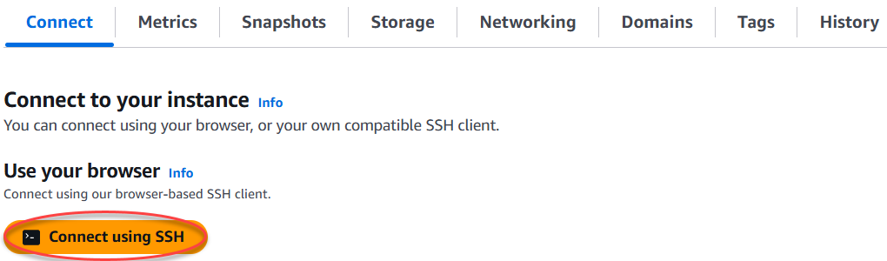 2. After you're connected, enter the following command to get the default application
password:

```
cat $HOME/bitnami_application_password
```

You should see a response similar to the following example, which contains the default
application password. Store this password in a safe place. You will use it in the next
section of this tutorial to sign in to the administration dashboard of your PrestaShop
website.

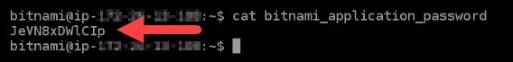

For more information, see [Getting the
application user name and password for your Bitnami instance in
Amazon Lightsail](log-in-to-your-bitnami-application-running-on-amazon-lightsail.md "log-in-to-your-bitnami-application-running-on-amazon-lightsail.md").

## Step 2: Attach a static IP

address to your PrestaShop instance

The default dynamic public IP address attached to your instance changes every time you
stop and start the instance. You can create a static IP address and attach it to your instance to
keep the public IP address from changing. Later, when you use your domain name with your
instance, you don’t have to update your domain’s DNS records each time you stop and start the
instance. You can attach only one static IP address to each instance.

On the instance management page, under the **Networking** tab,
choose **Create a static IP** or **Attach static
IP** (if you previously created a static IP that you can attach to your
instance), then follow the instructions on the page. For more information, see [Create a static IP and attach it to an
instance](lightsail-create-static-ip.md "lightsail-create-static-ip.md").


After the new static IP address is attached to your instance, you must complete the
following steps to make the PrestaShop software aware of the new static IP address.

1. Make a note of the static IP address of your instance. It's listed in the header
   section of your instance management page.

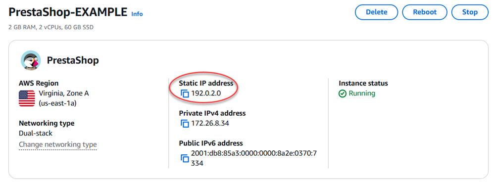 2. On the instance management page, under the **Connect** tab, choose
**Connect using SSH**.

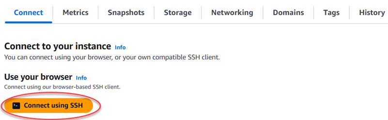 3. After you're connected, enter the following command. Be sure to replace
`<StaticIP>` with the new static IP address of your
instance.

```
sudo /opt/bitnami/configure_app_domain --domain `<StaticIP>`
```

**Example:**

```
sudo /opt/bitnami/configure_app_domain --domain `203.0.113.0`
```

You should see a response similar to the following example. The PrestaShop software
should now be aware of the new static IP address.

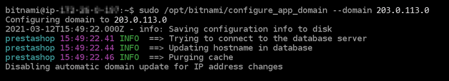

###### Note

PrestaShop does not currently support IPv6 addresses. You can enable IPv6 for the
instance, but the PrestaShop software will not respond to requests over the IPv6
network.

## Step 3: Sign in to the administration

dashboard of your PrestaShop website

Complete the following step to access your PrestaShop website and sign in to its
administration dashboard. To sign in, you will use the default user name
(`user@example.com`) and the default application password that you got earlier in
this guide.

1. In the Lightsail console, make note of the public or static IP address that is
   listed in the header area of the instance management page.

 2. Browse to the following address to access the sign in page for the administration
dashboard of your PrestaShop website. Be sure to replace
`<InstanceIpAddress>` with the public or static IP
address of your instance.

```
http://`<InstanceIpAddress>`/administration
```

**Example:**

```
http://`203.0.113.0`/administration
```

3. Enter the default user name (`user@example.com`), the default application
   password you got earlier in this guide, and choose **Log in**.

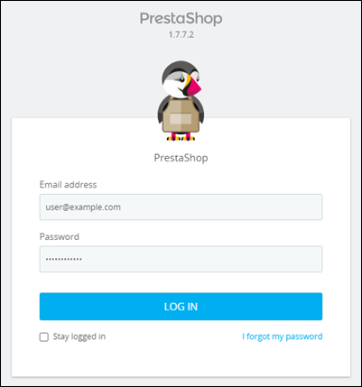

The PrestaShop administration dashboard appears.

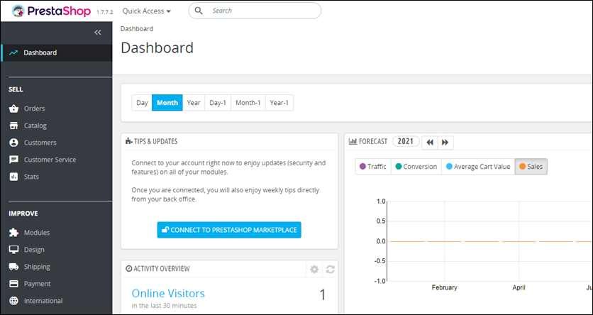

To change the default user name or password that you use to sign in to the administration
dashboard of your PrestaShop website, choose **Advanced Parameters** in the
navigation pane, and then choose **Team**. For more information, see [User Guide
PrestaShop](https://docs.prestashop-project.org/1.7-documentation/user-guide "https://docs.prestashop-project.org/1.7-documentation/user-guide") in the _PrestaShop documentation_.

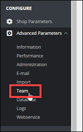

For more information about the administration dashboard, see For more information, see
[User Guide
PrestaShop](https://docs.prestashop-project.org/1.7-documentation/user-guide "https://docs.prestashop-project.org/1.7-documentation/user-guide") in the _PrestaShop documentation_.

## Step 4: Route

traffic for your registered domain name to your PrestaShop website

To route traffic for your registered domain name, such as `example.com`, to
your PrestaShop website, you add a record to the domain name system (DNS) of your domain. DNS
records are typically managed and hosted at the registrar where you registered your domain.
However, we recommend that you transfer management of your domain's DNS records to Lightsail
so that you can administer it using the Lightsail console.

On the Lightsail console home page, under the **Domains &
DNS** tab, choose **Create DNS zone**, then follow the instructions
on the page.

For more information, see [Creating a DNS
zone to manage your domain’s DNS records in Lightsail](lightsail-how-to-create-dns-entry.md "lightsail-how-to-create-dns-entry.md").

After your domain name is routing traffic to your instance, you must complete the
following steps to make the PrestaShop software aware of the domain name.

1. On the instance management page, under the **Connect** tab, choose
   **Connect using SSH**.

 2. After you're connected, enter the following command. Be sure to replace
`<DomainName>` with the domain name that is routing
traffic to your instance.

```
sudo /opt/bitnami/configure_app_domain --domain `<DomainName>`
```

**Example:**

```
sudo /opt/bitnami/configure_app_domain --domain `www.example.com`
```

You should see a response similar to the following example. The PrestaShop software
should now be aware of the domain name.

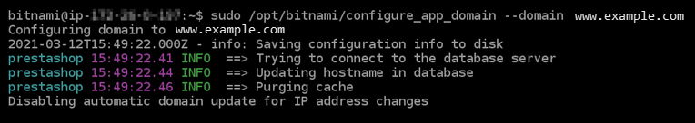

## Step 5: Configure HTTPS for your

PrestaShop website

Complete the following steps to configure HTTPS on your PrestaShop website. These steps
show you how to use the Bitnami HTTPS configuration tool (bncert), which is a command line
tool for requesting SSL/TLS certificates, setting up redirections (e.g. HTTP to HTTPS), and
renewing certificates.

###### Important

The bncert tool will issue certificates only for domains that are currently routing
traffic to the public IP address of your PrestaShop instance. Before starting with these
steps, make sure that you add DNS records to the DNS of all domains that you want to use
with your PrestaShop website.

1. On the instance management page, under the Connect tab, choose **Connect using
   SSH**.

 2. After you're connected, enter the following command to start the bncert-tool.

```
sudo /opt/bitnami/bncert-tool
```

You should see a response similar to the following example:

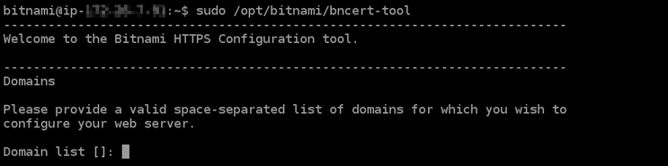 3. Enter your primary domain name and alternate domain names separated by a space as
shown in the following example.

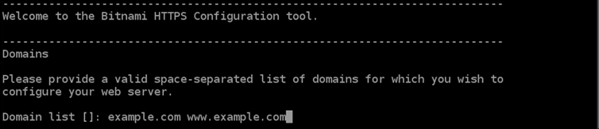 4. The bncert tool will ask how you want your website's redirection to be configured.
These are the options available:

    * **Enable HTTP to HTTPS redirection** - Specifies
     whether users who browse to the HTTP version of your website (i.e.,
     `http:/example.com`) are automatically redirected to the HTTPS version
     (i.e., `https://example.com`). We recommend enabling this option because it
     forces all visitors to use the encrypted connection. Type `Y` and press
     **Enter** to enable it.
    * **Enable non-www to www redirection** - Specifies
     whether users who browse to the apex of your domain (i.e.,
     `https://example.com`) are automatically redirected to your domain's
     `www` subdomain (i.e., `https://www.example.com`). We
     recommend enabling this option. However, you may want to disable it and enable the
     alternate option (enable `www` to non-`www` redirection) if you
     have specified the apex of your domain as your preferred website address in search
     engine tools like Google's webmaster tools, or if your apex points directly to your IP
     and your `www` subdomain references your apex via a CNAME record. Type
     `Y` and press **Enter** to enable it.
    * **Enable www to non-www redirection** - Specifies
     whether users who browse to your domain's `www` subdomain (i.e.,
     `https://www.example.com`) are automatically redirected to the apex of
     your domain (i.e., `https://example.com`). We recommend disabling this, if
     you enabled non-`www` redirection to `www`. Type `N`
     and press **Enter** to disable it.

Your selections should look like the following example.

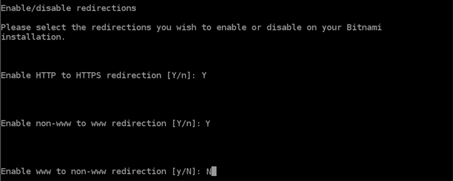 5. The changes that are going to be made are listed. Type `Y` and press
**Enter** to confirm and continue.

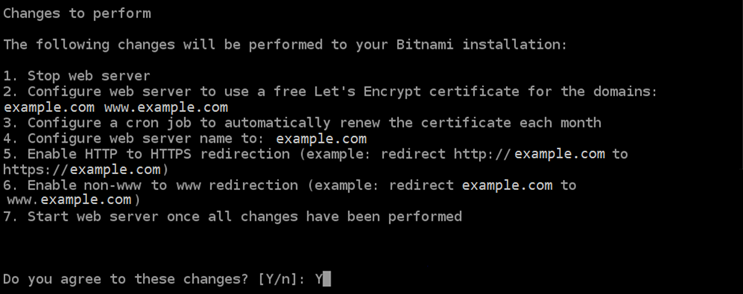 6. Enter your email address to associate with your Let's Encrypt certificate and press
**Enter**.

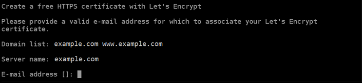 7. Review the Let's Encrypt Subscriber Agreement. Type `Y` and press
**Enter** to accept the agreement and continue.

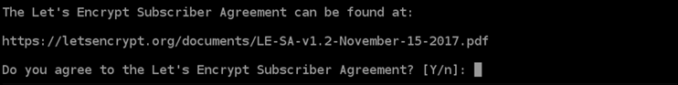

The actions are performed to enable HTTPS on your instance, including requesting the
certificate and configuring the redirections you specified.


Your certificate is successfully issued and validated, and the redirections are
successfully configured on your instance if you see a message similar to the following
example.

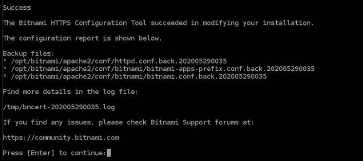

The `bncert` tool will perform an automatic renewal of your certificate
every 80 days before it expires. Continue to the next set of steps to finish enabling
HTTPS on your PrestaShop website. 8. Browse to the following address to access the sign in page for the administration
dashboard of your PrestaShop website. Be sure to replace
`<DomainName>` with the registered domain name that is
routing traffic to your instance.

```
http://`<DomainName>`/administration
```

**Example:**

```
http://`www.example.com`/administration
```

9. Enter the default user name (`user@example.com`), the default application
   password you got earlier in this guide, and choose **Log in**.


The PrestaShop administration dashboard appears.

 10. Choose **Shop Parameters** in the navigation pane, and then choose
**General**.

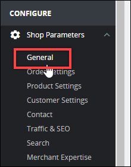 11. Choose **Yes** next to **Enable SSL**.

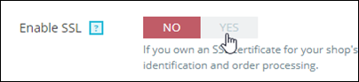 12. Scroll to the bottom of the page and choose **Save**. 13. When the **General** page reloads, choose **Yes**
next to **Enable SSL on all pages**.

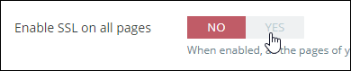 14. Scroll to the bottom of the page and choose **Save**.

HTTPS is now configured for your PrestaShop website. When customers browse to the HTTP
version (e.g., `http://www.example.com`) of your PrestaShop website, they will
be automatically redirected to the HTTPS version (e.g.,
`https://www.example.com`).

## Step 6: Configure SMTP for email

notifications

Configure the SMTP settings of your PrestaShop website to enable email notifications for
it. To do so, sign in to the administration dashboard of your PrestaShop website. Choose
**Advanced Parameters** in the navigation pane, and then choose
**E-mail**. You should also adjust your email contacts accordingly. To do
so, choose **Shop Parameters** in the navigation pane, and then choose
**Contact**.

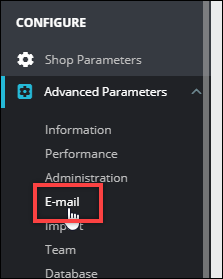

For more information, For more information, see [User Guide
PrestaShop](https://docs.prestashop-project.org/1.7-documentation/user-guide "https://docs.prestashop-project.org/1.7-documentation/user-guide") in the _PrestaShop documentation_ and [Configure
SMTP for outbound emails](https://docs.bitnami.com/aws/apps/prestashop/configuration/configure-smtp/ "https://docs.bitnami.com/aws/apps/prestashop/configuration/configure-smtp/") in the Bitnami documentation.

###### Important

If you configure SMTP to use ports 25, 465, or 587, then you must open those ports in
the firewall of your instance in the Lightsail console. For more information, see [Adding and editing instance firewall
rules in Amazon Lightsail](amazon-lightsail-editing-firewall-rules.md "amazon-lightsail-editing-firewall-rules.md").

If you configure your Gmail account to send email on your PrestaShop website, then you
must use an app password instead of using the standard password that you use to sign in to
Gmail. For more information, see [Sign in with App
Passwords](https://support.google.com/accounts/answer/185833?hl=en "https://support.google.com/accounts/answer/185833?hl=en").

## Step 7: Read the

Bitnami and PrestaShop documentation

Read the Bitnami documentation to learn how to perform administrative tasks on your
PrestaShop instance and website, such as install plugins and customize the theme. For more
information, see [Bitnami PrestaShop
Stack for AWS Cloud](https://docs.bitnami.com/aws/apps/prestashop/ "https://docs.bitnami.com/aws/apps/prestashop/") in the _Bitnami documentation_.

You should also read the PrestaShop documentation to learn how to administer your
PrestaShop website. For more information, see the [User Guide
PrestaShop](https://docs.prestashop-project.org/1.7-documentation/user-guide "https://docs.prestashop-project.org/1.7-documentation/user-guide") in the _PrestaShop documentation_.

## Step 8: Create a snapshot of

your PrestaShop instance

After you configure your website the way you want it, create
periodic snapshots of your instance to back it up. A snapshot is a copy of the system disk and original configuration of an instance. A
snapshot contains all of the data that is needed to restore your instance (from the moment
when the snapshot was taken).

You can create [snapshots manually](understanding-snapshots-in-amazon-lightsail.md#manual-snapshots "understanding-snapshots-in-amazon-lightsail.md#manual-snapshots"), or
[enable automatic snapshots](understanding-snapshots-in-amazon-lightsail.md#automatic-snapshots "understanding-snapshots-in-amazon-lightsail.md#automatic-snapshots") to have Lightsail create daily snapshots for you. If
something goes wrong with your instance, you can create a new replacement instance using
the snapshot.

You can work with snapshots on your instance's management page on the **Snapshots** tab.
For more information, see [Snapshots in Amazon Lightsail](understanding-snapshots-in-amazon-lightsail.md "understanding-snapshots-in-amazon-lightsail.md").


