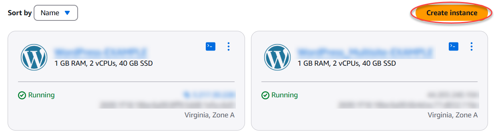
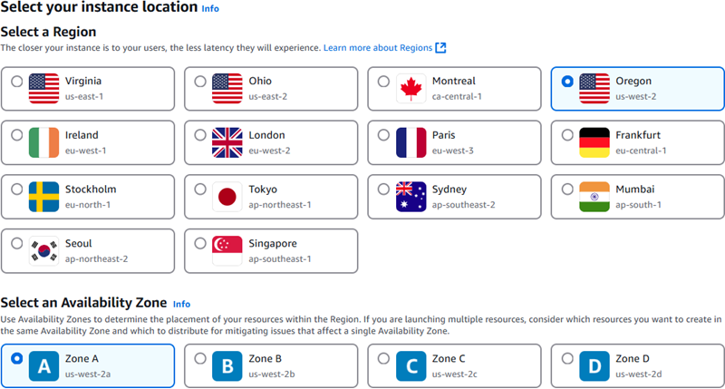
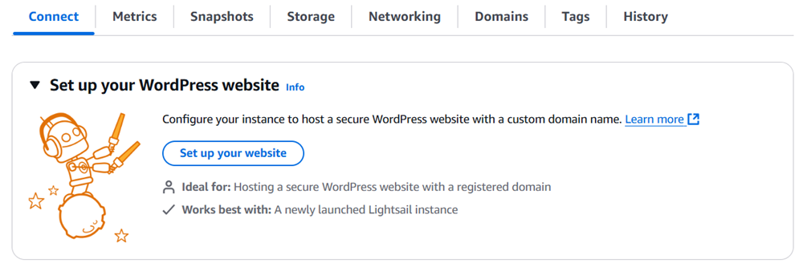
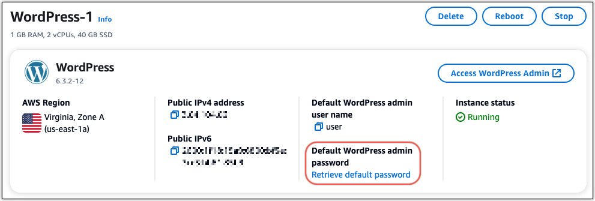
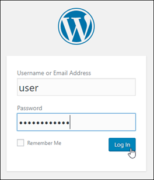

# Launch and configure WordPress on

Lightsail

###### Tip

Did you know that you can enable automatic snapshots for your instance? With automatic snapshots enabled, Lightsail stores seven daily snapshots
and automatically replaces the oldest with the newest. For more information, see [Configure
automatic snapshots for Lightsail instances and disks](amazon-lightsail-configuring-automatic-snapshots.md "amazon-lightsail-configuring-automatic-snapshots.md").

With this quick start guide, you will learn how to launch and configure a WordPress instance
on Amazon Lightsail.

## Step 1: Create a WordPress

instance

Complete the following steps to get your WordPress instance up and running.

###### To create a Lightsail instance for WordPress

1. Sign in to the [Lightsail console](https://lightsail.aws.amazon.com/ "https://lightsail.aws.amazon.com/").
2. On the **Instances** section of the Lightsail home page, choose
   **Create instance**.

 3. Choose the AWS Region and Availability Zone for your instance.

 4. Choose the image for your instance as follows:

    1. For **Select a platform**, choose **Linux/Unix**.
    2. For **Select a blueprint**, choose **WordPress**.

5. Choose an instance plan.

A plan includes a machine configuration (RAM, SSD, vCPU) at a low, predictable cost, plus a
data transfer allowance. 6. Enter a name for your instance. Resource names:

    * Must be unique within each AWS Region in your Lightsail account.
    * Must contain 2 to 255 characters.
    * Must start and end with an alphanumeric character or number.
    * Can include alphanumeric characters, numbers, periods, dashes, and
     underscores.

7. Choose **Create instance**.
8. To view the test blog post, go to the instance management page and copy the public IPv4 address shown in the upper-right corner of the page.
   Paste the address into the address field of an internet-connected web browser. The browser displays the test blog post.

## Step 2: Configure your WordPress

instance

You can configure your WordPress instance using a guided, step-by-step workflow that
configures the following:

- A registered domain name – Your WordPress site
  needs a domain name that is easy to remember. Users will specify this domain name to access
  your WordPress site. For more information, see
  [Register and manage domains for your website in Lightsail](amazon-lightsail-domain-registration.md "amazon-lightsail-domain-registration.md").
- DNS management – You must decide how to manage
  the DNS records for your domain. A DNS record tells the DNS server which IP address or hostname a domain or subdomain is associated with. A DNS zone contains the DNS records for
  your domain. For more information, see [Understanding DNS in Lightsail](understanding-dns-in-amazon-lightsail.md "understanding-dns-in-amazon-lightsail.md").
- A Static IP address – The default public IP address
  for your WordPress instance changes if you stop and start your instance. When you attach a
  static IP address to your instance, it stays the same even if you stop and start your instance.
  For more information, see [View and
  manage IP addresses for Lightsail resources](understanding-public-ip-and-private-ip-addresses-in-amazon-lightsail.md "understanding-public-ip-and-private-ip-addresses-in-amazon-lightsail.md").
- An SSL/TLS certificate – After you create a
  validated certificate and install it on your instance, you can enable HTTPS for your
  WordPress website so that traffic that is routed to the instance through your registered domain
  is encrypted using HTTPS. For more information, see
  [Secure your WordPress site with
  HTTPS on Lightsail](amazon-lightsail-enabling-https-on-wordpress.md "amazon-lightsail-enabling-https-on-wordpress.md").

###### Tip

Review the following tips before you begin. For troubleshooting information, see [Troubleshooting WordPress setup](amazon-lightsail-troubleshooting-wp-setup.md "amazon-lightsail-troubleshooting-wp-setup.md").

- Setup supports Lightsail instances with WordPress version 6 and newer, that were created after
  January 1, 2023.
- The Certbot dependency file, HTTPS rewrite script and certificate renewal script that are run during setup are saved in the `/opt/bitnami/lightsail/scripts/` directory on your instance.
- Your instance must be in a **Running** state. Allow a few minutes for the SSH connection to become ready
  if the instance was just started.
- Ports 22, 80, and 443 on your instance firewall must allow TCP connections from
  any IP address while setup is running. For more information, see [Instance
  firewalls](understanding-firewall-and-port-mappings-in-amazon-lightsail.md "understanding-firewall-and-port-mappings-in-amazon-lightsail.md").
- When you add or update DNS records that point traffic from your apex domain
  (`example.com`) and its `www` subdomains
  (`www.example.com`), they will need to propagate throughout the
  Internet. You can verify that your DNS changes have taken effect by using tools such
  as [nslookup](https://aws.amazon.com/blogs/messaging-and-targeting/how-to-check-your-domain-verification-settings/ "https://aws.amazon.com/blogs/messaging-and-targeting/how-to-check-your-domain-verification-settings/"), or [DNS
  Lookup](https://mxtoolbox.com/DnsLookup.aspx "https://mxtoolbox.com/DnsLookup.aspx") from _MxToolbox_.
- Wordpress instances that were created prior to January 1, 2023, might contain a deprecated Certbot Personal Package Archive (PPA) repository that will
  cause website setup to fail. If this repository is present during setup, it will be removed from the existing path and backed up to the following
  location on your instance: `~/opt/bitnami/lightsail/repo.backup`. For more information about the deprecated PPA, see [Certbot PPA](https://launchpad.net/~certbot/+archive/ubuntu/certbot "https://launchpad.net/~certbot/+archive/ubuntu/certbot") on the _Canonical_ website.
- Let's Encrypt certificates will automatically renew
  every 60 to 90 days.
- While setup is in progress, do not stop or make changes to your instance. It can
  take up to 15 minutes to configure your instance. You can view the progress for each
  step in the instance connect tab.

###### To configure your instance using the website setup wizard

1. On the instance management page, on the **Connect** tab, choose
   **Set up your website**.

 2. For **Specify a domain name**, use an existing Lightsail managed domain,
register a new domain with Lightsail, or use a domain that you registered by using another
domain registrar. Choose **Use this domain** to go to the next step. 3. For **Configure DNS**, do one of the following:

    * Choose **Lightsail managed domain** to use a Lightsail DNS
     zone. Choose **Use this DNS zone** to go to the next step.
    * Choose **Third-party domain** to use the hosting service that
     manages the DNS records for your domain. Note that we create a matching DNS zone
     in your Lightsail account in case you decide to use it later on. Choose
     **Use third-party DNS** to go to the next step.

4. For **Create a static IP address**, enter a name for your static IP
   address and then choose **Create static IP**.
5. For **Manage domain assignments**, choose **Add
   assignment**, choose a domain type, and then choose
   **Add**. Choose **Continue** to go to the next
   step.
6. For **Create an SSL/TLS certificate**, choose your domains and
   subdomains, enter an email address, select **I authorize Lightsail to
   configure a Let's Encrypt certificate on my instance**, and choose
   **Create certificate**. We start to configure the Lightsail
   resources.

While setup is in progress, do not stop or make changes to your instance.
It can take up to 15 minutes to configure your instance. You can view the progress for
each step in the instance connect tab. 7. After the website setup is complete, verify that the URLs that you specified in the
domain assignments step open your WordPress site.

## Step 3: Get the

default application password for your WordPress website

You need the default application password to sign in to the administration dashboard for
your WordPress website.

###### To get the default password for the WordPress administrator

1. Open the instance management page for your WordPress instance.
2. On the **WordPress** panel, choose **Retrieve default
   password**. This expands **Access default password** at
   the bottom of the page.

 3. Choose **Launch CloudShell**. This opens a panel at the bottom of
the page. 4. Choose **Copy** and then paste the contents into the CloudShell
window. You can either put your cursor at the CloudShell prompt and press Ctrl+V,
or you can right-click to open the menu and then choose **Paste**. 5. Make a note of the password displayed in the CloudShell window. You need this
to sign in to the administration dashboard of your WordPress website.

## Step 4: Sign in to your WordPress

website

Now that you have the default user password, navigate to your WordPress website's home
page, and sign in to the administration dashboard. After you’re signed in, you can change the
default password.

###### To sign in to the administration dashboard

1. Open the instance management page for your WordPress instance.
2. On the **WordPress** panel, choose **Access WordPress
   Admin**.
3. On the **Access your WordPress Admin Dashboard** panel, under
   **Use public IP address**, choose the link with this format:

http://`public-ipv4-address`./wp-admin 4. For **Username or Email Address**, enter `user`. 5. For **Password**, enter the password obtained in the previous step. 6. Choose **Log in**.

You are now signed in to the administration dashboard of your WordPress website where
you can perform administrative actions. For more information about administering your
WordPress website, see the [WordPress
Codex](https://codex.wordpress.org/ "https://codex.wordpress.org/") in the WordPress documentation.

## Step 5: Read the

Bitnami documentation

Read the Bitnami documentation to learn how to perform administrative tasks on your
WordPress website, such as install plugins, customize the theme, and upgrade your version of
WordPress.

For more information, see the [Bitnami WordPress for AWS Cloud](https://docs.bitnami.com/aws/apps/wordpress/ "https://docs.bitnami.com/aws/apps/wordpress/").

## Step 6: Create

a snapshot of your instance

After you configure your website the way you want it, create
periodic snapshots of your instance to back it up. A snapshot is a copy of the system disk and original configuration of an instance. A
snapshot contains all of the data that is needed to restore your instance (from the moment
when the snapshot was taken).

You can create [snapshots manually](understanding-snapshots-in-amazon-lightsail.md#manual-snapshots "understanding-snapshots-in-amazon-lightsail.md#manual-snapshots"), or
[enable automatic snapshots](understanding-snapshots-in-amazon-lightsail.md#automatic-snapshots "understanding-snapshots-in-amazon-lightsail.md#automatic-snapshots") to have Lightsail create daily snapshots for you. If
something goes wrong with your instance, you can create a new replacement instance using
the snapshot.

You can work with snapshots on your instance's management page on the **Snapshots** tab.
For more information, see [Snapshots in Amazon Lightsail](understanding-snapshots-in-amazon-lightsail.md "understanding-snapshots-in-amazon-lightsail.md").

