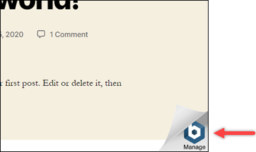
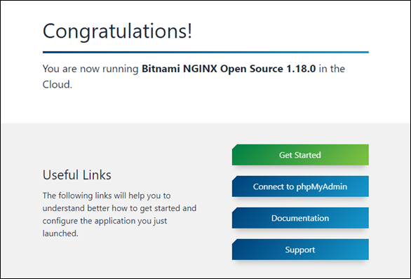
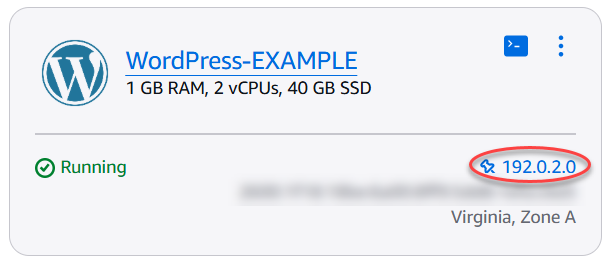
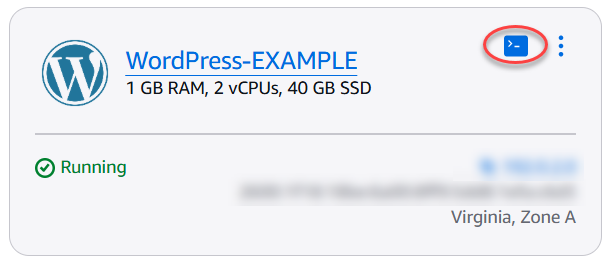

# Remove the Bitnami banner from

Lightsail instances

Some of the Bitnami blueprints that can be selected for Amazon Lightsail instances display a
Bitnami banner on the home page of the application. In the following example from a "Certified
by Bitnami" WordPress instance, the Bitnami banner is displayed in the bottom-right corner of
the home page. In this guide, we show you how to permanently remove the Bitnami icon from the
home page of the application on your instance.


Not all Bitnami blueprint applications display the Bitnami banner on the home page of the
application. Visit the home page of your Lightsail instance to determine if a Bitnami banner
is displayed. In the following example from a "Packaged by Bitnami" Nginx instance, the Bitnami
icon is not displayed. Instead, a place-holder information page is displayed, which is
eventually replaced by the application that you choose to deploy on your instance. If your
instance doesn't display a Bitnami banner, then you don't have to follow the procedures in this
guide.



## Remove the Bitnami banner from your instance

Complete the following procedure to confirm that your instance has a Bitnami icon
displayed in the home page of the application, and to remove it.

1. Sign in to the [Lightsail console](https://lightsail.aws.amazon.com/ "https://lightsail.aws.amazon.com/").
2. In the **Instances** section of the Lightsail home page, copy the
   public IP address of the instance that you want to confirm.

 3. Open a new browser tab, enter the public IP address of your instance into the address
bar, and press **Enter**. 4. Confirm one of the following options:

    1. If the Bitnami icon is not displayed on the page, then stop following these
     procedures. You don't need to remove the Bitnami icon from the home page of your
     application.
    2. If the Bitnami icon is displayed in the lower-right corner of the page as shown in
     the following example, then continue to the following set of steps to remove
     it.


    

In the following set of steps, you will connect to your instance using the Lightsail
browser-based SSH client. After you're connected, you will run the Bitnami Configuration
Tool (bnconfig) tool to remove the Bitnami icon from the home page of your application.
The bnconfig tool is a command line tool that allows you to configure you’re the
application on your Bitnami blueprint instance. For more information, see [Learn About
The Bitnami Configuration Tool](https://docs.bitnami.com/aws/faq/configuration/understand-bnconfig/ "https://docs.bitnami.com/aws/faq/configuration/understand-bnconfig/") in the _Bitnami
documentation_. 5. Return to the browser tab that is on the Lightsail home page. 6. Choose the browser-based SSH client icon that is next to the name of the instance that
you wish to connect to.

 7. After the SSH client is connected to your instance, enter one of the following
commands:

    1. If your instance uses Apache, then enter one of the following commands. If one of
     the commands fails, try the other. The first part of this command disables the Bitnami
     banner, and the second part restarts the Apache service.


    ```
    sudo /opt/bitnami/apps/wordpress/bnconfig --disable_banner 1 && sudo /opt/bitnami/ctlscript.sh restart apache
    ```


    ```
    sudo /opt/bitnami/wordpress/bnconfig --disable_banner 1 && sudo /opt/bitnami/ctlscript.sh restart apache
    ```

You can confirm that the process was successful by browsing to the public IP address
of your instance and confirming that the Bitnami icon is gone.
