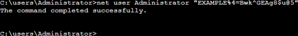

# Secure Windows

Server Amazon EC2 instances launched from Lightsail snapshots

To improve the security of a Windows Server instance in Amazon Elastic Compute Cloud (Amazon EC2) created from an
Amazon Lightsail snapshot, we recommend that you change the default administrator password. This
removes the association between your Lightsail key pairs and your new Windows Server instance
in Amazon EC2.

###### Note

If you created Linux or Unix instances in Amazon EC2 from a Lightsail snapshot, then you
should perform a few steps to secure those instances. For more information, see [Secure an Amazon EC2 Linux or
Unix instance that was created from a Lightsail snapshot](amazon-lightsail-securing-linux-unix-amazon-ec2-instances.md "amazon-lightsail-securing-linux-unix-amazon-ec2-instances.md").

**Contents**

- [Connect to
  your Windows Server instance in Amazon EC2](#connect-to-your-windows-server-instance-in-ec2 "#connect-to-your-windows-server-instance-in-ec2")
- [Change the default administrator password of your Windows Server instance in
  Amazon EC2](#change-the-password-of-your-windows-server-instance-in-ec2 "#change-the-password-of-your-windows-server-instance-in-ec2")

## Connect to your Windows

Server instance in Amazon EC2

To change your Windows Server administrator password, connect to your Windows Service
instance in Amazon EC2 using Remote Desktop Protocol (RDP). To learn how to connect to your
instance, see [Connect to a
Windows Server instance in Amazon EC2 created from a Lightsail snapshot](amazon-lightsail-connecting-to-windows-server-amazon-ec2-instances.md "amazon-lightsail-connecting-to-windows-server-amazon-ec2-instances.md").

Continue to the [Change the default administrator password of your Windows Server instance in
Amazon EC2](#change-the-password-of-your-windows-server-instance-in-ec2 "#change-the-password-of-your-windows-server-instance-in-ec2") section of this guide after you’re connected to your instance in Amazon EC2.

## Change the

default administrator password of your Windows Server instance in Amazon EC2

Change the default password on your Windows Server instance to remove the association
between your Lightsail key pairs and your new Windows Server instance in Amazon EC2.

###### To change the default administrator password of your Windows Server instance in

Amazon EC2

1. After you establish an RDP connection to your instance, open a Command Prompt and
   enter the following command.

```
net user Administrator "`Password`"
```

In the command, replace `Password` with your new
password.

**Example:**

```
net user Administrator "`EXAMPLE%4=Bwk^GEAg8$u@5`"
```

You should see a result similar to the following:

 2. Store the new password in a safe place. You cannot retrieve the new password using the
Amazon EC2 console. The console can retrieve only the default password. If you attempt to
connect to the instance using the default password after changing it, an error message
appears stating that your credentials did not work.

If you lose your password or it expires, you can generate a new password. For password
reset procedures, see [Resetting a Lost or Expired Windows Administrator Password](../../../AWSEC2/latest/WindowsGuide/ResettingAdminPassword.md "../../../AWSEC2/latest/WindowsGuide/ResettingAdminPassword.md") in the Amazon EC2
documentation.
