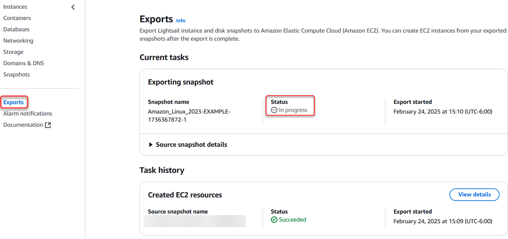

# Track snapshot export status in

Lightsail

The **Exports** section on the Amazon Lightsail console, is where you can
track the status of exporting Lightsail snapshots to Amazon EC2, or creating new EC2 instances from
exported instance snapshots. Export tasks can take a while depending on the size and
configuration of the source instance or block storage disk. **Exports** can be
accessed from the left navigation pane on all pages of the Lightsail console.

For more information about exporting Lightsail snapshots to Amazon EC2, or creating EC2
instances from exported snapshots, see the following guides:

- [Export snapshots to
  Amazon EC2](amazon-lightsail-exporting-snapshots-to-amazon-ec2.md "amazon-lightsail-exporting-snapshots-to-amazon-ec2.md")
- [Create
  Amazon EC2 instances from exported snapshots](amazon-lightsail-creating-ec2-instances-from-exported-snapshots.md "amazon-lightsail-creating-ec2-instances-from-exported-snapshots.md")
