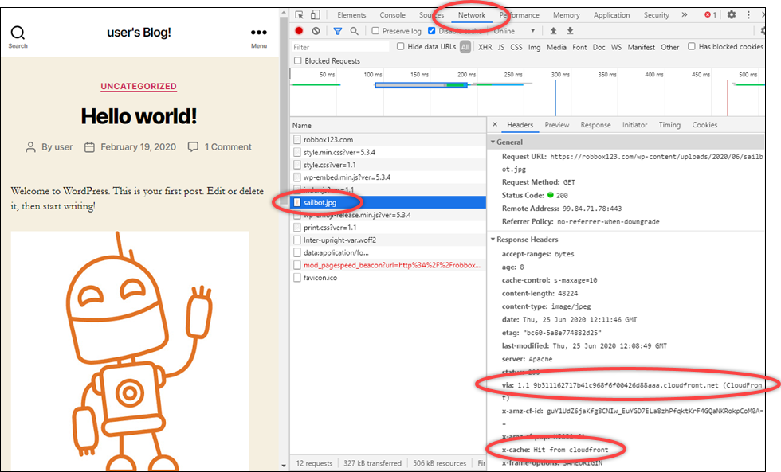

# Validate your Lightsail distribution's

content caching

In this guide, you will learn how to test that your Amazon Lightsail distribution is caching
and serving content from your origin. You should perform this test after you add your registered
domain name to your distribution. For more information about distributions, see [Content delivery network
distributions](amazon-lightsail-content-delivery-network-distributions.md "amazon-lightsail-content-delivery-network-distributions.md").

## Test your distribution

Complete the following procedure to test your distribution. We use the Chrome web browser
in this procedure; other browsers may use similar steps.

1. Open the Chrome web browser.
2. Open the **Chrome Menu** in the upper-right-hand corner of the
   browser window and select **More Tools** > **Developer
   Tools**.

You can also use the shortcut Option + ⌘ + J (on macOS), or Shift + CTRL + J (on
Windows/Linux). 3. In the developer tools pane, choose the **Network** tab. 4. Browse to the domain of your distribution (e.g.,
`https://www.example.com`).

The **Network** tab of the Chrome developer tools should will
populate with a list of objects from your website. 5. Choose a static object, such as an image file (.jpg, .png, .gif). 6. In the **Header** panel that appears, you should see that the
`via` and `x-cache` headers both mention CloudFront. This confirms that
your distribution is caching and serving content from your origin. your

