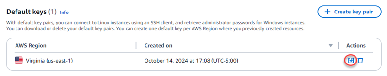

# Transfer files

between Linux instances on Lightsail using scp

Use the secure copy (scp) command in Linux to transfer files from your local computer to
your Linux or Unix instance, and from one instance to another in Amazon Lightsail. To learn
more about the scp command, see [scp(1) — Linux manual
page](https://man7.org/linux/man-pages/man1/scp.1.html "https://man7.org/linux/man-pages/man1/scp.1.html") on the _man7_ website.

This tutorial walks you through the steps to copy files from one Lightsail instance to
another.

###### Contents

- [Prerequisites](#amazon-lightsail-copy-files-to-linux-instance-prerequisites "#amazon-lightsail-copy-files-to-linux-instance-prerequisites")
- [Step 1: Save the private key (.pem)
  file to your local computer](#get-and-transfer-instance-ssh-key "#get-and-transfer-instance-ssh-key")
- [Step 2: Change the permissions of
  the private key](#copy-private-key-change-permissions "#copy-private-key-change-permissions")
- [Step 3: Transfer the private key to your
  instance](#copy-private-key-to-instance "#copy-private-key-to-instance")
- [Step 4: Securely transfer files between
  Lightsail Linux and Unix instances](#transfer-files-between-instances-scp "#transfer-files-between-instances-scp")

## Prerequisites

- You have two Lightsail instances running, with the public IP addresses of
  both instances. To get the public IP address of your instance. Sign in to the
  [Lightsail console](https://lightsail.aws.amazon.com/ "https://lightsail.aws.amazon.com/"), and then
  copy the public IP address that is displayed next to your instance.
- You can access both instances using an SSH key pair. For more information, see
  [Connect to Linux instances](lightsail-how-to-connect-to-your-instance-virtual-private-server.md "lightsail-how-to-connect-to-your-instance-virtual-private-server.md").

## Step 1: Save the private key (.pem)

file to your local computer

Complete the following steps to save the private key (.pem) file to your local
computer. The private key file for the target instance will be used to securely transfer
files from one instance to another. To copy files between instances in the same
AWS Region, you will use the default key for that Region. To copy files between
instances in different Regions, you will use the default key for the Region that the
target instance is in. To learn more about key pairs, see [SSH and connecting to
instances](understanding-ssh-in-amazon-lightsail.md "understanding-ssh-in-amazon-lightsail.md").

###### Note

If you’re using your own key pair, or you created a key pair using the Lightsail
console, locate your own private key and use it to connect to your instance.
Lightsail does not store your private key when you upload your own key or create a
key pair using the Lightsail console. You cannot transfer files to your instance
using scp without your private key.

###### To save the private key (.pem) to your local computer

1. Sign in to the [Lightsail
   console](https://lightsail.aws.amazon.com/ "https://lightsail.aws.amazon.com/").
2. Choose your **User Name** on the top navigation bar, and then
   choose **Account** from the drop-down.
3. Choose the **SSH Keys** tab.
4. Scroll down to the **Default keys** section of the
   page.
5. Choose **Download** next to the default private key for the
   AWS Region where the instance that you want to transfer the files to is
   located.

 6. Save your private key in a secured location on your local drive.

You might want to move the downloaded key to a directory in which you store
all of your SSH keys, such as a "Keys" folder in your user's home directory. You
will need to refer to the directory where the private key is saved in the next
section of this guide. If the private key attempts to save as a format other
than `.pem`, you should manually change the format to
`.pem` before saving.

## Step 2: Change the permissions of

the private key

In the following procedure you will change the permissions of your private key file to
be readable and writable only by you.

###### To change the permissions of your private key file

1. Open a terminal window on your local machine.
2. Enter the following command to make the private key of the key pair readable
   and writable only by you. This is a security best practice required by some
   operating systems.

```
sudo chmod 400 `/path/to/private-key`.pem
```

In the command, replace
`/path/to/private-key` with the
directory path to where you saved the private key of the key pair that is being
used by your instance.

**Example:**

```
sudo chmod 400 `/Users/user/Keys/LightsailDefaultKey-us-west-2`.pem
```

## Step 3: Transfer the private key to your

instance

In the following procedure you will transfer the private key to your source instance
by running the scp command from your local computer.

###### To use scp to transfer the private key from your computer to your source

instance

1. Determine the location of the private key file on your computer and the
   destination path on the instance. In the following examples, the name of the
   private key file is `private-key.pem`, the user name
   for the source instance is `ec2-user`, the IPv4 address
   of the source instance is `public-ipv4-address`, and
   the IPv6 address of the source instance is
   `public-ipv6-address`. The
   `destination-path/` is the location on source
   instance where you are transferring the private key to.

###### Note

You can specify one of the following user names depending on the blueprint
that is used by your instance:

    * AlmaLinux OS 9, Amazon Linux 2, Amazon Linux 2023, CentOS Stream 9, FreeBSD, and
     openSUSE instances: `ec2-user`
    * Debian instances: `admin`
    * Ubuntu instances: `ubuntu`
    * Bitnami instances: `bitnami`
    * Plesk instances: `ubuntu`
    * cPanel & WHM instances: `centos`
    * (**IPv4**) To transfer the private key
     file to the instance, enter the following command from your
     computer.


    ```
    scp -i `/path/private-key`.pem `/path/private-key`.pem `ec2-user`@`public-ipv4-address`:`path/`
    ```
    * (**IPv6**) To transfer the private key
     file to the instance if the instance only has an IPv6 address, enter the
     following command from your computer. The IPv6 address must be enclosed
     in square brackets (`[ ]`), which must be escaped
     (`\`).


    ```
    scp -i `/path/private-key`.pem `/path/private-key`.pem `ec2-user`@\[`public-ipv6-address`\]:`path/`
    ```

2. If you haven't already connected to the instance using SSH, you see a response
   like the following:

```
The authenticity of host 'ec2-198-51-100-1.compute-1.amazonaws.com (10.254.142.33)'
can't be established.
RSA key fingerprint is 1f:51:ae:28:bf:89:e9:d8:1f:25:5d:37:2d:7d:b8:ca:9f:f5:f1:6f.
Are you sure you want to continue connecting (yes/no)?
```

Enter `yes`. 3. If the transfer is successful, the response is similar to the
following:

```
Warning: Permanently added 'ec2-198-51-100-1.compute-1.amazonaws.com' (RSA)
to the list of known hosts.
private-key.pem                                100%   480     24.4KB/s   00:00
```

Now that you have transferred the private key to your source instance, you can
securely connect to and transfer files to your target instance. Continue to the next
step to learn how.

## Step 4: Securely transfer files between

Lightsail Linux and Unix instances

In the following procedure you will run the scp command from one instance
(**source instance**), to transfer files to another instance
(**target instance**).

###### To use scp to transfer files between instances

1. Connect to the **source instance** using SSH. You can connect
   by using the terminal program on your local computer, or by using the
   browser-based SSH client in Lightsail. For more information, see [Connect to Linux instances](lightsail-how-to-connect-to-your-instance-virtual-private-server.md "lightsail-how-to-connect-to-your-instance-virtual-private-server.md").
2. Determine the location of the files on the **source
   instance** and the destination path on the **target
   instance**. In the following examples, the name of the private key
   file is `private-key.pem`, the user name for the
   instance is `ec2-user`, the IPv4 address of the
   instance is `public-ipv4-address`, and the IPv6 address
   of the instance is `public-ipv6-address`. The
   `destination-path/` is the location on the
   **target instance** where you are transferring the files
   to.
   - (**IPv4**) To transfer files from the
     **source instance** to the **target
     instance**, enter the following command from the
     **source instance**.

   ```
   scp -i `/path/private-key`.pem `/path/my-file.txt` `ec2-user`@`public-ipv4-address`:`destination-path/`
   ```

   - (**IPv6**) To transfer files from the
     **source instance** to the **target
     instance**, enter the following command from the
     **source instance**. The IPv6 address must be
     enclosed in square brackets (`[ ]`), which must be escaped
     (`\`).

   ```
   scp -i `/path/private-key`.pem `/path/my-file.txt` `ec2-user`@\[`public-ipv6-address`\]:`destination-path/`
   ```

3. If you haven't already connected to the **target instance**
   using SSH, you see a response like the following:

```
The authenticity of host 'ec2-198-51-100-1.compute-1.amazonaws.com (10.254.142.33)'
can't be established.
RSA key fingerprint is 1f:51:ae:28:bf:89:e9:d8:1f:25:5d:37:2d:7d:b8:ca:9f:f5:f1:6f.
Are you sure you want to continue connecting (yes/no)?
```

Enter `yes`. 4. If the transfer is successful, the response is similar to the
following:

```
Warning: Permanently added 'ec2-198-51-100-1.compute-1.amazonaws.com' (RSA)
to the list of known hosts.
my-file.txt                                100%   480     24.4KB/s   00:00
```
