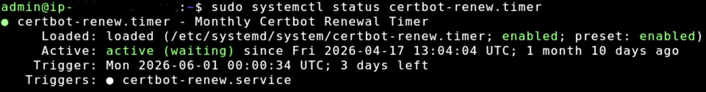

# Certificate did not automatically renew

The WordPress guided workflow configures automatic renewal of your Let's Encrypt
SSL/TLS certificate. The Lightsail blueprint uses a systemd timer to renew the
certificate. If your certificate expires despite automatic renewal being configured, use
the following steps to diagnose and resolve the issue.

## Step 1: Check if your certificate has expired

Connect to your instance by using the Lightsail [browser-based SSH client](lightsail-how-to-connect-to-your-instance-virtual-private-server.md "lightsail-how-to-connect-to-your-instance-virtual-private-server.md").

Run the following command to check the certificate status:

```
`$` sudo certbot certificates
```

If the expiry date shown in the output is in the past, your certificate has
expired and automatic renewal has failed. Continue to Step 2.

## Step 2: Re-enable automatic renewal

The Lightsail blueprint uses a systemd timer to automatically renew the
certificate. If this timer is inactive or disabled, the certificate will not renew
automatically.

Run the following command to check the status of the renewal timer:

```
`$` sudo systemctl status certbot-renew.timer
```

If the timer is active, you should see output similar to the following:



If the timer is not active or the command returns an error, run the following
command to re-enable it:

```
`$` sudo systemctl enable --now certbot-renew.timer
```

Re-enabling the timer restores automatic renewal for future renewals, but does not
renew the certificate immediately. If your certificate has already expired, continue
to Step 3.

## Step 3: Manually renew the expired certificate

Run the following commands to stop the web server, force a certificate renewal,
and restart the web server:

```
`$` sudo systemctl stop apache2
```

```
`$` sudo certbot renew --force-renewal
```

```
`$` sudo systemctl restart apache2
```
