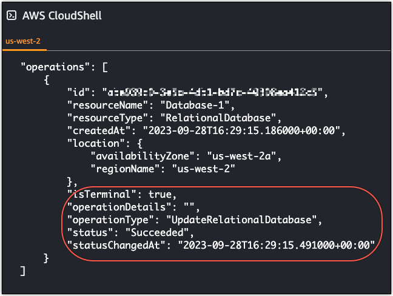

# Disable

point-in-time backups for Lightsail databases

Use the following procedure to disable point-in-time backups for your Lightsail managed
database.

###### Important

With point-in-time backups, you can easily recover your data if your database ever
fails. We recommend that you leave point in time backups enabled for your Lightsail
managed database.

## Prerequisite

Use the AWS Command Line Interface (AWS CLI), or AWS CloudShell to enable or disable point-in-time backups for
your Lightsail database. CloudShell is a browser-based, pre-authenticated shell
that you can launch directly from the Lightsail console. For more information, see
[Set up and configure the AWS CLI
for Lightsail operations](lightsail-how-to-set-up-and-configure-aws-cli.md "lightsail-how-to-set-up-and-configure-aws-cli.md") , and [Manage Lightsail resources with
AWS CloudShell](amazon-lightsail-cloudshell.md "amazon-lightsail-cloudshell.md").

## Disable database point-in-time

backups

To disable the point-in-time backups for your managed database in Lightsail, you
must update the database using the `update-relational-database` Lightsail
command of the AWS CLI. For more information, see [update-relational-database](../../../cli/latest/reference/lightsail/update-relational-database.md "../../../cli/latest/reference/lightsail/update-relational-database.md") in the _AWS CLI Command
Reference_.

- Enter the following command in a Terminal, Command Prompt, or CloudShell
  window:

```
aws lightsail update-relational-database --region `Region` --relational-database-name `DatabaseName` --disable-backup-retention --apply-immediately
```

The `--disable-backup-retention` value in the command turns off the
point-in-time backup for the specified database. In the command, replace:

    + `DatabaseName` with the name of your
     database.
    + `Region` with the AWS Region of your
     database.

You should see an operation response with a status of `Succeeded`. The
status of your database will change to **Modifying** for a short period
of time while it's being updated. When the status of your database changes back to
**Available**, the point-in-time restore options will be disabled
as shown in the following example.



###### Note

To enable the point-in-time backup, run the same command listed earlier but with
the `--enable-backup-retention` parameter instead.
