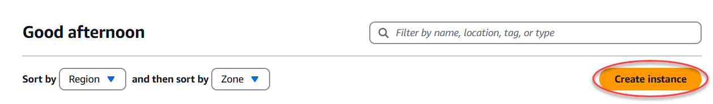
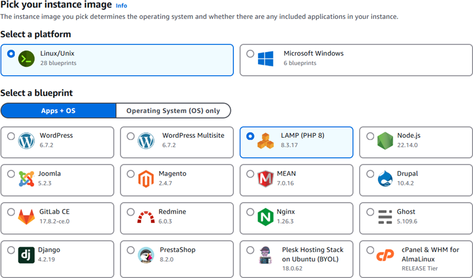
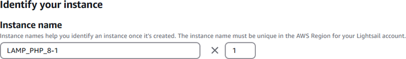
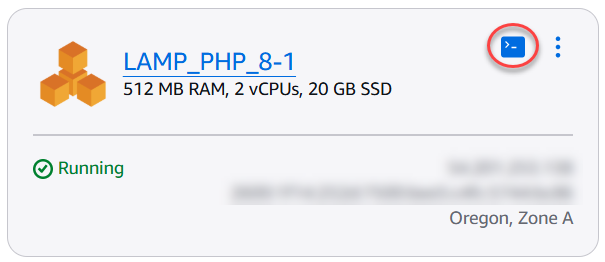
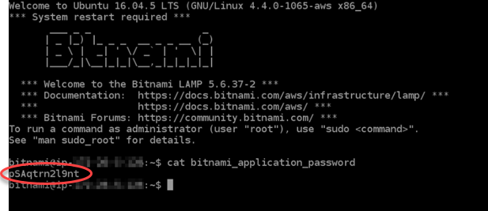
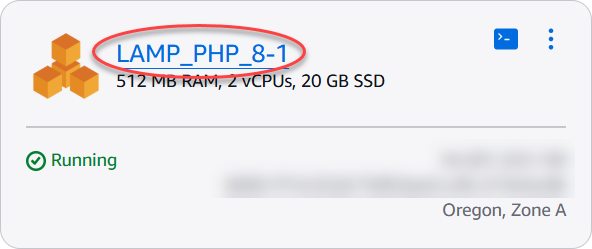
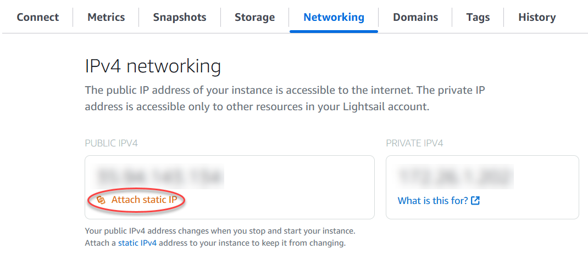
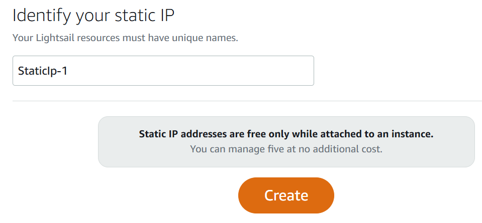
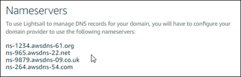

# Deploy PHP

applications on a Lightsail LAMP instance

Amazon Lightsail is the easiest way to get started with Amazon Web Services (AWS) if you just need
virtual private servers. Lightsail includes everything you need to launch your project quickly
– a virtual machine, SSD-based storage, data transfer, DNS management, and a static IP – for a
low, predictable price.

This tutorial shows you how to launch and configure a LAMP instance on Lightsail. It
includes steps to connect to your instance via SSH, get the application password for your
instance, create a static IP and attach it to your instance, and create a DNS zone and map your
domain. When you’re done with this tutorial, you have the fundamentals to get your instance up
and running on Lightsail.

**Contents**

- [Step 1: Sign up for AWS](#tutorial-launching-and-configuring-lamp-sign-up-for-aws "#tutorial-launching-and-configuring-lamp-sign-up-for-aws")
- [Step 2: Create a LAMP
  instance](#create-a-lamp-instance "#create-a-lamp-instance")
- [Step 3: Connect to your instance via SSH and get the application password
  for your LAMP instance](#tutorial-launching-and-configuring-lamp-connecting-to-your-instance-via-ssh "#tutorial-launching-and-configuring-lamp-connecting-to-your-instance-via-ssh")
- [Step 4: Install an
  application on top of your LAMP instance](#install-an-application-on-lamp "#install-an-application-on-lamp")
- [Step 5: Create a static IP address and attach it to your LAMP
  instance](#tutorial-launching-and-configuring-lamp-creating-a-lightsail-static-ip "#tutorial-launching-and-configuring-lamp-creating-a-lightsail-static-ip")
- [Step 6: Create a DNS zone and map a
  domain to your LAMP instance](#creating-a-dns-zone "#creating-a-dns-zone")
- [Next
  steps](#tutorial-launching-and-configuring-lamp-next-steps "#tutorial-launching-and-configuring-lamp-next-steps")

## Step 1: Sign up for

AWS

This tutorial requires an AWS account. [Sign up for AWS](https://console.aws.amazon.com/console/home "https://console.aws.amazon.com/console/home"), or [sign in to AWS](https://console.aws.amazon.com/console/home "https://console.aws.amazon.com/console/home") if you already
have an account.

## Step 2: Create a LAMP instance

Get your LAMP instance up and running in Lightsail. For more information about creating
an instance in Lightsail, see [Creating an
Amazon Lightsail instance in the Lightsail](how-to-create-amazon-lightsail-instance-virtual-private-server-vps.md "how-to-create-amazon-lightsail-instance-virtual-private-server-vps.md") documentation.

1. Sign in to the [Lightsail console](https://lightsail.aws.amazon.com/ "https://lightsail.aws.amazon.com/").
2. On the **Instances** section of the Lightsail home page, choose
   **Create instance**.

 3. Choose the AWS Region and Availability Zone for your instance.

 4. Choose your instance image.

    1. Choose **Linux/Unix** as the platform.
    2. Choose **LAMP (PHP 8)** as the blueprint.

 5. Choose an instance plan.

A plan includes a low, predictable cost, machine configuration (RAM, SSD, vCPU), and
data transfer allowance. You can try the $5 USD Lightsail plan without charge for one
month (up to 750 hours). AWS credits one free month to your account.

###### Note

As part of the AWS Free Tier, you can get started with Amazon Lightsail for free on
select instance bundles. For more information, see **AWS Free Tier**
on the [Amazon Lightsail Pricing page](https://aws.amazon.com/lightsail/pricing "https://aws.amazon.com/lightsail/pricing"). 6. Enter a name for your instance.

Resource names:

    * Must be unique within each AWS Region in your Lightsail account.
    * Must contain 2 to 255 characters.
    * Must start and end with an alphanumeric character or number.
    * Can include alphanumeric characters, numbers, periods, dashes, and
     underscores.

 7. (Optional) Choose **Add new tag** to add a tag to your instance. Repeat this step as needed to add additional tags. For
more information on tag usage, see [Tags](amazon-lightsail-tags.md "amazon-lightsail-tags.md").

    1. For **Key**, enter a tag key.


    
    2. (Optional) For **Value**, enter a tag value.


    

8. Choose **Create instance**.

## Step 3: Connect to your instance via SSH and get the application password for your LAMP

instance

The default password to sign in to your database in LAMP is stored on your instance.
Retrieve it by connecting to your instance using the browser-based SSH terminal in the
Lightsail console and running a special command. For more information, see [Getting the
application user name and password for your Bitnami instance in
Amazon Lightsail](log-in-to-your-bitnami-application-running-on-amazon-lightsail.md "log-in-to-your-bitnami-application-running-on-amazon-lightsail.md").

1. On the **Instances** section of the Lightsail home page, choose the
   SSH quick-connect icon for your LAMP instance.

 2. After the browser-based SSH client window opens, enter the following command to
retrieve the default application password:

```
cat bitnami_application_password
```

###### Note

If you're in a directory other than the user home directory, then enter `cat
 $HOME/bitnami_application_password`. 3. Make note of the password displayed on the screen. You use this password later to
install Bitnami applications on your instance, or to access the MySQL database with the
user name of `root`.



## Step 4: Install an application on top of your

LAMP instance

Deploy your PHP application on top of your LAMP instance, or install a Bitnami
application. The main directory to deploy your PHP application is
`/opt/bitnami/apache2/htdocs`. Copy your PHP application files to that directory
and access the application by browsing to your instance’s public IP address.

You can also install a Bitnami application using module installers. Download WordPress,
Drupal, Magento, Moodle among other applications from the [Bitnami website](https://bitnami.com/stack/lamp/modules "https://bitnami.com/stack/lamp/modules") and extend the
functionality of your server. For more information about installing Bitnami applications, see
[Getting
Started](https://docs.bitnami.com/aws/infrastructure/lamp/get-started "https://docs.bitnami.com/aws/infrastructure/lamp/get-started") in the Bitnami documentation.

## Step

5: Create a static IP address and attach it to your LAMP instance

The default public IP for your LAMP instance changes if you stop and start the instance. A
static IP address, attached to an instance, stays the same even if you stop and start your
instance.

Create a static IP address and attach it to your LAMP instance. For more information, see
[Create a static IP and attach it to an
instance](lightsail-create-static-ip.md "lightsail-create-static-ip.md") in the Lightsail documentation.

1. On the **Instances** section of the Lightsail home page, choose
   your running LAMP instance.

 2. Choose the **Networking** tab, then choose **Attach static
IP**.

 3. Name your static IP, then choose **Create and attach**.



## Step 6: Create a DNS zone and map a domain to your LAMP

instance

Transfer management of your domain's DNS records to Lightsail. This allows you to more
easily map a domain to your LAMP instance, and manage all of your website’s resources using
the Lightsail console. For more information, see [Creating a DNS zone to manage your domain’s DNS
records](lightsail-how-to-create-dns-entry.md "lightsail-how-to-create-dns-entry.md").

1. On the **Domains & DNS** section of the Lightsail home page,
   choose **Create DNS zone**.
2. Enter your domain, then choose **Create DNS zone**.
3. Make note of the name server addresses listed on the page.

You add these name server addresses to your domain name’s registrar to transfer
management of your domain’s DNS records to Lightsail.

 4. After management of your domain’s DNS records are transferred to Lightsail, add an A
record to point the apex of your domain to your LAMP instance, as follows:

    1. In the **Assignments** tab of the DNS zone, choose **Add
     assignment**.
    2. In the **Select a domain** field, choose the domain or
     subdomain.
    3. In the **Select a resource** drop down, select the LAMP instance
     you created earlier in this tutorial.
    4. Choose the **Assign**.Allow time for the change to propagate through the internet's DNS before your domain

begins routing traffic to your LAMP instance.

## Next steps

Here are a few additional steps you can perform after launching a LAMP instance in
Amazon Lightsail:

- [Create a snapshot
  of your Linux or Unix instance](lightsail-how-to-create-a-snapshot-of-your-instance.md "lightsail-how-to-create-a-snapshot-of-your-instance.md")
- [Create and
  attach additional block storage disks to your Linux-based instances](create-and-attach-additional-block-storage-disks-linux-unix.md "create-and-attach-additional-block-storage-disks-linux-unix.md")
