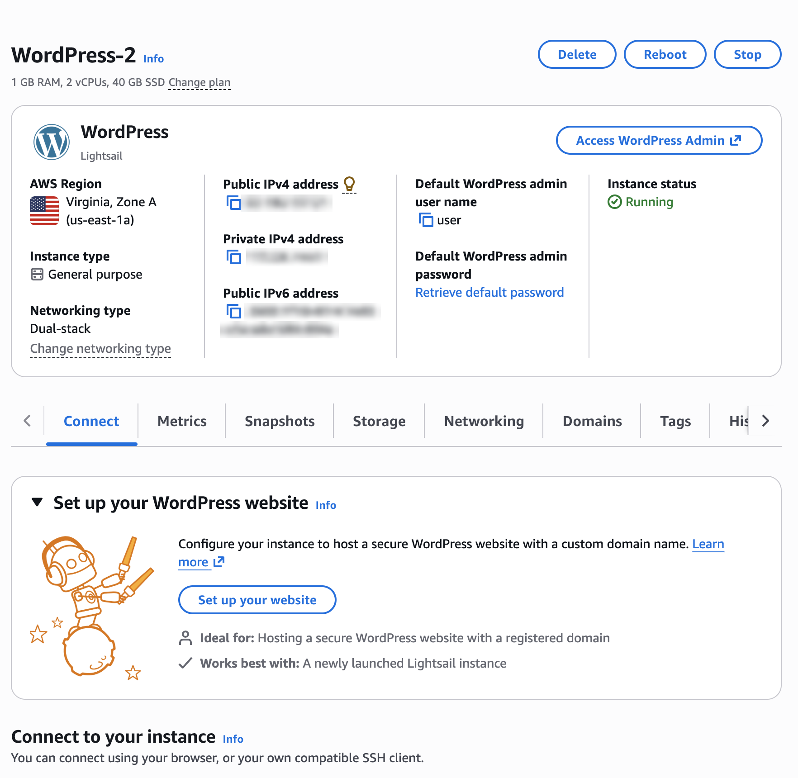
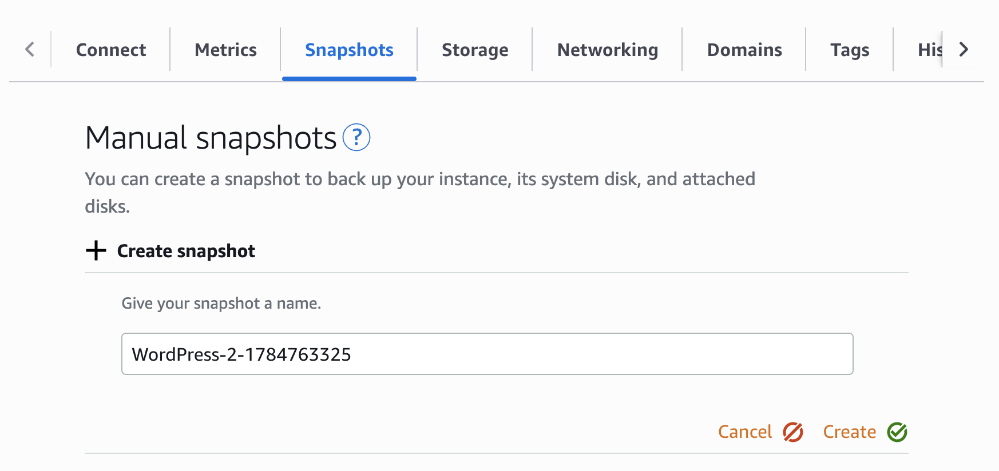
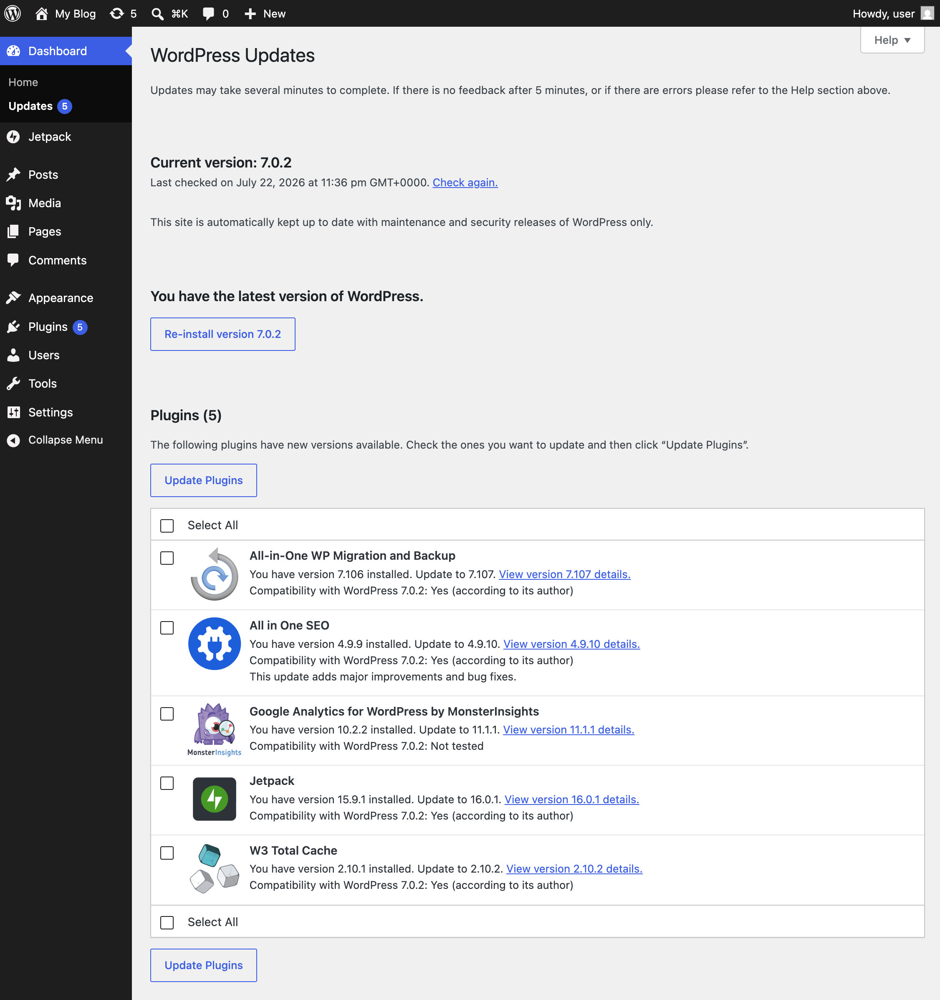
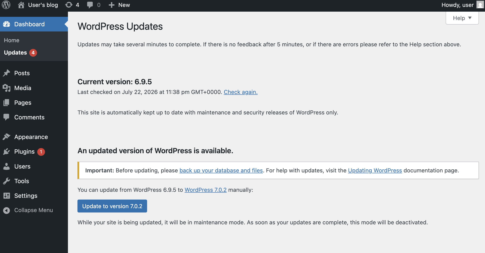
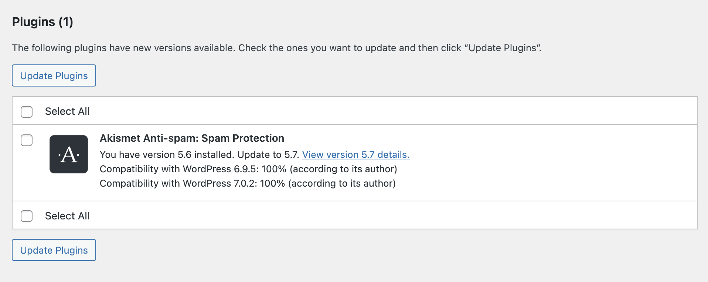
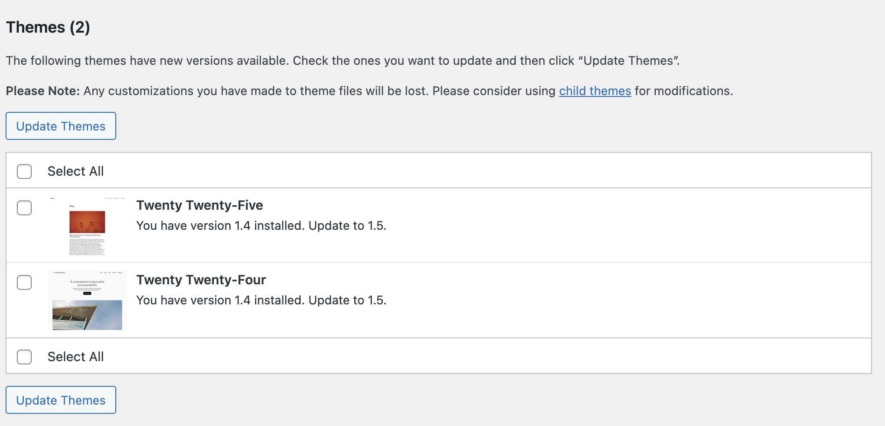

# Update software on your WordPress instance

###### Important

This tutorial applies to instances that use the **WordPress** blueprint.
If your instance uses **WordPress packaged by Bitnami**, see the [Bitnami
WordPress documentation](https://docs.bitnami.com/general/apps/wordpress/administration/upgrade/ "https://docs.bitnami.com/general/apps/wordpress/administration/upgrade/") instead. Instances that use WordPress packaged by Bitnami
store WordPress in a different location (`/opt/bitnami`) and use different service
management tools.

Amazon Web Services (AWS) and Lightsail do not update or patch the operating system or
applications on your instance after you create it. WordPress does install some updates on its
own. By default, it installs minor core releases that contain security and maintenance fixes.
It doesn't install major core releases automatically. Plugin and theme updates are also manual
until you turn on automatic updates for them. Under the [AWS Shared
Responsibility Model](https://aws.amazon.com/compliance/shared-responsibility-model/ "https://aws.amazon.com/compliance/shared-responsibility-model/"), you are responsible for keeping the WordPress software on your
instance up to date.

WordPress software updates regularly include security fixes. Running outdated versions of
WordPress core, themes, or plugins is one of the most common causes of compromised
websites.

This guide shows you which updates WordPress installs automatically, how to update the
WordPress software manually, and how to turn on automatic updates for plugins and
themes.

## Understand WordPress update types

WordPress software updates fall into the following categories. Each has a different risk
profile and update mechanism.

| Update type                                               | Example                     | Default behavior                                                        |
| --------------------------------------------------------- | --------------------------- | ----------------------------------------------------------------------- |
| *_Core minor releases_<br>• (maintenance and<br>security) | 6.5.1 to 6.5.2              | WordPress installs these automatically in the background                |
| *_Core major releases_<br>• (feature releases)            | 6.5 to 6.6                  | Manual only                                                             |
| **Themes and plugins**                                    | Any theme or plugin version | Manual by default; you can enable automatic updates per theme or plugin |
| **Translations**                                          | Language pack updates       | WordPress installs these automatically                                  |

Since WordPress 3.7, WordPress automatically installs minor core releases that contain
security and maintenance fixes. This is the default behavior unless you have disabled it.
This means a running WordPress instance already receives critical security patches for its
current branch. However, when a release branch stops receiving security backports, you must
update to a newer major version to keep receiving fixes. For more information, see [Updating
WordPress](https://wordpress.org/documentation/article/updating-wordpress/ "https://wordpress.org/documentation/article/updating-wordpress/") in the _WordPress documentation_.

## Prerequisites

- You launched a WordPress instance in Lightsail. For more information, see [Launch and configure a WordPress instance](amazon-lightsail-launch-and-configure-wordpress.md "amazon-lightsail-launch-and-configure-wordpress.md").
- You have the administrator password for your WordPress website. For more information,
  see [Get the admin password for your
  WordPress website](amazon-lightsail-launch-and-configure-wordpress.md#launch-configure-wp-get-password "amazon-lightsail-launch-and-configure-wordpress.md#launch-configure-wp-get-password").

## Step 1: Back up your instance with a snapshot

Before you update any software, create a backup of your instance. If an update fails or
is incompatible with your themes or plugins, you can restore your website from the
snapshot.

1. Sign in to the [Lightsail
   console](https://lightsail.aws.amazon.com/ "https://lightsail.aws.amazon.com/").
2. Open the instance management page for your WordPress instance.

 3. Choose the **Snapshots** tab. 4. Under **Manual snapshots**, choose **Create
snapshot**, enter a name, and then choose **Create**.



For more information, see [Back up Linux/Unix
Lightsail instances with snapshots](lightsail-how-to-create-a-snapshot-of-your-instance.md "lightsail-how-to-create-a-snapshot-of-your-instance.md") and [Configure automatic
snapshots](amazon-lightsail-configuring-automatic-snapshots.md "amazon-lightsail-configuring-automatic-snapshots.md").

###### Note

For major version updates, we recommend that you first test the update on a new
instance created from your snapshot before you apply it to your live website.

###### Note

Snapshots incur a monthly storage fee, and they continue to accrue charges until you
delete them. For snapshot pricing, retention, and how to remove snapshots that you no longer
need, see [Snapshots in Amazon Lightsail](understanding-snapshots-in-amazon-lightsail.md "understanding-snapshots-in-amazon-lightsail.md"), [Delete unused Lightsail snapshots to avoid monthly charges](amazon-lightsail-deleting-snapshots.md "amazon-lightsail-deleting-snapshots.md"), and the [Lightsail pricing page](https://aws.amazon.com/lightsail/pricing/ "https://aws.amazon.com/lightsail/pricing/").

## Step 2: Update WordPress

### Option 1: Update WordPress from the administration dashboard

The simplest way to update WordPress core, themes, and plugins is the one-click update
in the WordPress administration dashboard.

1. Navigate to the administration dashboard of your WordPress website at
   `https://`your-ip`/wp-admin`, and sign in with
   the user name `user` and your administrator password. If you don't
   have your administrator password, see [Get the admin password for your WordPress
   website](amazon-lightsail-launch-and-configure-wordpress.md#launch-configure-wp-get-password "amazon-lightsail-launch-and-configure-wordpress.md#launch-configure-wp-get-password").
2. In the left navigation pane, choose **Dashboard**, and then choose
   **Updates**. A number badge on the menu item indicates how many
   updates are available.

 3. Under **Current version**, if a newer version of WordPress is
available, choose **Update to version
`X.X.X`**.

WordPress places your website in maintenance mode, downloads the new version, and
installs it. Visitors briefly see a maintenance message while the update runs.

 4. If prompted, choose **Update WordPress Database**. WordPress
stores your content, settings, and user data in a database. A core update sometimes
requires changes to how that data is organized. For example, adding new columns or
tables. Choosing this button applies those structural changes so the new version of
WordPress works correctly. 5. Under the **Plugins** section of the Updates page, select the
plugins to update, and then choose **Update Plugins**.

 6. Under the **Themes** section, select the themes to update, and
then choose **Update Themes**.

 7. After the updates complete, browse your website and confirm your pages, themes, and
plugins work as expected.

###### Note

Remove plugins and themes that you no longer use. Inactive plugins and themes still
add attack surface and must be kept up to date. For more information, see [Tips and best practices for WordPress instances in Amazon Lightsail](amazon-lightsail-wordpress-tips-best-practices.md "amazon-lightsail-wordpress-tips-best-practices.md").

### Option 2: Update WordPress from the command line

You can also update WordPress from within your instance by using WP-CLI, the command
line interface for WordPress. This is useful for scripting updates or when you can't access
the administration dashboard. For more information, see the [WP-CLI website](https://wp-cli.org/ "https://wp-cli.org/").

On the WordPress blueprint, the WordPress installation directory is
`/var/www/html`, and WP-CLI is preinstalled and preconfigured with this path,
so you don't need to pass a `--path` parameter. The WordPress files are owned by
the `admin` user.

###### Important

Run WP-CLI commands as the `admin` user that you sign in with. Do not run
them with `sudo` or as another user. Running updates as a different user can
leave behind directories that the `admin` user can't write to, causing later
updates to fail. If that happens, see [Troubleshooting](#update-wordpress-troubleshooting "#update-wordpress-troubleshooting").

1. Connect to your instance by using the browser-based SSH client in the Lightsail
   console, or by using your own SSH client with the user name `admin`. For
   more information, see [Connect to Linux or Unix instances on Lightsail](lightsail-how-to-connect-to-your-instance-virtual-private-server.md "lightsail-how-to-connect-to-your-instance-virtual-private-server.md").
2. Verify the WP-CLI version. WP-CLI is preinstalled on the WordPress
   blueprint:

```
wp --version
```

3. Check the currently installed WordPress version and available updates:

```
wp core check-update
```

4. Update WordPress core, then update the database schema:

```
wp core update
wp core update-db
```

5. Update all plugins and themes:

```
wp plugin update --all
wp theme update --all
```

6. Verify the installed version:

```
wp core version
```

## Step 3: Enable automatic updates

When you enable automatic updates, your website spends less time running software with
known vulnerabilities.

### WordPress core

Your WordPress instance installs maintenance and security releases automatically. It
doesn't install major releases automatically. To move to a new major release, update
WordPress manually as described in [Step
2](#update-wordpress-step-2-update "#update-wordpress-step-2-update"). We recommend that you create a snapshot first, and that you test the update on
an instance created from that snapshot.

### Plugins and themes

1. In the left navigation pane, choose **Plugins**, and then choose
   **Installed Plugins**.
2. In the **Automatic Updates** column, choose **Enable
   auto-updates** for each plugin that you want WordPress to update
   automatically.
3. To enable automatic updates for themes, choose **Appearance**,
   choose **Themes**, select a theme, and then choose **Enable
   auto-updates**.

###### Note

The same risk applies to plugin and theme auto-updates: they run without a fresh
backup. Enable them selectively for plugins and themes from well-maintained sources, and
keep automatic snapshots enabled.

### Automatic updates from the command line

You can also turn on automatic plugin and theme updates with WP-CLI instead of the
administration dashboard. Connect to your instance, and then run the following commands as
the `admin` user.

1. Turn on automatic updates for all plugins and themes:

```
wp plugin auto-updates enable --all
wp theme auto-updates enable --all
```

2. Confirm which plugins and themes have automatic updates turned on:

```
wp plugin auto-updates status --all
wp theme auto-updates status --all
```

###### Note

These commands apply to plugins and themes only. You can't change the core update
setting from the command line.

## Step 4: Keep the operating system up to date

Updating the WordPress application alone is not enough to keep your instance secure. The
underlying operating system, web server, PHP runtime, and database also receive security
patches. The WordPress blueprint runs on Debian, which uses the APT package manager.

1. Connect to your instance by using the browser-based SSH client in the Lightsail
   console, or by using your own SSH client with the user name `admin`. For more
   information, see [Connect to Linux or Unix instances on Lightsail](lightsail-how-to-connect-to-your-instance-virtual-private-server.md "lightsail-how-to-connect-to-your-instance-virtual-private-server.md").
2. Update the package lists and apply all available upgrades:

```
sudo apt update
sudo apt upgrade -y
```

3. If a kernel update was installed, reboot the instance during a low-traffic
   window:

```
sudo reboot
```

###### Important

If your instance doesn't have a static IP address attached, its public IP address
changes when you stop and start the instance. Attach a static IP address before rebooting
if your DNS records point to the instance's public IP. For more information, see [Create and attach a static IP to your Lightsail instance](lightsail-create-static-ip.md "lightsail-create-static-ip.md").

## Troubleshooting

### Your website is stuck in maintenance mode

If an update is interrupted, your website might continue to display "Briefly
unavailable for scheduled maintenance." To resolve this, connect to your instance by using
SSH and delete the maintenance flag file from the WordPress installation directory:

```
rm /var/www/html/.maintenance
```

### An update broke your website

Restore your instance from the snapshot that you created in [Step 1](#update-wordpress-step-1-backup "#update-wordpress-step-1-backup"). For more information, see [Create Lightsail instances from snapshots](lightsail-how-to-create-instance-from-snapshot.md "lightsail-how-to-create-instance-from-snapshot.md"). Then identify the
incompatible theme or plugin by testing the update on a non-production copy of your
instance.

### Plugin or theme updates fail with "Could not move the old version to the upgrade-temp-backup directory"

Before installing an update, WordPress moves the old version to
`wp-content/upgrade-temp-backup` so that it can restore it if the update
fails. If you see this warning, update the directory's ownership and permissions, and then
retry the update:

```
sudo chown -R admin:www-data /var/www/html/wp-content/upgrade-temp-backup
sudo find /var/www/html/wp-content/upgrade-temp-backup -type d -exec chmod 2775 {} \;
sudo find /var/www/html/wp-content/upgrade-temp-backup -type f -exec chmod 0664 {} \;
```

The update fails safely: your website continues to run the old plugin or theme version
until the update succeeds.

### The one-click update fails with a file permissions error

The dashboard update runs as the web server user, which requires group write access to
the WordPress files. This typically happens after you upload plugin, theme, or other files
manually over SSH or SFTP, which creates files without group write permission. Connect to
your instance by using SSH and restore the ownership and permissions that the blueprint
uses:

```
sudo chown -R admin:www-data /var/www/html/wp-content
sudo find /var/www/html/wp-content -type d -exec chmod 2775 {} \;
sudo find /var/www/html/wp-content -type f -exec chmod 0664 {} \;
```
