# Enable HTTPS on instances that use Nginx packaged by Bitnami with Let's Encrypt and Certbot

###### This blueprint packaged by Bitnami is being deprecated

Blueprints packaged by Bitnami will no longer receive updates after May 19, 2026.
Starting November 19, 2026, you will no longer be able to create new instances with
this blueprint. When creating new instances, we recommend using the equivalent
Lightsail blueprint if available. Existing instances using blueprints packaged by
Bitnami will continue to run without any disruption.
[Learn more](amazon-lightsail-faq-bitnami-blueprints.md "amazon-lightsail-faq-bitnami-blueprints.md")

If you have an existing instance that uses a blueprint packaged by Bitnami and want to
migrate to a Lightsail-packaged blueprint, see
[Migrate to Lightsail blueprints](migrate-from-bitnami-to-lightsail-blueprints.md "migrate-from-bitnami-to-lightsail-blueprints.md").

###### Important

- The Linux distribution used by Bitnami instances changed from Ubuntu to Debian in
  July, 2020. Because of this change, some of the steps in this tutorial will differ
  depending on the Linux distribution of your instance. All Bitnami blueprint instances
  created after the change use the Debian Linux distribution. Instances created before the
  change will continue to use the Ubuntu Linux distribution. To check the distribution of
  your instance, run the `uname -a` command. The response will show either Ubuntu
  or Debian as your instance's Linux distribution.
- Bitnami is in the process of modifying the file structure for many of their stacks.
  The file paths in this tutorial may change depending on whether your Bitnami stack uses
  native Linux system packages (Approach A), or if it is a self-contained installation
  (Approach B). To identify your Bitnami installation type and which approach to follow, run
  the following command:

`test ! -f "/opt/bitnami/common/bin/openssl" && echo "Approach
 A: Using system packages." || echo "Approach B: Self-contained
 installation."`
**Contents**

- [Step 1:
  Complete the prerequisites](#complete-the-prerequisites-lets-encrypt-nginx-bitnami "#complete-the-prerequisites-lets-encrypt-nginx-bitnami")
- [Step 2: Install
  Certbot on your Lightsail instance](#install-certbot-on-your-instance-nginx-bitnami "#install-certbot-on-your-instance-nginx-bitnami")
- [Step 3: Request a
  Let's Encrypt SSL wildcard certificate](#request-a-lets-encrypt-certificate-nginx-bitnami "#request-a-lets-encrypt-certificate-nginx-bitnami")
- [Step 4: Add TXT records to your domain's DNS zone](#add-txt-records-nginx-bitnami "#add-txt-records-nginx-bitnami")
- [Step 5: Confirm that the TXT records have propagated](#confirm-txt-records-nginx-bitnami "#confirm-txt-records-nginx-bitnami")
- [Step
  6: Complete the Let's Encrypt SSL certificate request](#complete-certificate-request-nginx-bitnami "#complete-certificate-request-nginx-bitnami")
- [Step 7: Create links to the Let's Encrypt certificate files in the Nginx server directory](#link-certificate-files-nginx-bitnami "#link-certificate-files-nginx-bitnami")
- [Step 8:
  Configure HTTP to HTTPS redirection for your web application](#configure-http-to-https-redirection-nginx-bitnami "#configure-http-to-https-redirection-nginx-bitnami")
- [Step 9: Renew the
  Let's Encrypt certificates every 90 days](#renew-certificate-nginx-bitnami "#renew-certificate-nginx-bitnami")

## Step 1: Complete the prerequisites

Complete the following prerequisites if you haven't already done so:

- Make sure your Nginx instance is in a running state. To learn more, see
  [Start, stop, or restart your instance](lightsail-how-to-start-stop-or-restart-your-instance-virtual-private-server.md "lightsail-how-to-start-stop-or-restart-your-instance-virtual-private-server.md").
- Register a domain name, and get administrative access to edit its DNS records. To
  learn more, see [DNS](understanding-dns-in-amazon-lightsail.md "understanding-dns-in-amazon-lightsail.md").

###### Note

We recommend that you manage your domain's DNS records using a Lightsail DNS zone.
To learn more, see [Create a DNS zone
to manage your domain's DNS records](lightsail-how-to-create-dns-entry.md "lightsail-how-to-create-dns-entry.md").

- Use the browser-based SSH terminal in the Lightsail console to perform the steps in
  this tutorial. However, you can also use your own SSH client, such as PuTTY. To learn more
  about configuring PuTTY, see [Download and set up PuTTY
  to connect using SSH in Amazon Lightsail](lightsail-how-to-set-up-putty-to-connect-using-ssh.md "lightsail-how-to-set-up-putty-to-connect-using-ssh.md").

After you've completed the prerequisites, continue to the [next section](#install-certbot-on-your-instance-nginx-bitnami "#install-certbot-on-your-instance-nginx-bitnami") of this
tutorial.

## Step 2: Install Certbot on your Lightsail instance

Certbot is a client used to request a certificate from Let's Encrypt and deploy it to a
web server. Let's Encrypt uses the ACME protocol to issue certificates, and Certbot is an
ACME-enabled client that interacts with Let's Encrypt.

###### To install Certbot on your Lightsail instance

1. Sign in to the [Lightsail console](https://lightsail.aws.amazon.com/ "https://lightsail.aws.amazon.com/").
2. On the Instances home page, choose the SSH quick connect icon for the instance that
   you want to connect to. For example, with a WordPress instance named
   _Example_:

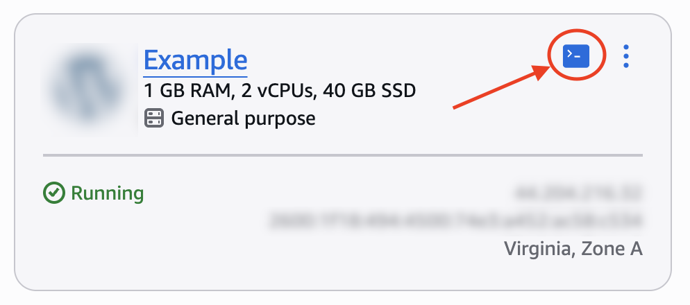 3. After your Lightsail browser-based SSH session is connected, enter the following
command to update the packages on your instance:

```
sudo apt-get update
```

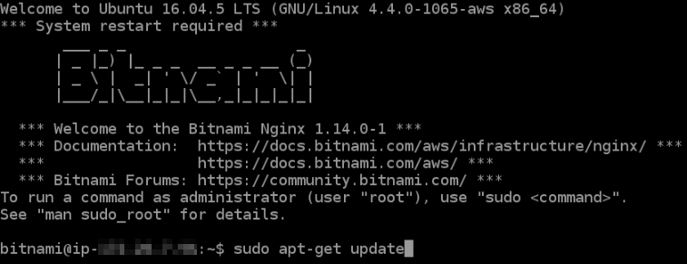 4. Enter the following command to install the software properties package. Certbot's
developers use a Personal Package Archive (PPA) to distribute Certbot. The software
properties package makes it more efficient to work with PPAs.

```
sudo apt-get install software-properties-common
```

###### Note

If you encounter a `Could not get lock` error when running the `sudo
 apt-get install` command, please wait approximately 15 minutes and try again.
This error may be caused by a cron job that is using the Apt package management tool to
install [unattended-upgrades](https://wiki.debian.org/PeriodicUpdates "https://wiki.debian.org/PeriodicUpdates"). 5. Enter the following command to add Certbot to the local apt repository:

###### Note

Step 5 applies only to instances that use the Ubuntu Linux distribution. Skip this
step if your instance uses the Debian Linux distribution.

```
sudo apt-add-repository ppa:certbot/certbot -y
```

6. Enter the following command to update apt to include the new repository:

```
sudo apt-get update -y
```

7. Enter the following command to install Certbot:

```
sudo apt-get install certbot -y
```

Certbot is now installed on your Lightsail instance. 8. Keep the browser-based SSH terminal window open—you return to it later in this
tutorial. Continue to the [next section](#request-a-lets-encrypt-certificate-nginx-bitnami "#request-a-lets-encrypt-certificate-nginx-bitnami") of this tutorial.

## Step 3: Request a Let's Encrypt SSL wildcard certificate

Begin the process of requesting a certificate from Let's Encrypt. Using Certbot, request a
wildcard certificate, which lets you use a single certificate for a domain and its subdomains.
For example, a single wildcard certificate works for the `example.com` top-level
domain, and the `blog.example.com`, and `stuff.example.com`
subdomains.

###### To request a Let's Encrypt SSL wildcard certificate

1. In the same browser-based SSH terminal window used in [step 2](#install-certbot-on-your-instance-nginx-bitnami "#install-certbot-on-your-instance-nginx-bitnami") of this
   tutorial, enter the following commands to set an environment variable for your domain. You
   can now more efficiently copy and paste commands to obtain the certificate. Be sure to
   replace `domain` with the name of your registered
   domain name.

```
DOMAIN=`domain`
```

```
WILDCARD=*.$DOMAIN
```

Example:

```
DOMAIN=`example.com`
```

```
WILDCARD=*.$DOMAIN
```

2. Enter the following command to confirm the variables return the correct values:

```
echo $DOMAIN && echo $WILDCARD
```

You should see a result similar to the following:

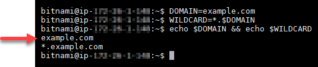 3. Enter the following command to start Certbot in interactive mode. This command tells
Certbot to use a manual authorization method with DNS challenges to verify domain
ownership. It requests a wildcard certificate for your top-level domain, as well as its
subdomains.

```
sudo certbot -d $DOMAIN -d $WILDCARD --manual --preferred-challenges dns certonly
```

4. Enter your email address when prompted, because it's used for renewal and security
   notices.
5. Read the Let's Encrypt terms of service. When done, press Y if you agree. If you
   disagree, you cannot obtain a Let's Encrypt certificate.
6. Respond accordingly to the prompt to share your email address and to the warning about
   your IP address being logged.
7. Let's Encrypt now prompts you to verify that you own the domain specified. You do this
   by adding TXT records to the DNS records for your domain. A set of TXT record values are
   provided as shown in the following example:

###### Note

Let's Encrypt may provide a single or multiple TXT records that you must use for
verification. In this example, we were provided with two TXT records to use for
verification.

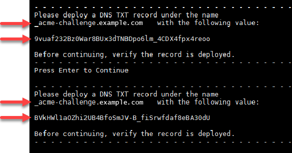 8. Keep the Lightsail browser-based SSH session open—you return to it later in this
tutorial. Continue to the [next section](#add-txt-records-nginx-bitnami "#add-txt-records-nginx-bitnami") of this tutorial.

## Step 4: Add TXT records to your domain's DNS zone

Adding a TXT record to your domain's DNS zone verifies that you own the domain. For
demonstration purposes, we use the Lightsail DNS zone. However, the steps might be similar
for other DNS zones typically hosted by domain registrars.

###### Note

To learn more about how to create a Lightsail DNS zone for your domain, see [Creating a DNS zone to manage your domain's
DNS records in Lightsail](lightsail-how-to-create-dns-entry.md "lightsail-how-to-create-dns-entry.md").

###### To add TXT records to your domain's DNS zone in Lightsail

1. In the left navigation pane, choose the **Domains & DNS**.
2. Under the **DNS zones** section of the page, choose the DNS Zone for
   the domain that you specified in the Certbot certificate request.
3. In the DNS zone editor, choose **DNS records**.
4. Choose **Add record**.
5. In the **Record type** drop-down menu, choose **TXT
   record**.
6. Enter the values specified by the Let's Encrypt certificate request into the
   **Record name** and **Responds with** fields.

###### Note

The Lightsail console pre-populates the apex portion of your domain. For example,
if you want to add the
`_acme-challenge.example.com` subdomain, then
you only have to enter `_acme-challenge` into the
text box, and Lightsail adds the `.example.com` portion for you when you
save the record. 7. Choose **Save**. 8. Repeat steps 4 through 7 to add the second set of TXT records specified by the Let's
Encrypt certificate request. 9. Keep the Lightsail console browser window open—you return to it later in this
tutorial. Continue to the [next
section](#confirm-txt-records-nginx-bitnami "#confirm-txt-records-nginx-bitnami") of this tutorial.

## Step 5: Confirm that the TXT records have propagated

Use the MxToolbox utility to confirm that the TXT records have propagated to the
internet's DNS. DNS record propagation might take a while depending on your DNS hosting
provider, and the configured time to live (TTL) for your DNS records. It is important that you
complete this step, and confirm that your TXT records have propagated, before continuing your
Certbot certificate request. Otherwise, your certificate request fails.

###### To confirm the TXT records have propagated to the internet's DNS

1. Open a new browser window and go to [https://mxtoolbox.com/TXTLookup.aspx](https://mxtoolbox.com/TXTLookup.aspx "https://mxtoolbox.com/TXTLookup.aspx").
2. Enter the following text into the text box. Be sure to replace
   `domain` with your domain.

```
_acme-challenge.`domain`
```

Example:

```
_acme-challenge.example.com
```

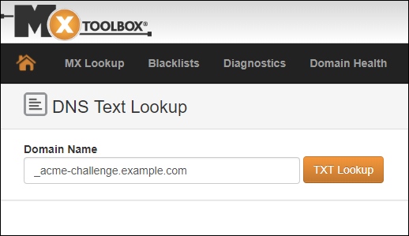 3. Choose **TXT Lookup** to run the check. 4. One of the following responses occurs:

    * If your TXT records have propagated to the internet's DNS, you see a response
     similar to the one shown in the following screenshot. Close the browser window and
     continue to the next section of this tutorial.


    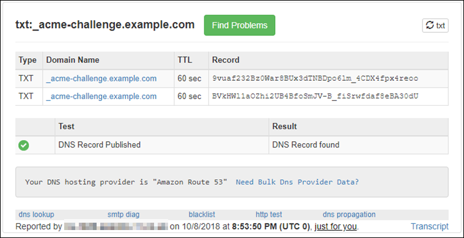
    * If your TXT records have not propagated to the internet's DNS, you see a
     **DNS Record not found** response. Confirm that you added the
     correct DNS records to your domains' DNS zone. If you added the correct records, wait
     a while longer to let your domain's DNS records propagate, and run the TXT lookup
     again.

## Step 6: Complete the Let's Encrypt SSL certificate request

Go back to the Lightsail browser-based SSH session for your Nginx instance
and complete the Let's Encrypt certificate request. Certbot saves your SSL certificate, chain, and key
files to a specific directory on your instance.

###### To complete the Let's Encrypt SSL certificate request

1. In the Lightsail browser-based SSH session for your Nginx instance,
   press **Enter** to continue your Let's Encrypt SSL certificate request. If successful,
   a response similar to the one shown in the following screenshot appears:

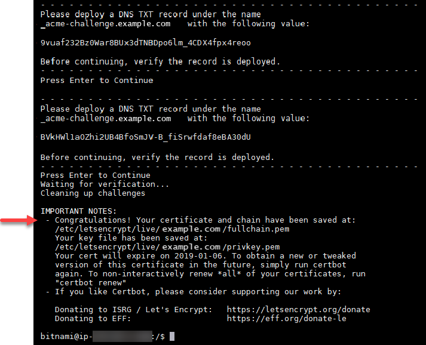

The message confirms that your certificate, chain, and key files are stored in the
`/etc/letsencrypt/live/`domain`/` directory. Make
sure to replace `domain` with your domain, such as
`/etc/letsencrypt/live/`example.com`/`. 2. Make note of the expiration date specified in the message. You use it to renew your
certificate by that date.

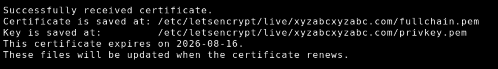 3. Now that you have the Let's Encrypt SSL certificate, continue to the [next section](#link-certificate-files-nginx-bitnami "#link-certificate-files-nginx-bitnami") of this tutorial.

## Step 7: Create links to the Let's Encrypt certificate files in the Nginx server directory

Create links to the Let's Encrypt SSL certificate files in the Nginx server directory on
your Nginx instance. Also, back up your existing certificates, in case you need them
later.

###### To create links to the Let's Encrypt certificate files in the Nginx server directory

1. In the Lightsail browser-based SSH session for your Nginx instance, enter the
   following command to stop the underlying services:

```
sudo /opt/bitnami/ctlscript.sh stop
```

You should see a response similar to the following:

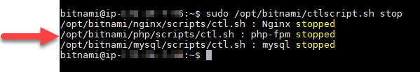 2. Enter the following commands individually to rename your existing certificate files as
backups. Refer to the **Important** block at the beginning of
this tutorial for information about the different distributions and file
structures.

    * For Debian Linux distributions


    Approach A (Bitnami installations using system packages):


    ```
    sudo mv /opt/bitnami/nginx/conf/bitnami/certs/server.crt /opt/bitnami/nginx/conf/bitnami/certs/server.crt.old
    ```


    ```
    sudo mv /opt/bitnami/nginx/conf/bitnami/certs/server.key /opt/bitnami/nginx/conf/bitnami/certs/server.key.old
    ```

    Approach B (Self-contained Bitnami installations):


    ```
    sudo mv /opt/bitnami/nginx/conf/server.crt /opt/bitnami/nginx/conf/server.crt.old
    ```


    ```
    sudo mv /opt/bitnami/nginx/conf/server.key /opt/bitnami/nginx/conf/server.key.old
    ```
    * For older instances that use the Ubuntu Linux distribution:


    ```
    sudo mv /opt/bitnami/nginx/conf/bitnami/certs/server.crt /opt/bitnami/nginx/conf/bitnami/certs/server.crt.old
    ```


    ```
    sudo mv /opt/bitnami/nginx/conf/bitnami/certs/server.key /opt/bitnami/nginx/conf/bitnami/certs/server.key.old
    ```

3. Enter the following commands individually to create links to your Let's Encrypt
certificate files in the Nginx server directory. Refer to the **Important** block at the beginning of this tutorial for information about the
different distributions and file structures.

###### Note

If you closed your browser-based SSH terminal window since setting the `DOMAIN`
variable in Step 3, run `DOMAIN=`example.com`` again,
replacing `example.com` with your domain.

    * For Debian Linux distributions


    Approach A (Bitnami installations using system packages):


    ```
    sudo ln -sf /etc/letsencrypt/live/$DOMAIN/privkey.pem /opt/bitnami/nginx/conf/bitnami/certs/server.key
    ```


    ```
    sudo ln -sf /etc/letsencrypt/live/$DOMAIN/fullchain.pem /opt/bitnami/nginx/conf/bitnami/certs/server.crt
    ```

    Approach B (Self-contained Bitnami installations):


    ```
    sudo ln -sf /etc/letsencrypt/live/$DOMAIN/privkey.pem /opt/bitnami/nginx/conf/server.key
    ```


    ```
    sudo ln -sf /etc/letsencrypt/live/$DOMAIN/fullchain.pem /opt/bitnami/nginx/conf/server.crt
    ```
    * For older instances that use the Ubuntu Linux distribution:


    ```
    sudo ln -s /etc/letsencrypt/live/$DOMAIN/privkey.pem /opt/bitnami/nginx/conf/bitnami/certs/server.key
    ```


    ```
    sudo ln -s /etc/letsencrypt/live/$DOMAIN/fullchain.pem /opt/bitnami/nginx/conf/bitnami/certs/server.crt
    ```

4. Enter the following command to start the underlying services that you stopped
earlier:

```
sudo /opt/bitnami/ctlscript.sh start
```

You should see a result similar to the following:

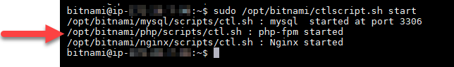

Your Nginx instance is now configured to use SSL encryption. However,
traffic is not automatically redirected from HTTP to HTTPS. 5. Continue to the [next section](#configure-http-to-https-redirection-nginx-bitnami "#configure-http-to-https-redirection-nginx-bitnami") of this tutorial.

## Step 8: Configure HTTP to HTTPS redirection for your web application

You can configure an HTTP to HTTPS redirect for your Nginx instance.
Automatically redirecting from HTTP to HTTPS makes your site accessible only by your customers using SSL,
even when they connect using HTTP. Refer to the Important block at the beginning of this
tutorial for information about the different distributions and file structures.

This tutorial uses Vim for demonstration purposes; however, you can use any text editor of
your choice.

###### For Debian Linux distributions – Configure HTTP to HTTPS redirection for your web application

**Approach A (Bitnami installations using system packages):**

1. In the Lightsail browser-based SSH session for your Nginx instance, enter the
   following command to modify the server-block configuration file. Replace
   `<ApplicationName>` with the name of your application.

```
sudo vim /opt/bitnami/nginx/conf/server_blocks/<ApplicationName>-server-block.conf
```

2. Press `i` to enter insert mode in the Vim editor.
3. Edit the file with the information from the following example:

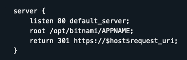 4. Press the **ESC** key, and then enter `:wq` to write
(save) your edits, and quit Vim. 5. Enter the following command to modify the server section of the Nginx
configuration file:

```
sudo vim /opt/bitnami/nginx/conf/nginx.conf
```

6. Press `i` to enter insert mode in the Vim editor.
7. Edit the file with the information from the following example:

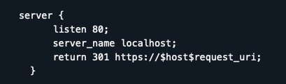 8. Press the **ESC** key, and then enter `:wq` to write
(save) your edits, and quit Vim. 9. Enter the following command to restart the underlying services and make your edits
effective:

```
sudo /opt/bitnami/ctlscript.sh restart
```

###### Approach B (Self-contained Bitnami installations):

1. In the Lightsail browser-based SSH session for your Nginx instance,
   enter the following command to modify the server section of the Nginx configuration
   file:

```
sudo vim /opt/bitnami/nginx/conf/nginx.conf
```

2. Press `i` to enter insert mode in the Vim editor.
3. Edit the file with the information from the following example:

 4. Press the **ESC** key, and then enter `:wq` to write
(save) your edits, and quit Vim. 5. Enter the following command to restart the underlying services and make your edits
effective:

```
sudo /opt/bitnami/ctlscript.sh restart
```

###### For older instances that use the Ubuntu Linux distribution – Configure HTTP to HTTPS redirection for your web application

1. In the Lightsail browser-based SSH session for your Nginx instance,
   enter the following command to edit the Nginx web server configuration file using
   the Vim text editor:

```
sudo vim /opt/bitnami/nginx/conf/bitnami/bitnami.conf
```

2. Press `i` to enter insert mode in the Vim editor.
3. In the file, enter the following text between `server_name localhost;` and
   `include "/opt/bitnami/nginx/conf/bitnami/bitnami-apps-prefix.conf";`:

```
return 301 https://$host$request_uri;
```

The result should look like the following:

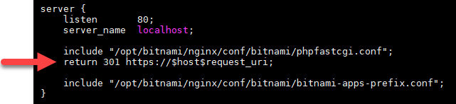 4. Press the **ESC** key, and then enter `:wq` to write
(save) your edits, and quit Vim. 5. Enter the following command to restart the underlying services and make your edits
effective:

```
sudo /opt/bitnami/ctlscript.sh restart
```

Your Nginx instance is now configured to automatically redirect
connections from HTTP to HTTPS. When a visitor goes to `http://www.example.com`, they are
automatically redirected to the encrypted `https://www.example.com`
address.

## Step 9: Renew the Let's Encrypt certificates every 90 days

Let's Encrypt certificates are valid for 90 days. Certificates can be renewed 30 days
before they expire. To renew the Let's Encrypt certificates, run the original command used to
obtain them. Repeat the steps in the [Request a Let's Encrypt SSL wildcard certificate](#request-a-lets-encrypt-certificate-nginx-bitnami "#request-a-lets-encrypt-certificate-nginx-bitnami") section of this
tutorial.
