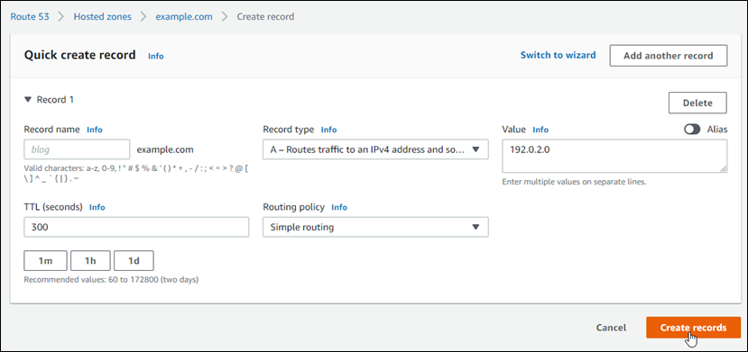
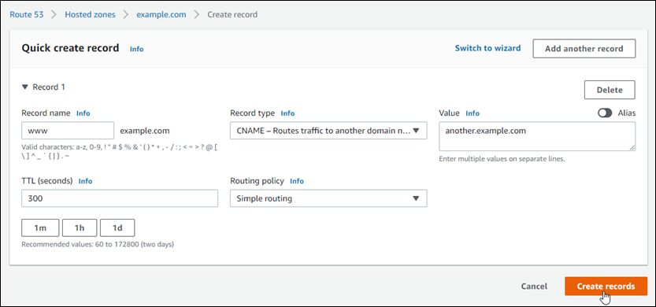

# Point a

domain to your Lightsail instance using Amazon Route 53

The DNS zone in Amazon Lightsail makes it easy to point a registered domain name, like
`example.com`, to your website running on a Lightsail instance. You can create up
to six Lightsail DNS zones, and not all DNS record types are supported. For more information
about Lightsail DNS zones, see [DNS](understanding-dns-in-amazon-lightsail.md "understanding-dns-in-amazon-lightsail.md").

If the Lightsail DNS zone is too limited for you, then we recommend using an Amazon Route 53
hosted zone to manage your domain’s DNS records. You can manage the DNS for up to 500 domains
using Route 53, and it supports a greater variety of DNS record types. Or, you might already be
using Route 53 to manage your domain’s DNS records and prefer to continue using it. This guide
shows you how to edit the DNS records for a domain managed in Route 53 to point to your Lightsail
instance.

## Prerequisites

Complete the following prerequisites if you haven’t already done so:

- Register a domain name using Route 53. For more information, see [Registering a
  New Domain](../../../Route53/latest/DeveloperGuide/domain-register.md "../../../Route53/latest/DeveloperGuide/domain-register.md") in the Route 53 documentation.
- If you already registered a domain but you’re not using Route 53 to manage its records,
  then you must transfer management of the DNS records for your domain to Route 53. For more
  information, see [Making
  Amazon Route 53 the DNS Service for an Existing Domain](../../../Route53/latest/DeveloperGuide/MigratingDNS.md "../../../Route53/latest/DeveloperGuide/MigratingDNS.md") in the Route 53
  documentation.
- Create a public hosted zone for your domain in Route 53. For more information, see [Creating a Public Hosted Zone](../../../Route53/latest/DeveloperGuide/CreatingHostedZone.md "../../../Route53/latest/DeveloperGuide/CreatingHostedZone.md") in the Route 53 documentation.
- Create a static IP and attach it to your Lightsail instance. In this guide, you
  create a DNS record in your domain’s Route 53 hosted zone that resolves to the static IP
  address (public IP address) of your instance. For more information, see [Create a static IP and attach it to an
  instance](lightsail-create-static-ip.md "lightsail-create-static-ip.md").

## Point a domain to a

Lightsail instance using Route 53

Complete the following steps to configure the two most common DNS records, address and
canonical name, in Route 53 to point your domain to a Lightsail instance.

###### Note

This procedure is also documented in the Route 53 Developer Guide. For more information,
see [Creating Records by Using the Amazon Route 53 Console](../../../Route53/latest/DeveloperGuide/resource-record-sets-creating.md "../../../Route53/latest/DeveloperGuide/resource-record-sets-creating.md") in the Route 53
documentation.

1. Sign in to the [Route 53 console](https://console.aws.amazon.com/route53 "https://console.aws.amazon.com/route53").
2. In the navigation pane, choose **Hosted zones**.
3. Choose the hosted zone for the domain name that you want to use to route traffic to
   your load balancer.
4. Choose **Create record**.

The **Quick create record** page appears.

###### Note

If you see the **Choose routing policy** page, then choose
**Switch to quick create** to switch to the quick create wizard
before continuing with the following steps. 5. For **Record type**, choose one of the following options:

**A - Routes traffic to an IPv4 address and some AWS resources**

An address (A) record maps a domain, such as `example.com`, or a
subdomain, such as `blog.example.com`, to a web server’s IP address, such
as `192.0.2.255`.

    1. Keep the **Record name** text box empty to point the apex
     of your domain, such as `example.com`, to an IP address, or enter a
     subdomain.
    2. Choose **A - Routes traffic to an IPv4 address and some AWS
     resources** in the **Record type** drop-down
     menu.
    3. Enter the static IP address (public IP address) of your Lightsail instance
     in the **Value** text box.
    4. Keep the TTL of 300, and the routing policy as **Simple
     routing**.

    

**CNAME - Routes traffic to another domain name and to some AWS resources**

A canonical name (CNAME) record maps an alias or subdomain, such as
`www.example.com`, to a domain, such as `example.com`, or a
subdomain, such as `www2.example.com`. A CNAME record redirects one
domain to another.

    1. Enter a subdomain in the **Record name** text box.
    2. Choose **CNAME - Routes traffic to another domain name and to some
     AWS resources** in the **Record type** drop-down
     menu.
    3. Enter a domain (i.e., `example.com`) or subdomain (i.e.,
     `another.example.com`) in the **Value** text
     box.
    4. Keep the TTL of 300, and the routing policy as **Simple
     routing**.

    

6. Choose **Create records** to add the record to your hosted
   zone.

###### Note

Allow time for the change to propagate through the internet's DNS. This may take a
few minutes to several hours.

To edit an existing record set in the Route 53 hosted zone, choose the record to edit,
enter your changes, and then choose **Save**.
