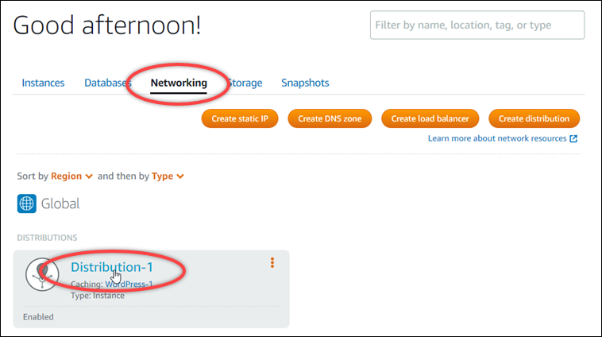
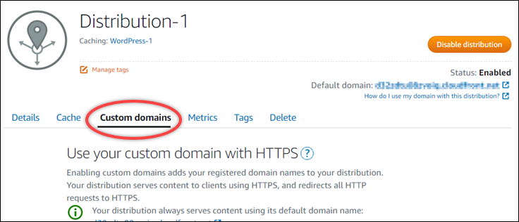
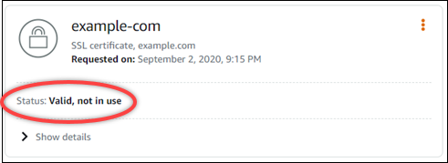

# Validate SSL/TLS

certificates for Lightsail distributions

An Amazon Lightsail SSL/TLS certificate must be validated after it's created, and before you
can use it with your Lightsail distribution. After your certificate request is submitted, the
status of your new certificate is changed to **Attempting to validate your
certificate**. During this time, Lightsail attempts to add the certificate's
validation record to the DNS of the domain names that you specified for the certificate. After a
while, the status will change to **Valid**, or **Validation timed
out**.

If automatic validation fails you must verify that you control all the domain names that you
specified for the certificate when you created it. You do this by adding canonical name (CNAME)
records to the DNS zone of each of the domains specified on the certificate. The records that
you need to add are listed in the **Validation details** section of the
certificate.

In this guide, we provide you with the procedure to manually validate your certificate using
a Lightsail DNS zone. The procedure to validate your certificate using a different DNS hosting
provider, like Domain.com or GoDaddy, may be similar. For more information about Lightsail DNS
zones, see [DNS](understanding-dns-in-amazon-lightsail.md "understanding-dns-in-amazon-lightsail.md").

For more information about SSL/TLS certificates, see [SSL/TLS
certificates](understanding-tls-ssl-certificates-in-lightsail-https.md "understanding-tls-ssl-certificates-in-lightsail-https.md").

**Contents**

- [Prerequisite](#validate-distribution-certificate-prerequisite "#validate-distribution-certificate-prerequisite")
- [Get the CNAME
  record values to validate your certificate](#get-distribution-certificate-cname-records "#get-distribution-certificate-cname-records")
- [Add the CNAME
  records to your domain's DNS zone](#add-distribution-certificate-cname-records "#add-distribution-certificate-cname-records")
- [View the status of
  your distribution certificate](#viewing-distribution-certificate-status "#viewing-distribution-certificate-status")

## Prerequisite

Before you get started, you need to create an SSL/TLS certificate for your distribution.
For more information, see [Create SSL/TLS certificates for your distribution](amazon-lightsail-create-a-distribution-certificate.md "amazon-lightsail-create-a-distribution-certificate.md").

## Get the CNAME record values to

validate your certificate

Complete the following procedure to get the CNAME records that you must add to your
domains to validate the certificate.

1. Sign in to the [Lightsail console](https://lightsail.aws.amazon.com/ "https://lightsail.aws.amazon.com/").
2. In the left navigation pane, choose **Networking**.
3. Choose the name of the distribution for which want to get the CNAME record values of a
   certificate.

 4. Choose the **Custom domains** tab on your distribution's management
page.

 5. Scroll down to the **Attached certificates** section of the
page.

All of your distribution certificates are listed under the **Attached
certificates** section of the page, including certificates created for other
Lightsail resources, and certificates that are pending validation. 6. Find the certificate that you want to validate, expand **Validation
details**, and make note of the **Name** and
**Value** of the CNAME records that you must add for each domain
listed.

You must add these records exactly as listed. We recommend that you copy and paste
these values into a text file that you can refer to later. For more information, see the
following [Add the
CNAME records to your domain's DNS zone](#add-distribution-certificate-cname-records "#add-distribution-certificate-cname-records") section of this guide.

## Add the CNAME records to your

domain's DNS zone

Complete the following procedure to add CNAME records to your domain's DNS zone.

1. In the left navigation pane, choose **Domains & DNS**.
2. Under the **DNS zones** section of the page, choose the domain name
   to which you want to add the CNAME records to validate your certificate.
3. Choose the **DNS records** tab.
4. Choose **Add record** in the DNS records management page.
5. Choose **CNAME** in the **Record type**
   drop-down.
6. In the **Record name** text box, enter the **Name**
   value of the CNAME record that you got from your certificate.

The Lightsail console pre-populates the apex portion of your domain. For example, if
you want to add the `www.example.com` subdomain, then you only have to enter
`www` into the text box, and Lightsail adds the `.example.com`
portion for you when you save the record. 7. In the **Route traffic to** text box, enter the
**Value** portion of the CNAME record that you got from your
certificate. 8. Confirm that the values you entered are exactly as they were listed on the certificate
that you want to validate. 9. Choose the save icon to save the record to your DNS zone.

Repeat these steps to add additional CNAME records for domains on your certificate
that need to be validated. Allow time for changes to propagate through the internet's DNS.
After a few minutes, you should see if the status of your distribution certificate has
changed to **Valid**. For more information, see the following [View the status of your
distribution certificate](#viewing-distribution-certificate-status "#viewing-distribution-certificate-status") section of this guide.

## View the status of your distribution

certificate

Complete the following procedure to view the status of your SSL/TLS certificate for your
distribution.

1. In the left navigation pane, choose **Networking**.
2. Choose the name of the distribution for which you want to view a certificate's
   status.

 3. Choose the **Custom domains** tab on your distribution's management
page.

 4. Scroll down to the **Attached certificates** section of the
page.

All of your distribution certificates are listed under the **Attached
certificates** section of the page, including certificates with
**Pending validation** and **Valid** statuses.

A **Valid** status confirms that you successfully validated your
certificate with the CNAME records that you added to your domains. Choose
**Details** to view your certificate's important dates, encryption
details, identification, and validation records. Your certificates are valid for 13 months
from the date on which you validated them, after which time Lightsail attempts to
automatically re-validate them. Don't delete the CNAME records that you added to your
domain because they are required when your certificate is re-validated on the
**Valid until** date listed.

After you validate your SSL/TLS certificate, you should enable custom domains for your
distribution to use the domain names of your certificate on your distribution. For more
information, see [Enable custom domains for your distribution](amazon-lightsail-enabling-distribution-custom-domains.md "amazon-lightsail-enabling-distribution-custom-domains.md").
