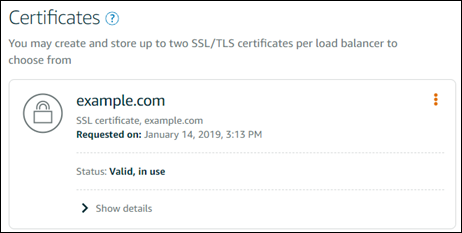

# Attach a validated SSL/TLS

certificate to your Lightsail load balancer

After you verify that you control your domain, the certificate's status will change to
**Valid**.

Your next step is to attach the certificate to your Lightsail load balancer.

1. From the Lightsail home page, choose **Networking**.
2. Choose your load balancer.
3. Choose the **Custom domains** tab.
4. In the **Certificates** section, choose **Attach
   certificate**.
5. Select a certificate from the dropdown list.
6. Choose **Attach**, to attach the certificate.
