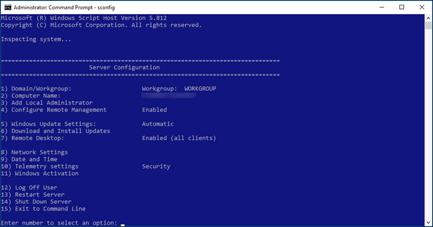
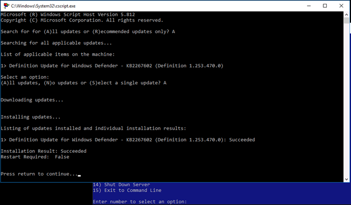
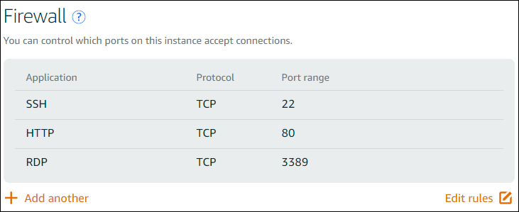
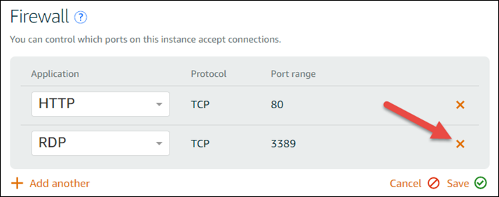

# Secure Windows

Server instances on Lightsail

In this article, we provide tips and tricks to help you avoid security risks when using your
Lightsail instance running Windows Server.

## About Lightsail

passwords

When you create a Windows Server-based instance, Lightsail randomly generates a long
password that is hard to guess. You use this password uniquely with your new instance. You can
use the default password to connect quickly to your instance using remote desktop (RDP). You
are always logged in as the **Administrator** on your Lightsail
instance.

## Manage your

password

You can change the password on your Windows Server-based instance. This might be useful if
you want to use a remote desktop client to access your Lightsail instance. Lightsail never
stores a password you generate.

###### Note

You can use either the Lightsail-generated password or your own custom password with
the browser-based RDP client in Lightsail. If you use a custom password, you will be
prompted for your password every time you log in. It's easier to use the
Lightsail-generated default password with the browser-based RDP client if you want quick
access to your instance.

Use the Windows Server password manager to change your password securely. Press
`Ctrl` + `Alt` + `Del`, and then choose **Change a
password**. Be sure to keep a record of your password, because Lightsail doesn't
store your password. If you need to retrieve your password, see the following: [Change
the Administrator password for a Windows-based instance](use-non-default-key-with-windows-based-instance-in-lightsail.md "use-non-default-key-with-windows-based-instance-in-lightsail.md").

If you change your password from the unique, default password, be sure to use a strong
password. You should avoid passwords that are based on names or dictionary words, or repeating
sequences of characters.

## Security patching

We recommend keeping your Windows Server-based Lightsail instances updated with the
latest security patches. Be sure your server is configured to download and install updates.
The following procedure tells you how to do this directly on your Lightsail instance running
Windows Server.

1. On your Windows Server-based instance, open a command prompt.
2. Type `sconfig`, and then press `Enter`.

Windows Update Settings (number 5) are at `Automatic` by default.

 3. To download and install new updates, type `6`, and then press
`Enter`. 4. Type `A` to search for **(A)ll updates** in the new
command window, and then press `Enter`. 5. Type `A` again to install **(A)ll updates**, and then
press `Enter`.

When finished, you see a message with the installation results and more instructions
(if those apply).

## Enable the Account Lockout

Policy in Windows Server

You can configure Windows Server to temporarily or indefinitely disable accounts when a
certain number of unsuccessful login attempts has been reached. For example, you can lock out
someone who attempts to log in to your instance using three unsuccessful passwords.

For more information, see [Account Lockout
Policy](<https://technet.microsoft.com/en-us/library/hh994563(v=ws.11).aspx> "https://technet.microsoft.com/en-us/library/hh994563(v=ws.11).aspx") in the _Windows Server documentation_.

## Ports and firewall

settings

By default, we open the following ports on your Windows Server-based instances.

The ports you enable are exposed to the world and can't be restricted by source IP. To
restrict access to your instance, you can turn off these ports and only enable them when you
need to access your instance. Here's how:

1. Find the instance you want to manage in Lightsail, and then choose
   **Manage**.
2. Choose **Networking**.
3. On the **Networking** page for your instance, choose **Edit
   rules**.
4. Delete the RDP/TCP/3389 rule by choosing the orange "x" next to the rule.

 5. Choose **Save**.
