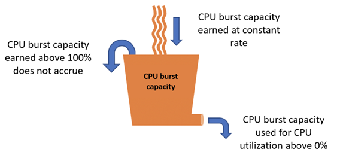

# View CPU burst capacity accrual for Lightsail

instances

Amazon Lightsail instance plans accrue 4.17% of CPU burst capacity per hour, except for Linux or Unix $380 and larger plans, and Windows $570 and larger plans.
The maximum CPU burst capacity that can be accrued is equivalent to the amount of CPU burst capacity percentage that can be earned in a 24-hour period. Your
instance stops accruing CPU burst capacity when the CPU burst capacity percentage reaches
100%.

###### Important

###### Accrued CPU burst capacity

- **Linux or Unix $380** and **Windows $570** and larger instance plans – These plans don't accrue CPU burst
  capacity. They will burst automatically, as needed.
- **Instances created before June 29, 2023** – CPU
  burst capacity does not persist if your instance is stopped. If you stop your instance,
  it loses all accrued burst capacity.
- **Instances created on or after June 29, 2023**
  – CPU burst capacity persists for seven days between instance stops and
  starts.
- Accrued CPU burst capacity on a running instance does not expire.

Lightsail instances receive additional CPU burst capacity at launch, this is called
launch CPU burst capacity. Launch CPU burst capacity allows instances to burst immediately
after launch before they have accrued additional burst capacity. Launch CPU burst capacity
does not count towards the burst capacity limit. If your instance has not spent its launch CPU
burst capacity, and remains idle over a 24-hour period while accruing more burst capacity, its
CPU burst capacity (percentage) metric graph will appear as over 100%.

Additionally, some Lightsail instances start in launch mode, which temporarily removes
some of the performance limitations that are typically present on burstable instances. Launch
mode allows you to run resource-intensive scripts at launch without affecting the overall
performance of your instance.
