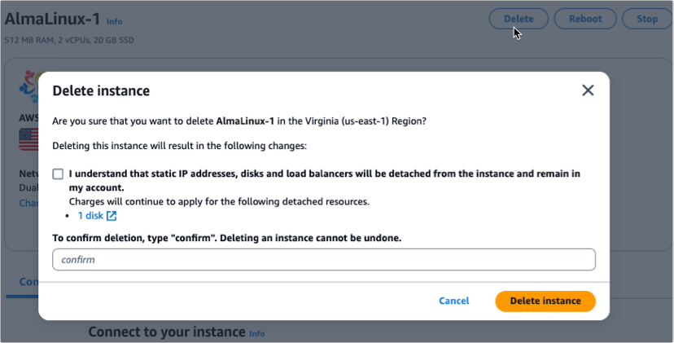
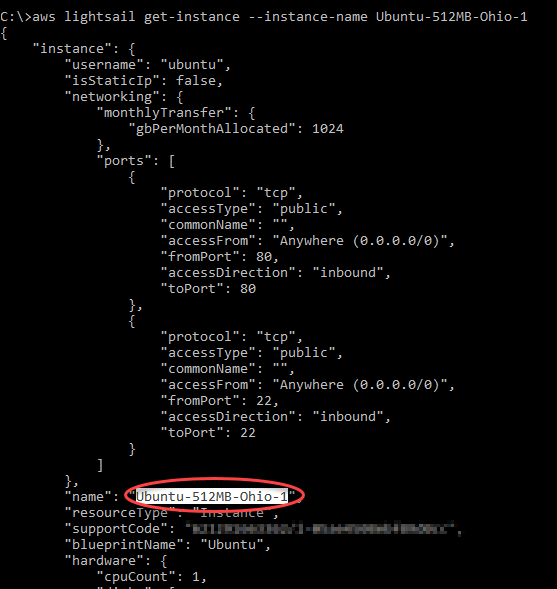
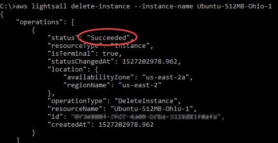

# Delete Lightsail instances

If you no longer need an instance, you can delete it using the Amazon Lightsail console or
the AWS Command Line Interface (AWS CLI). You stop incurring charges for the instance as soon as it’s deleted.
However, resources that were attached to the deleted instance will continue to incur charges
until you delete them as well. For more information on these resources and how to delete them
after deleting your instance, see [Next steps](#delete-instance-next-steps "#delete-instance-next-steps").

###### Warning

When you delete an instance, it can't be recovered. Any automatic snapshots of the
instance will also be deleted as part of this operation. If you want to retain your data for
later use, you must first create a snapshot of your instance or choose to keep an existing
automatic snapshot. For more information, see the following documentation:

- [Keep automatic snapshots from
  being replaced in Lightsail](amazon-lightsail-keeping-automatic-snapshots.md "amazon-lightsail-keeping-automatic-snapshots.md")
- [Back up Linux/Unix
  Lightsail instances with snapshots](lightsail-how-to-create-a-snapshot-of-your-instance.md "lightsail-how-to-create-a-snapshot-of-your-instance.md")
- [Create a snapshot of your
  Lightsail Windows Server instance](prepare-windows-based-instance-and-create-snapshot.md "prepare-windows-based-instance-and-create-snapshot.md")

## Delete an instance from the

Lightsail console home page

1. Sign in to the [Lightsail console](https://lightsail.aws.amazon.com/ "https://lightsail.aws.amazon.com/").
2. For the instance you want to delete, choose the actions menu icon (⋮), then
   choose **Delete**.

 3. Choose **Yes, delete** to confirm the deletion.

## Delete an instance from the

Lightsail console instance management page

1. In the Lightsail console on the home page, choose the instance you want to
   delete.
2. Choose the **Delete** button, then choose **Delete
   instance**.

 3. Select the checkbox, then enter **_Confirm_** into
the input field to acknowledge that you want to delete the instance. 4. Choose **Delete instance** to confirm the deletion.

## Delete an instance using the AWS CLI

1. Complete the following prerequisites if you haven't already.
   1. Install the AWS CLI. For more information, see [Install the
      AWS CLI](../../../cli/latest/userguide/installing.md "../../../cli/latest/userguide/installing.md") .
   2. Configure the AWS CLI. For more information, see [Configuring the AWS CLI](lightsail-how-to-set-up-and-configure-aws-cli.md "lightsail-how-to-set-up-and-configure-aws-cli.md").
   3. (Optional) Use AWS CloudShell. For more information, see [Manage Lightsail resources with
      AWS CloudShell](amazon-lightsail-cloudshell.md "amazon-lightsail-cloudshell.md").

2. Open a Terminal, Command Prompt, or CloudShell window, then type the following
   command to get the name of the instance you want to delete:

```
aws lightsail get-instances
```

You should see results similar to the following:

 3. Select and copy the name of the instance you want to delete so you can use it in the
next step.

###### Note

If the instance you want to delete does not appear, confirm that your AWS CLI is
configured for the AWS Region where the instance is located. For more information, see
[Configuring the AWS CLI](lightsail-how-to-set-up-and-configure-aws-cli.md "lightsail-how-to-set-up-and-configure-aws-cli.md"). 4. Type the following command to delete the instance.

```
aws lightsail delete-instance --instance-name `InstanceName`
```

In the command, replace `InstanceName` with the name of the
instance.

If the deletion is successful, you should see a confirmation similar to the
following:



###### Note

If the deletion isn’t successful, you should see an error message. Confirm that you
copied and pasted the exact name of the instance and try again.

## Next steps

After you delete an instance, a static IP, snapshots, block storage disks, and load
balancer associated to an instance remain in Lightsail, and incur additional charges. For
more information about how to delete those resources, see the following articles:

- [Delete a static IP](how-to-delete-static-ip.md "how-to-delete-static-ip.md")
- [Delete a snapshot](amazon-lightsail-deleting-snapshots.md "amazon-lightsail-deleting-snapshots.md")
- [Detach and delete a block
  storage disk](detach-and-delete-block-storage-disks.md "detach-and-delete-block-storage-disks.md")
- [Delete a load balancer](delete-lightsail-load-balancer.md "delete-lightsail-load-balancer.md")
