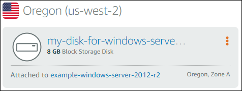

# Detach and delete Lightsail block

storage disks

If you no longer need a block storage disk, you can detach it from your stopped
Amazon Lightsail instance, and then delete it. This topic describes how to back up your data and
safely delete a disk.

## Prerequisites

- Stop your instance from running. You have to do this before you can detach and then
  delete your disk. [Learn how to stop your instance](lightsail-how-to-start-stop-or-restart-your-instance-virtual-private-server.md "lightsail-how-to-start-stop-or-restart-your-instance-virtual-private-server.md")
- (Optional) We recommend that you create a snapshot of your disk. That way, you have a
  backup in case you change your mind. For more information, see [Create a snapshot of your
  database](create-block-storage-disk-snapshot.md "create-block-storage-disk-snapshot.md")

## Detach and delete your

disk

Once you stop your Lightsail instance, you can safely detach and delete your
disk.

1. On the home page, choose **Storage**.
2. Choose the name of your attached disk to manage it.

 3. On the disk management page, choose **Detach**.

After a few seconds, the disk is detached and ready to be deleted or
reattached. 4. Choose the **Delete** tab. 5. Choose **Delete disk**, and then confirm by choosing **Yes,
delete**.

###### Important

This is a permanent operation and can't be undone. You will lose all data on the
disk when you delete it.
